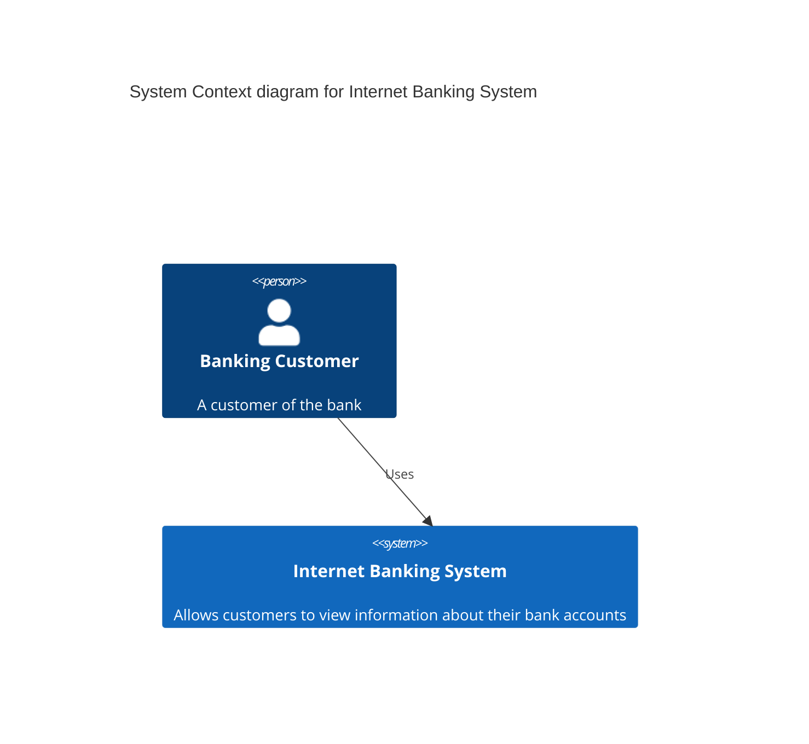
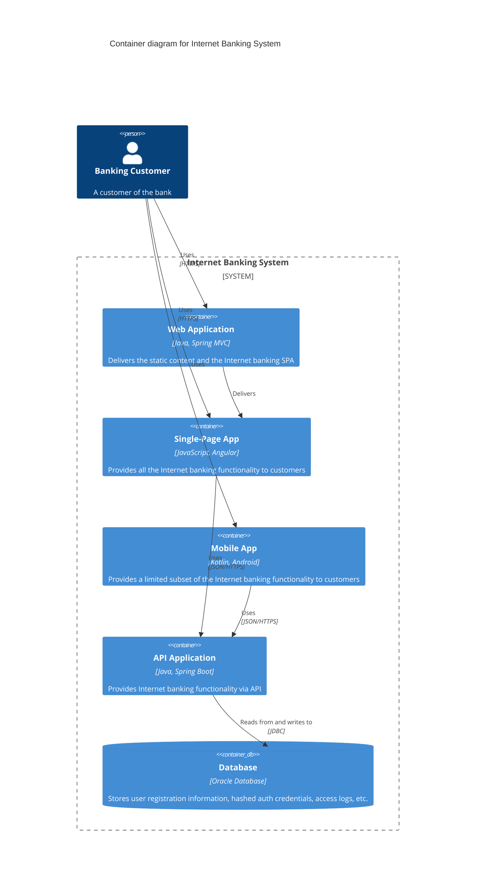
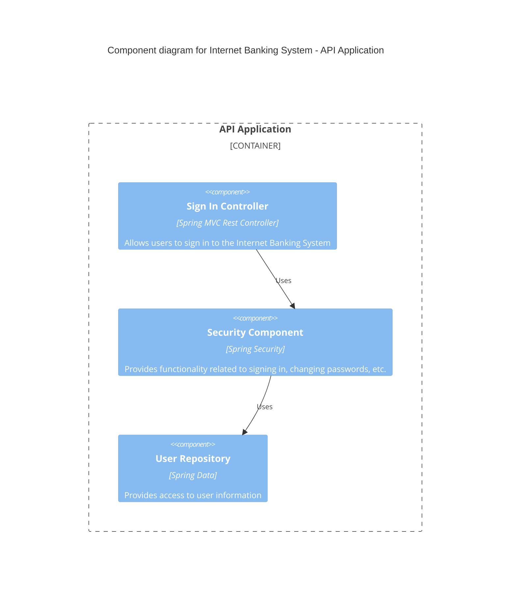
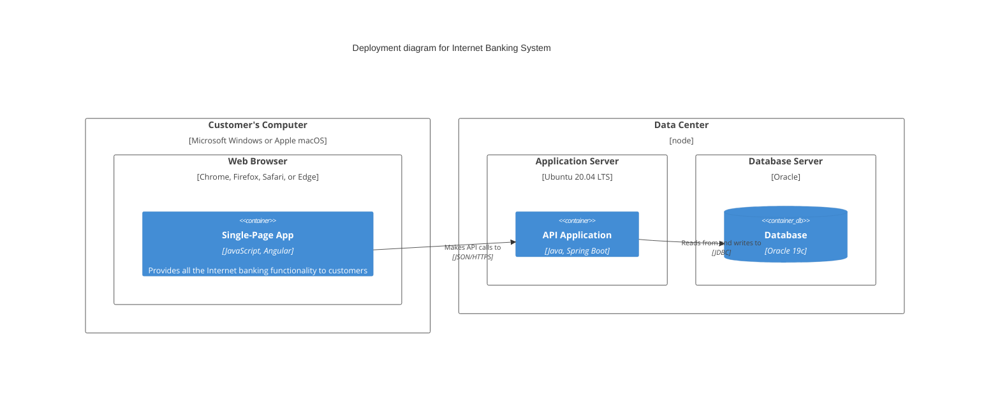
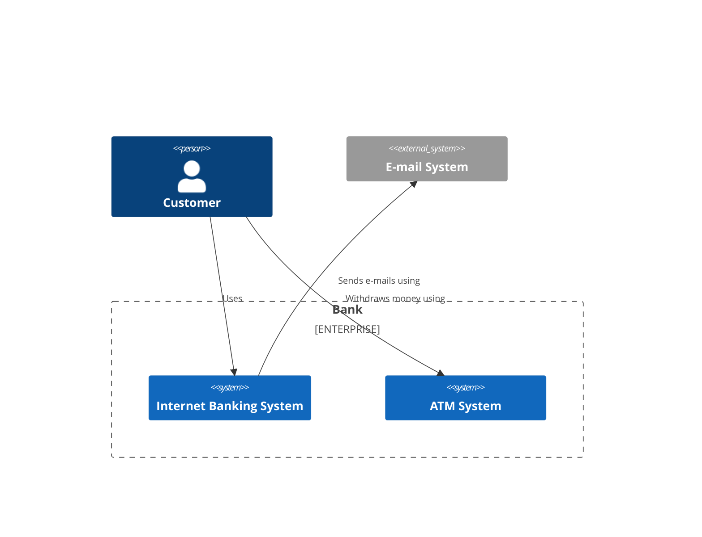

# C4 Diagram

C4 diagrams provide a way to visualize software architecture at different levels of abstraction. The C4 model consists of Context, Container, Component, and Code diagrams.

## Syntax

### Basic Elements
- Person: `Person(alias, label)`
- System: `System(alias, label)`
- Container: `Container(alias, label, technology)`
- Component: `Component(alias, label, technology)`
- Relationship: `Rel(from, to, label)`

## Basic Example

## Advanced Example

Here's a more detailed container diagram for a web application:

## Component Level

## Deployment Diagram

## Additional Features

### Boundaries and Enterprise

## Styling

The C4 diagrams automatically:
- Format different types of elements
- Show relationships and dependencies
- Display technology stacks
- Organize hierarchical structures
- Use consistent visual language

## Tips
- Start with Context diagrams
- Add detail gradually through Container and Component views
- Keep diagrams focused and clear
- Include relevant technical details
- Show key relationships
- Use meaningful descriptions
- Include technology choices where relevant
- Consider the audience's technical level
