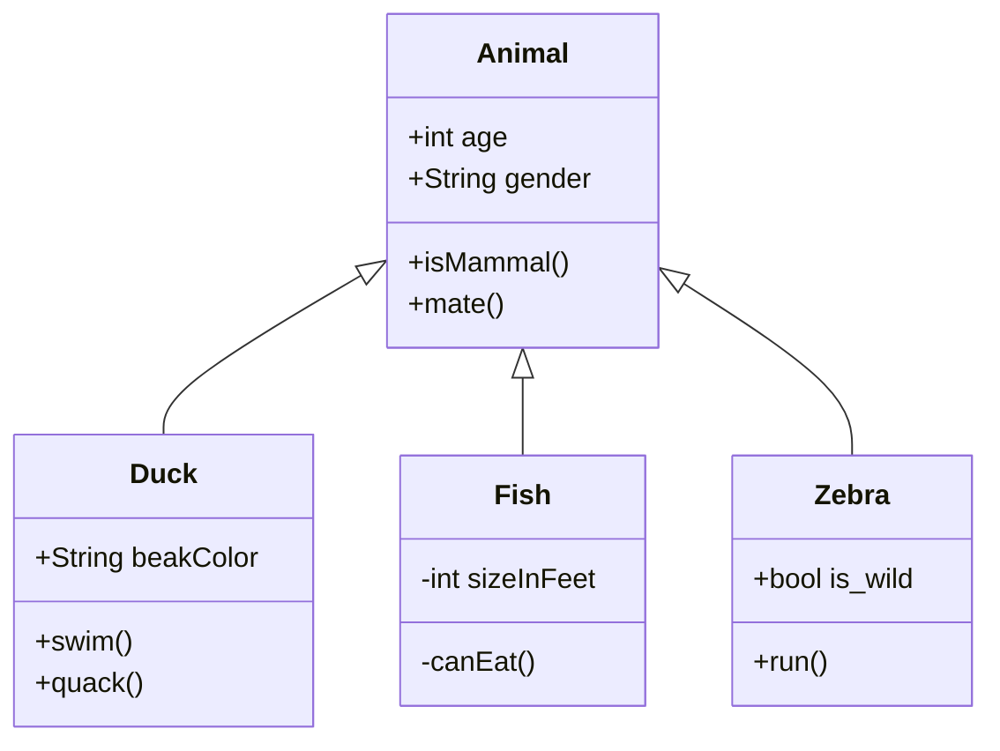
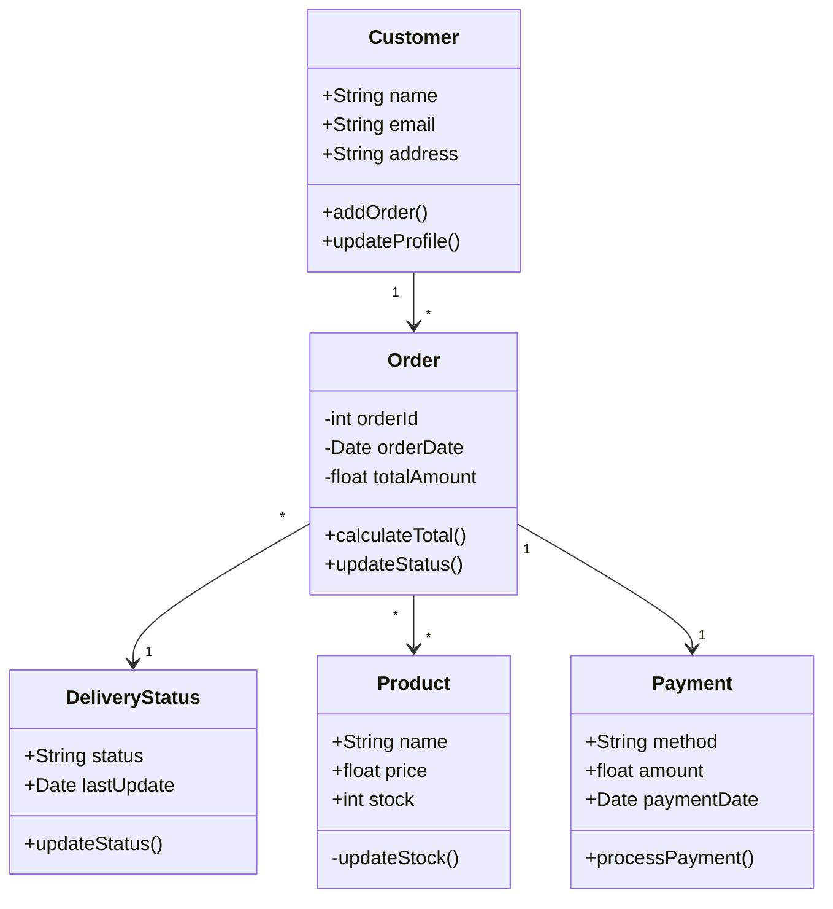
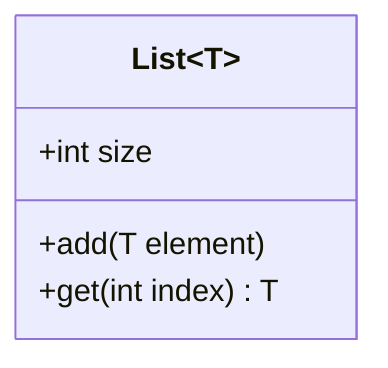
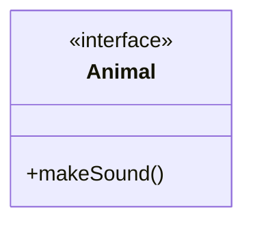
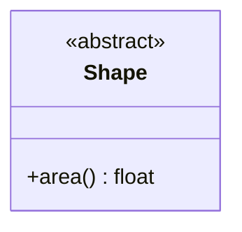

# Class Diagram

Class diagrams are the backbone of object-oriented modeling. They show the classes of a system, their attributes, operations, and the relationships between classes.

## Syntax

### Class Definition
```
class ClassName {
    +publicField
    -privateField
    #protectedField
    +publicMethod()
    -privateMethod()
    #protectedMethod()
}
```

### Relationships
- Inheritance: `<|--`
- Composition: `*--`
- Aggregation: `o--`
- Association: `-->`
- Dependency: `..>`
- Implementation: `<|..`

## Basic Example



## Advanced Example

Here's a more complex class diagram showing various relationships and features:



## Additional Features

### Generic Types


### Interfaces


### Abstract Classes


## Styling

You can use various notations for visibility:
- `+` Public
- `-` Private
- `#` Protected
- `~` Package/Internal

## Tips
- Keep classes focused and follow single responsibility principle
- Use meaningful names for classes and methods
- Show only relevant attributes and methods
- Use appropriate relationships between classes
- Consider using interfaces and abstract classes where appropriate
