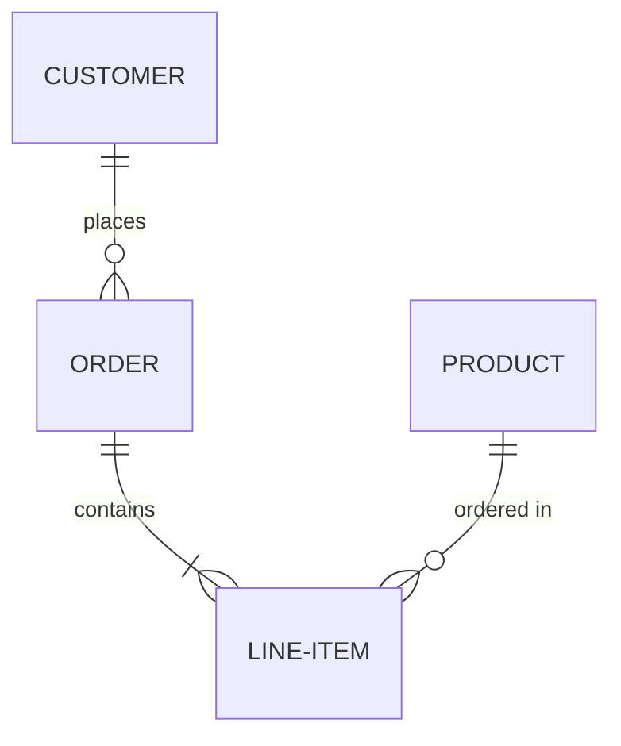
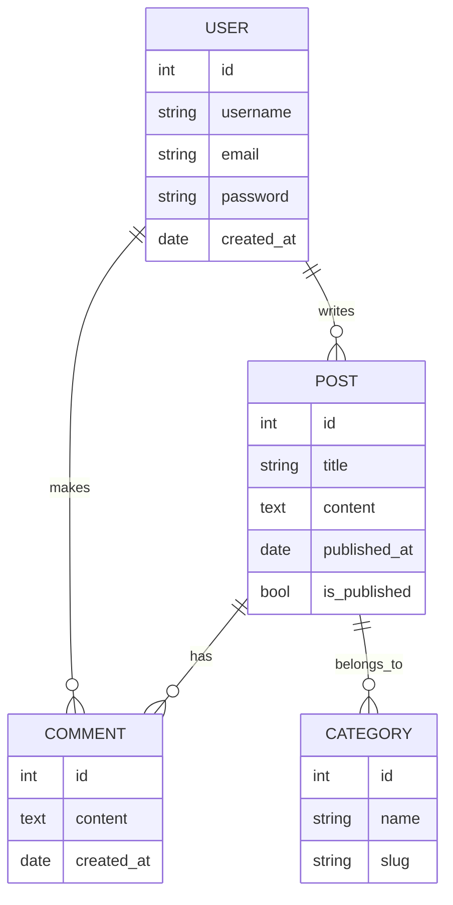
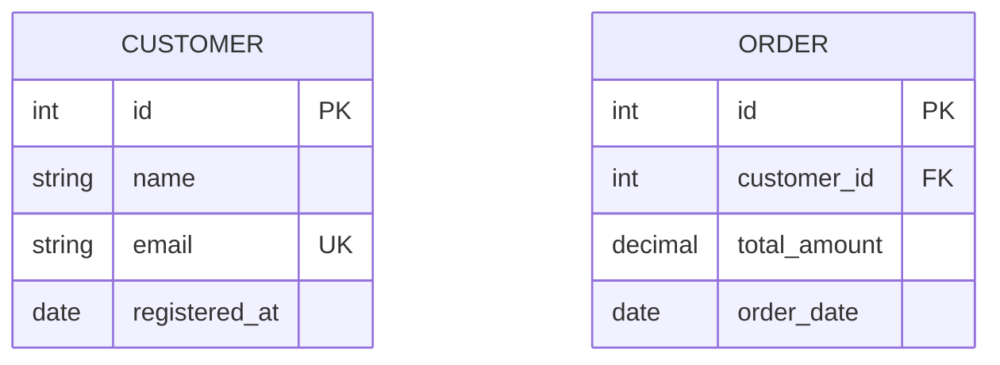
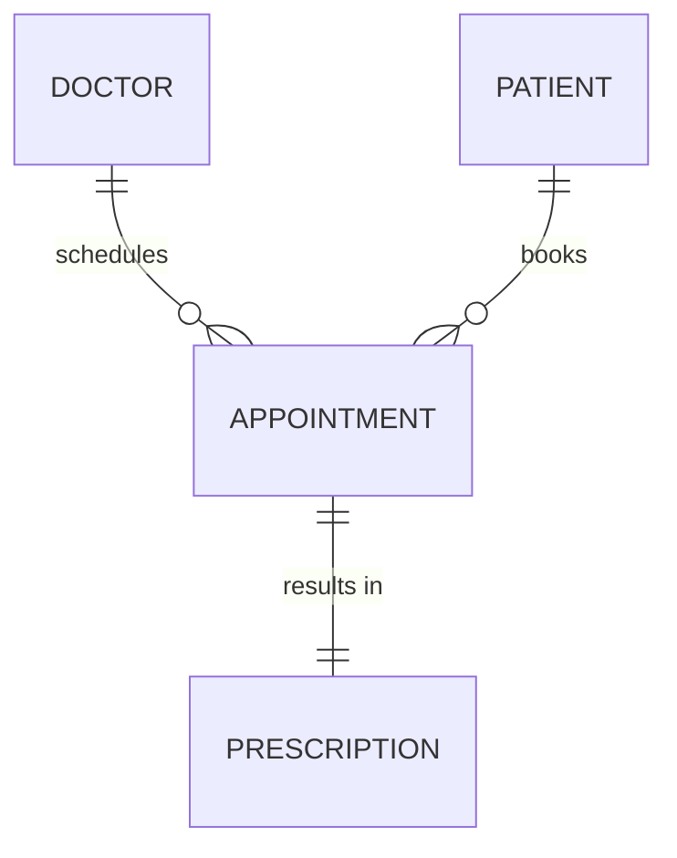
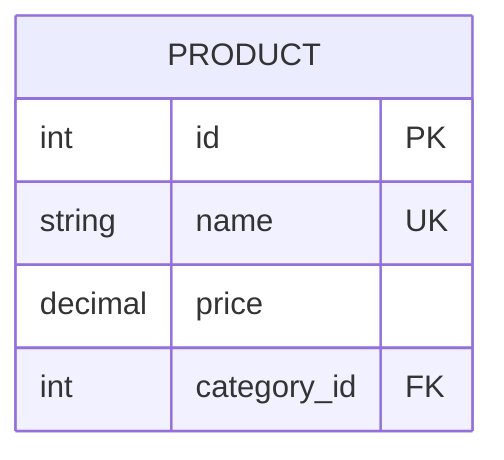

# Entity Relationship Diagram

Entity Relationship (ER) diagrams are used to model the relationships between entities in a database system. They show the logical structure of databases.

## Syntax

### Basic Elements
- Entities: `entity EntityName`
- Attributes: Listed within entities
- Relationships: Various types of connections between entities
- Cardinality: `|o--o|`, `}o--o{`, etc.

### Relationship Types
- One-to-One: `||--||`
- One-to-Many: `||--o{`
- Many-to-One: `}o--||`
- Many-to-Many: `}o--o{`

## Basic Example

## Advanced Example

Here's a more complex ER diagram showing a blog system:

## Attributes and Types

You can specify attributes with their types:

## Relationship Labels

You can add labels to describe relationships:

## Additional Features

### Key Types
- PK: Primary Key
- FK: Foreign Key
- UK: Unique Key

## Styling

The appearance can be customized with:
- Different relationship types
- Attribute types
- Relationship labels
- Entity names and descriptions

## Tips
- Use clear and descriptive entity names
- Include important attributes only
- Show relationships with proper cardinality
- Add meaningful relationship descriptions
- Consider normalization rules
- Group related entities together
- Use standard naming conventions
