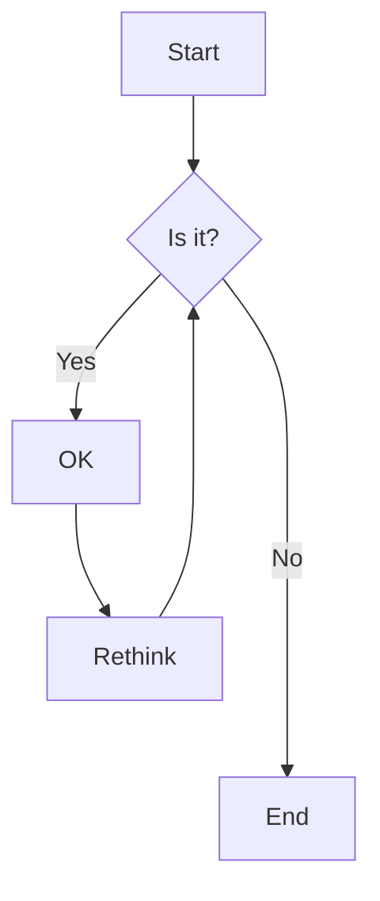
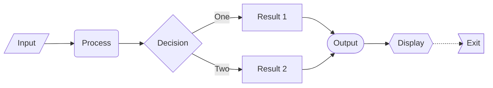
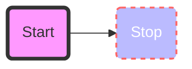

# Flowchart

Flowcharts are diagrams that represent workflows or processes. Mermaid can render flowcharts from text descriptions.

## Syntax

### Nodes
- `id[text]` - Rectangle node
- `id(text)` - Rounded rectangle node
- `id([text])` - Stadium-shaped node
- `id[[text]]` - Subroutine node
- `id>text]` - Asymmetric node
- `id{text}` - Rhombus node
- `id{{text}}` - Hexagon node
- `id[/text/]` - Parallelogram node
- `id[\text\]` - Parallelogram alt node

### Links
- `-->` - Arrow
- `---` - Open link
- `-.->` - Dotted link
- `==>` - Thick link
- `--text-->` - Arrow with text
- `--text---` - Open link with text
- `==text==>` - Thick link with text

## Example

## Advanced Example

Here's a more complex flowchart showing various node types and connections:

## Direction

You can specify the direction of the flowchart:
- `TB` - Top to bottom
- `TD` - Top-down (same as TB)
- `BT` - Bottom to top
- `RL` - Right to left
- `LR` - Left to right

## Styling

You can add styles to nodes and links:

## Tips
- Keep the flowchart simple and clear
- Use consistent node types for similar elements
- Add meaningful labels to connections
- Consider the direction that best presents your flow
