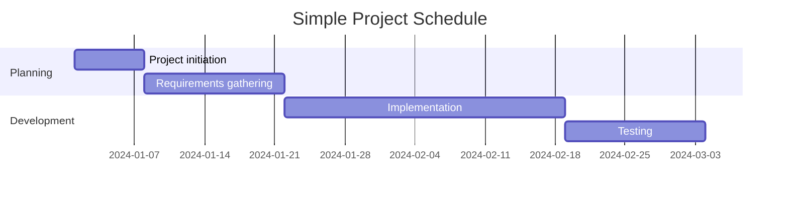
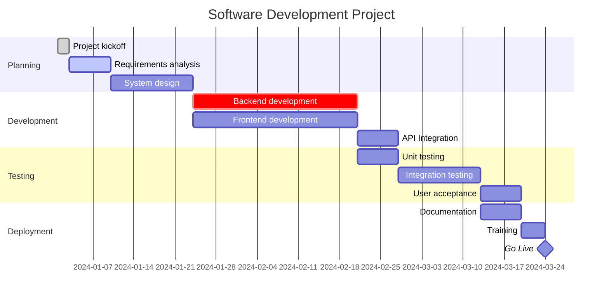
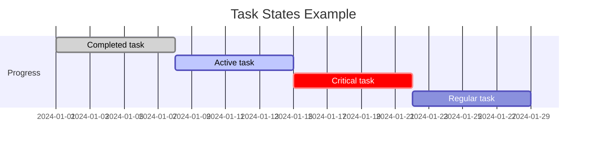
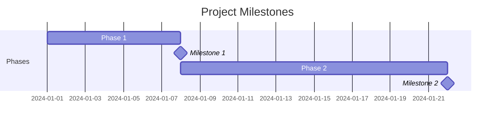
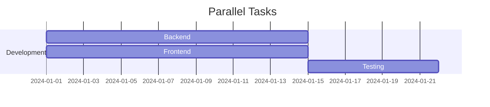

# Gantt Chart

Gantt charts are used for project planning and scheduling. They show tasks, their durations, and dependencies over time.

## Syntax

### Basic Elements
- Title: `title [Chart Title]`
- Date format: `dateFormat YYYY-MM-DD`
- Section: `section [Section Name]`
- Tasks: `[Task Name] : [Task ID], [Start Date], [Duration]`
- Dependencies: `after [Task ID]`

### Time Units
- Minute: `1m`
- Hour: `1h`
- Day: `1d`
- Week: `1w`
- Month: `1M`

## Basic Example

## Advanced Example

Here's a more complex Gantt chart showing a software development project:

## Task States

You can mark tasks with different states:
- `done` - Completed tasks
- `active` - Currently active tasks
- `crit` - Critical tasks

## Additional Features

### Milestones

Milestones are tasks with zero duration:

### Parallel Tasks

Tasks can run in parallel if they don't have dependencies:

## Styling

The appearance can be customized with:
- Different task states (done, active, crit)
- Milestones
- Sections for grouping
- Dependencies between tasks

## Tips
- Keep task names concise but descriptive
- Use meaningful section names
- Show critical dependencies
- Include milestones for important dates
- Group related tasks in sections
- Consider using different states to show progress
- Be realistic with time estimates
