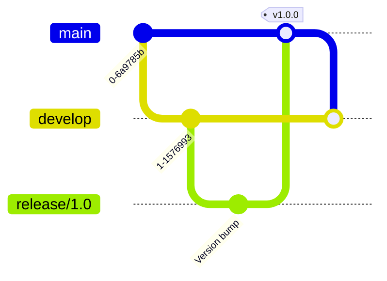

# Git Graph

Git graphs visualize Git repository history, showing commits, branches, and merges in a clear and understandable way.

## Syntax

### Basic Elements
- Commits: `commit id: "message"`
- Branches: `branch [name]`
- Checkouts: `checkout [branch]`
- Merges: `merge [branch]`
- Cherry-picks: `cherry-pick [id]`

## Basic Example

## Advanced Example

Here's a more complex git graph showing feature development workflow:

## Branch Management

## Release Management

## Additional Features

### Tags and Releases

### Cherry-picking

## Styling

The git graph automatically:
- Shows commit history
- Displays branch names
- Indicates merge points
- Shows tags and releases
- Uses different colors for branches

## Tips
- Keep commit messages clear and concise
- Use meaningful branch names
- Show important tags and releases
- Include significant merges
- Demonstrate branch strategy
- Keep the graph simple and readable
- Use consistent branch naming conventions
- Include relevant commit IDs when needed
