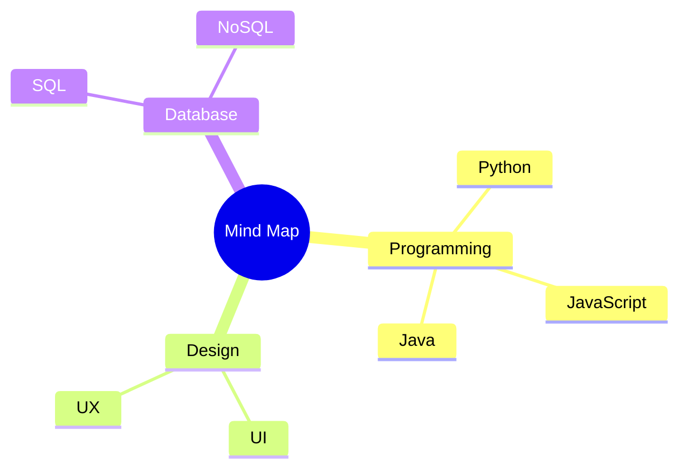
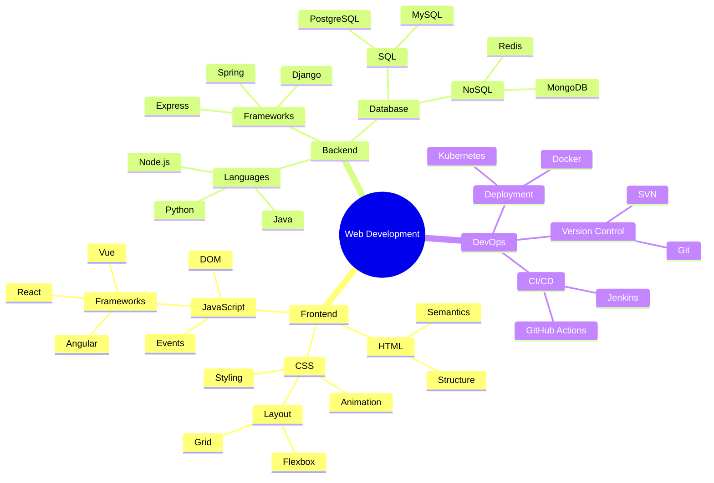
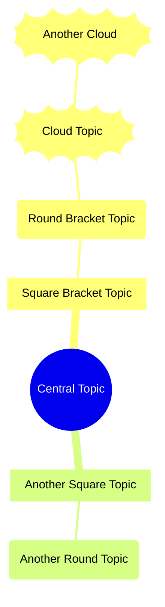
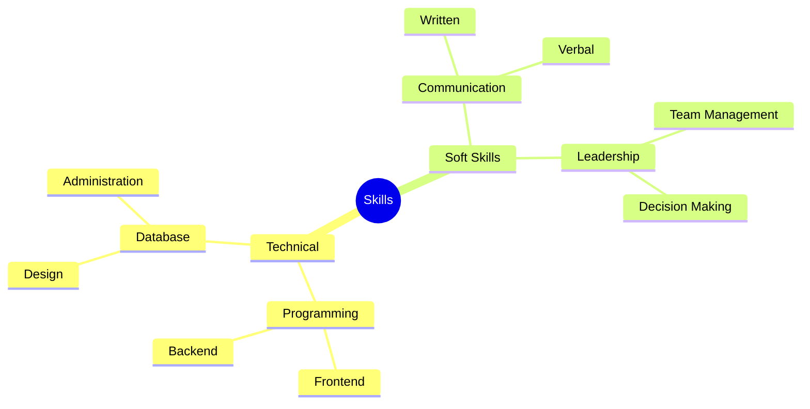

# Mind Map

Mind maps are diagrams used to visually organize information hierarchically. They're excellent for brainstorming, note-taking, and organizing complex ideas.

## Syntax

### Basic Elements
- Root: The central idea
- Branches: Main topics and subtopics
- Square Brackets: `[text]` for formatting
- Parentheses: `(text)` for formatting

## Basic Example



## Advanced Example

Here's a more detailed mind map for a web development project:



## Formatting Options

### Shapes and Styles



### Icons and Markers

```mermaid
mindmap
    root((Project Planning))
        [Priority Tasks]::icon(fa fa-star)
            Task 1
            Task 2
        [Timeline]::icon(fa fa-calendar)
            Week 1
            Week 2
        [Resources]::icon(fa fa-users)
            Team A
            Team B
```

## Additional Features

### Multiple Levels



## Styling

The mind map automatically:
- Centers the root node
- Arranges branches hierarchically
- Uses different shapes for nodes
- Applies consistent spacing
- Shows relationships clearly

## Tips
- Start with a clear central idea
- Use concise labels
- Organize related concepts together
- Limit the depth of branches
- Use consistent formatting
- Keep the structure balanced
- Add visual hierarchy with shapes
- Focus on key relationships
- Use meaningful groupings
