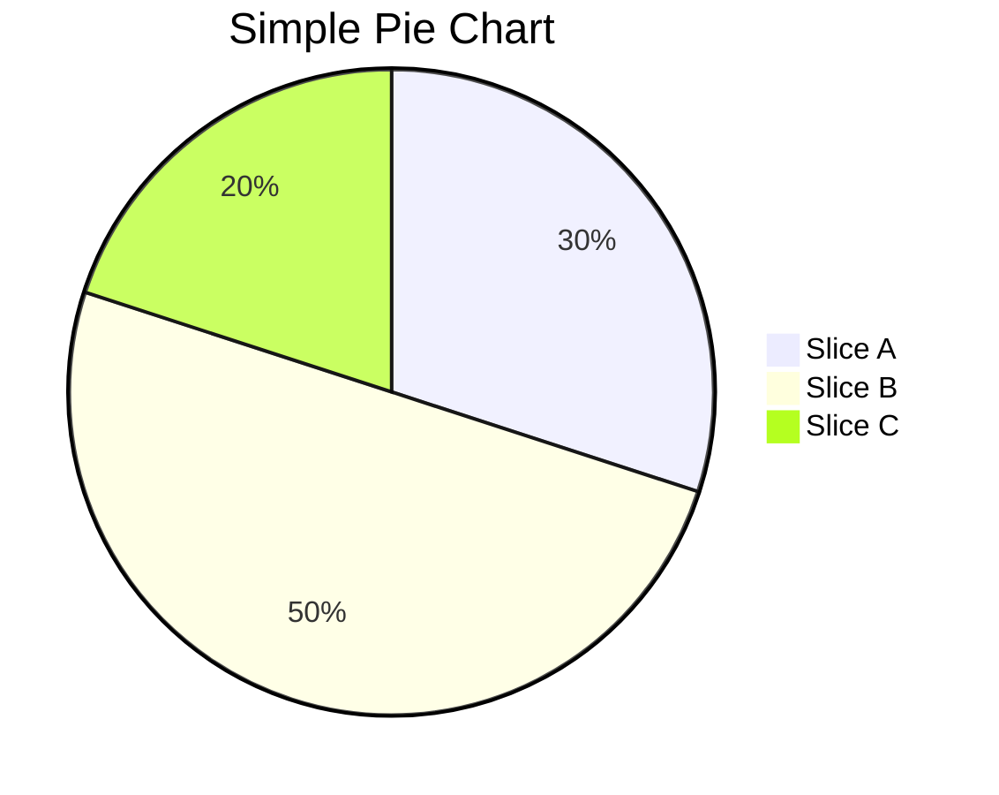
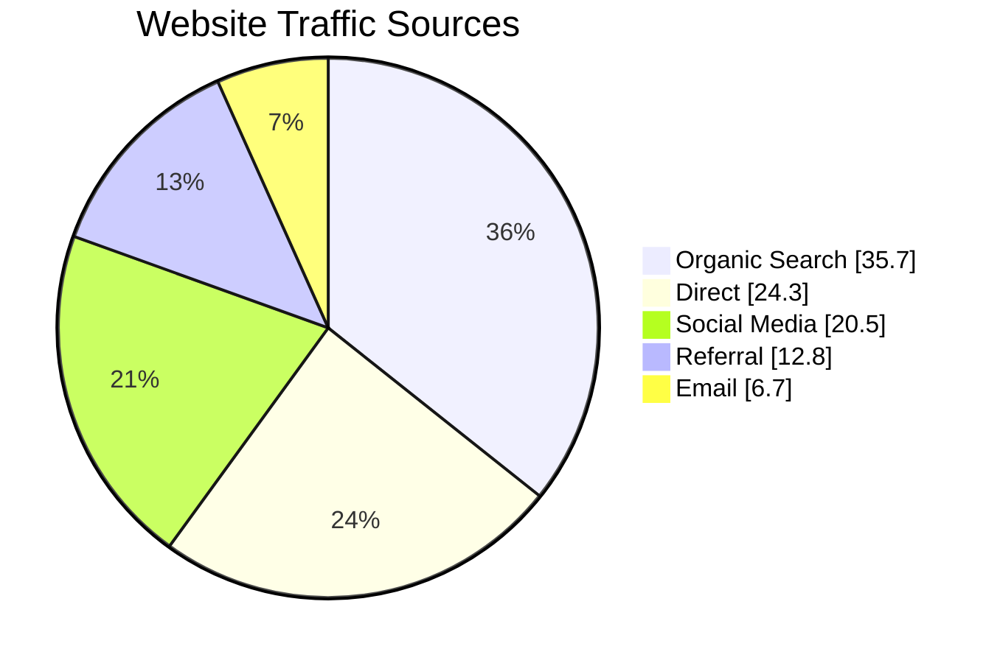
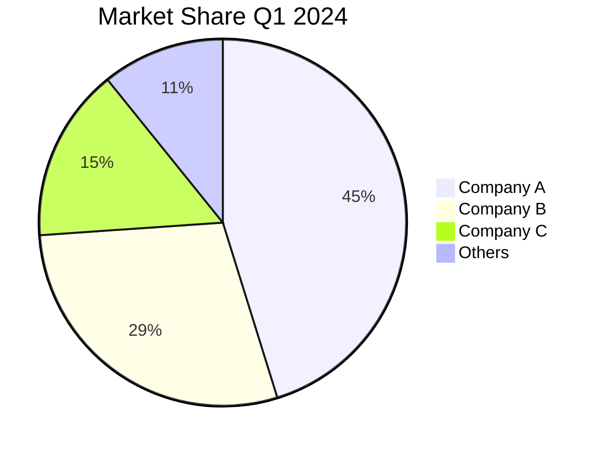
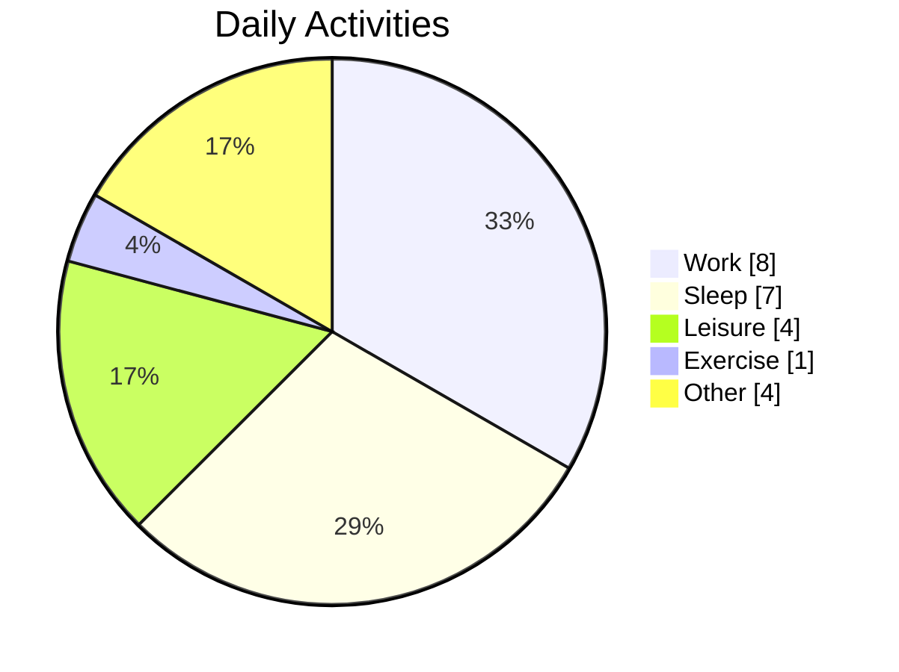
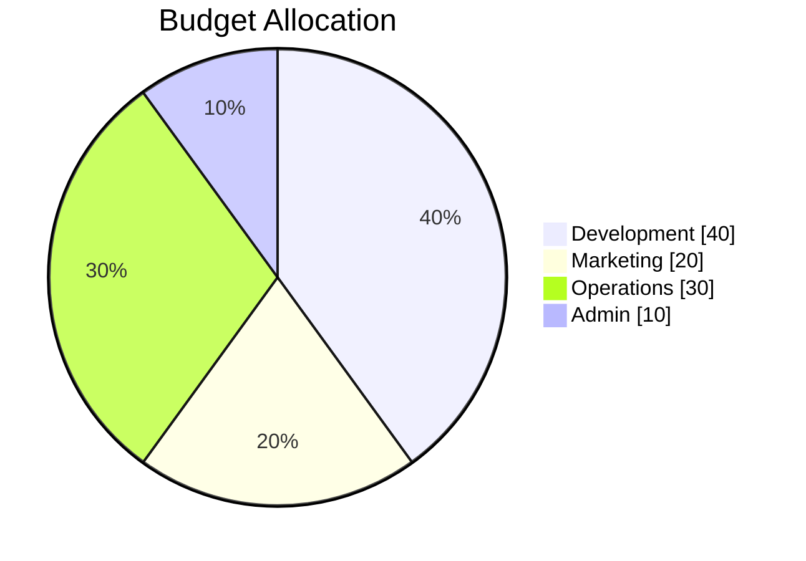

# Pie Chart

Pie charts are circular statistical graphics that display numerical proportions by dividing a circle into proportional slices.

## Syntax

### Basic Elements
- Title: `pie title [Chart Title]`
- Data entries: `"[Label]" : [Value]`
- Optional: `showData` - shows the values

## Basic Example

## Advanced Example

Here's a more detailed pie chart showing website traffic sources:

## Data Visualization

### Market Share Example

### Time Distribution

## Features

### Show Data Values

You can show the actual values using `showData`:

## Styling

The pie chart automatically:
- Assigns different colors to slices
- Calculates proportions
- Displays labels
- Shows percentage and/or values (with showData)

## Tips
- Keep the number of slices manageable (ideally less than 7)
- Use clear and concise labels
- Consider ordering slices by size
- Use meaningful titles
- Add `showData` when actual values are important
- Ensure values sum up to a meaningful total
- Use consistent decimal places for values
