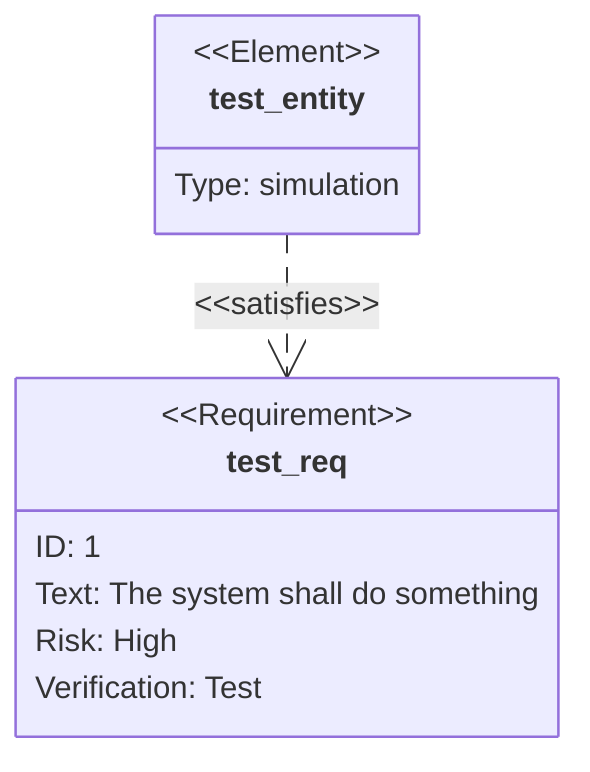
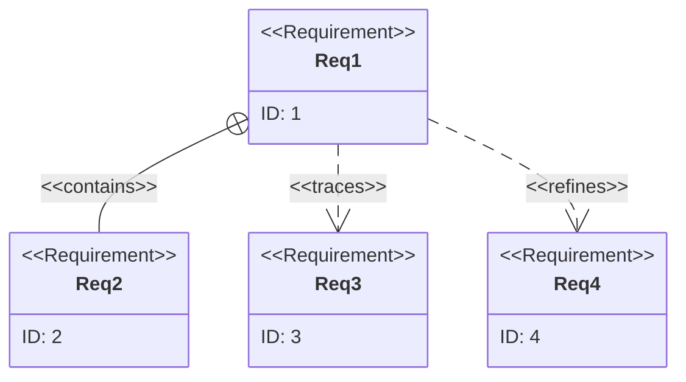

# Requirement Diagram

Requirement diagrams help visualize system requirements and their relationships. They're useful for documenting system specifications and dependencies.

## Syntax

### Basic Elements
- Requirements: `requirement [Name] { [Properties] }`
- Elements: `element [Name] { [Properties] }`
- Relationships: 
  - Contains: `contains`
  - Copies: `copies`
  - Derives: `derives`
  - Satisfies: `satisfies`
  - Verifies: `verifies`
  - Refines: `refines`
  - Traces: `traces`

## Basic Example



## Advanced Example

Here's a more complex requirement diagram for a login system:

```mermaid
requirementDiagram
    requirement UserAuth {
        id: REQ-001
        text: System must implement user authentication
        risk: medium
        verifyMethod: test
    }

    requirement SecureLogin {
        id: REQ-002
        text: Users must securely log in to the system
        risk: high
        verifyMethod: test
    }

    requirement PasswordPolicy {
        id: REQ-003
        text: Passwords must meet security requirements
        risk: high
        verifyMethod: test
    }

    element AuthService {
        type: service
    }

    element SecurityModule {
        type: module
    }

    AuthService - satisfies -> UserAuth
    SecurityModule - satisfies -> SecureLogin
    SecurityModule - satisfies -> PasswordPolicy
    SecureLogin - contains -> PasswordPolicy
```

## Requirement Properties

Requirements can have these properties:
- `id`: Unique identifier
- `text`: Description
- `risk`: Risk level (low, medium, high)
- `verifyMethod`: Verification method (test, inspection, demonstration)

## Relationship Types



## Element Types

Elements can be of different types:
```mermaid
requirementDiagram
    element UI {
        type: ui
    }
    element API {
        type: service
    }
    element Database {
        type: database
    }
    
    requirement SystemReq {
        id: SR-001
    }

    UI - satisfies -> SystemReq
    API - satisfies -> SystemReq
    Database - satisfies -> SystemReq
```

## Styling

The diagram automatically:
- Formats requirement boxes
- Shows relationship types
- Displays element types
- Organizes the layout

## Tips
- Use clear and unique IDs
- Write concise requirement descriptions
- Specify appropriate risk levels
- Include verification methods
- Show meaningful relationships
- Group related requirements
- Use appropriate element types
- Keep the diagram hierarchy clear
