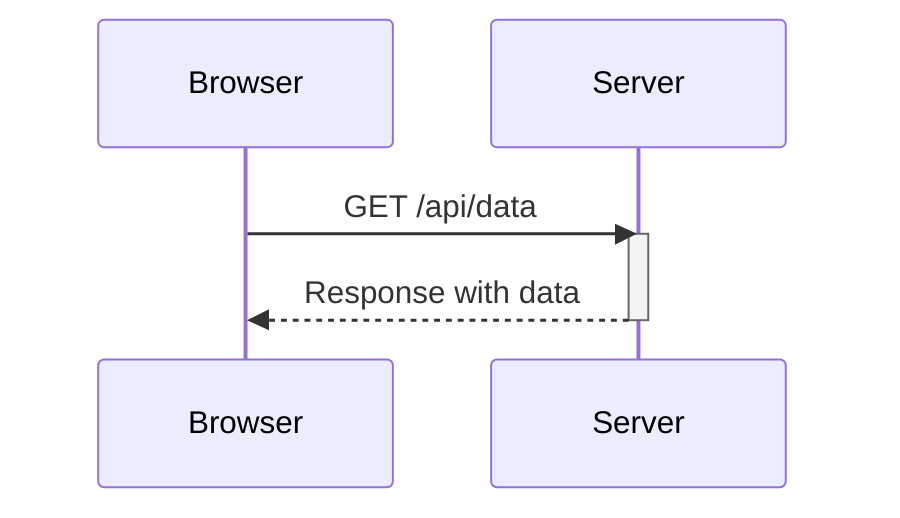
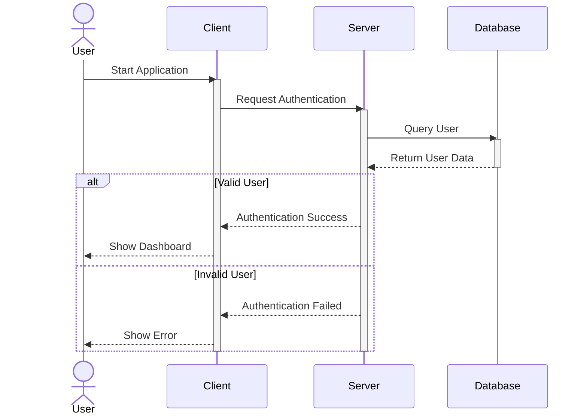
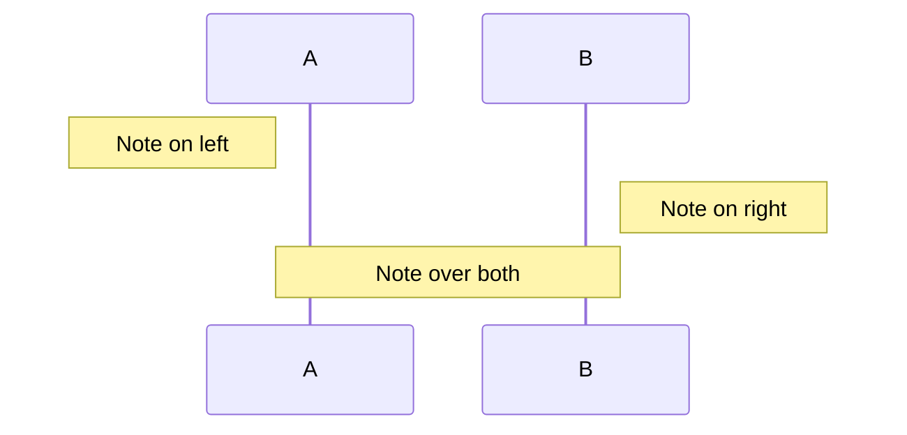
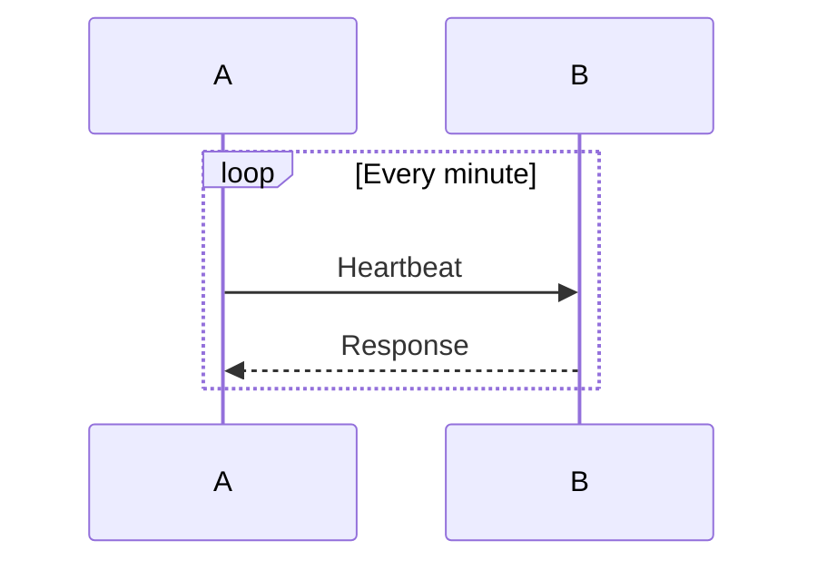

# Sequence Diagram

Sequence diagrams show how processes operate with one another and in what order. They're excellent for documenting system interactions.

## Syntax

### Basic Elements
- Participants: `participant A` or `actor A`
- Messages: 
  - Solid line: `->` 
  - Dotted line: `-->`
  - Solid line with arrowhead: `->>` 
  - Dotted line with arrowhead: `-->>`
- Activations: `activate` and `deactivate`
- Notes: `Note left of`, `Note right of`, `Note over`
- Loops: `loop [text]`
- Alternative paths: `alt [text]` and `else [text]`
- Optional paths: `opt [text]`
- Parallel paths: `par [text]`

## Basic Example

## Advanced Example

Here's a more complex sequence diagram showing various features:

## Additional Features

### Notes

### Loops

## Styling

You can customize the appearance using these directives:
- `autonumber` - Automatically number the messages
- `participant A as "Display Name"` - Use aliases for participants
- Colors and other styles can be applied using CSS

## Tips
- Keep the diagram focused on the key interactions
- Use clear and concise message descriptions
- Group related interactions using loops or alt/opt blocks
- Add notes to explain complex interactions
- Consider using aliases for long participant names
