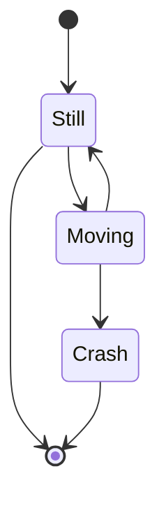
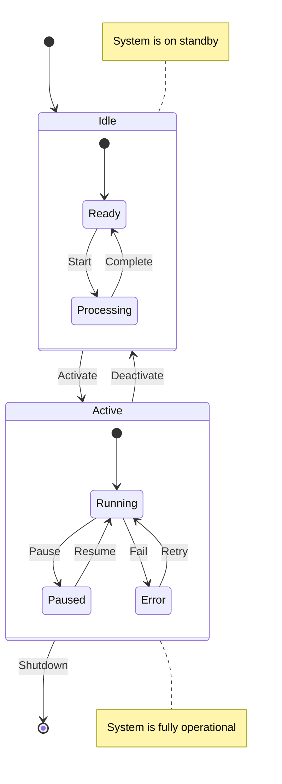
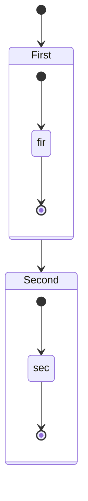
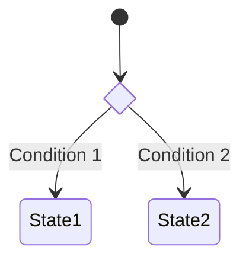
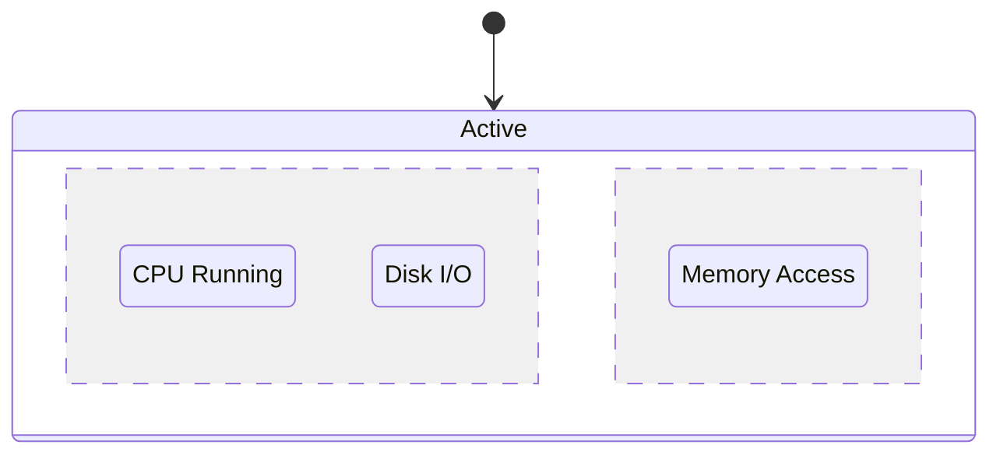

# State Diagram

State diagrams describe the different states of a system and the transitions between those states. They are particularly useful for modeling the behavior of reactive systems.

## Syntax

### Basic Elements
- States: `state StateName`
- Transitions: `-->` 
- Start state: `[*]`
- End state: `[*]`
- Composite states: Can contain nested states
- Choice points: `<<choice>>`
- Notes: `note left/right of`

## Basic Example

## Advanced Example

Here's a more complex state diagram showing various features:

## Composite States

## Choice Points

## Concurrent States

## Styling

You can customize the appearance using:
- Different arrow types
- State descriptions
- Notes
- Direction (LR or TB)

## Tips
- Start with the main states of your system
- Use clear and concise state names
- Include all possible transitions
- Add conditions to transitions when necessary
- Use composite states to manage complexity
- Document important state behaviors with notes
