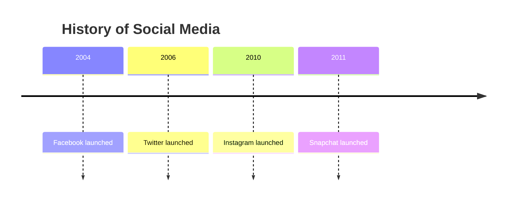
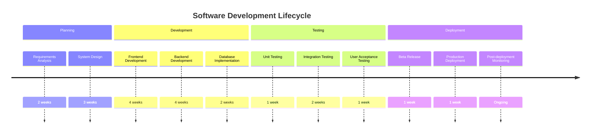
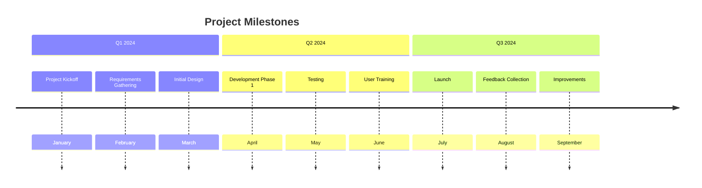
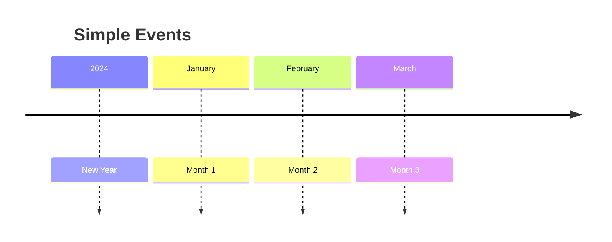
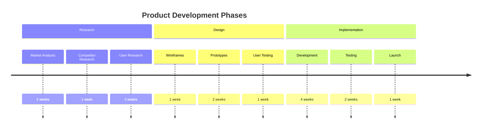

# Timeline

Timeline diagrams visualize a sequence of events in chronological order. They're perfect for project planning, historical events, and process documentation.

## Syntax

### Basic Elements
- Title: Optional title for the timeline
- Section: Group events into sections
- Events: Individual timeline entries

## Basic Example

## Advanced Example

Here's a more detailed timeline showing a software development lifecycle:

## Project Timeline

## Event Types

### Simple Events

### Sectioned Events

## Styling

The timeline automatically:
- Arranges events chronologically
- Groups related events in sections
- Shows duration when specified
- Maintains consistent spacing
- Displays clear relationships

## Tips
- Keep event descriptions concise
- Use meaningful section names
- Include important dates
- Group related events together
- Show clear progression
- Include durations when relevant
- Use consistent formatting
- Focus on key milestones
- Consider the timeline's scale
