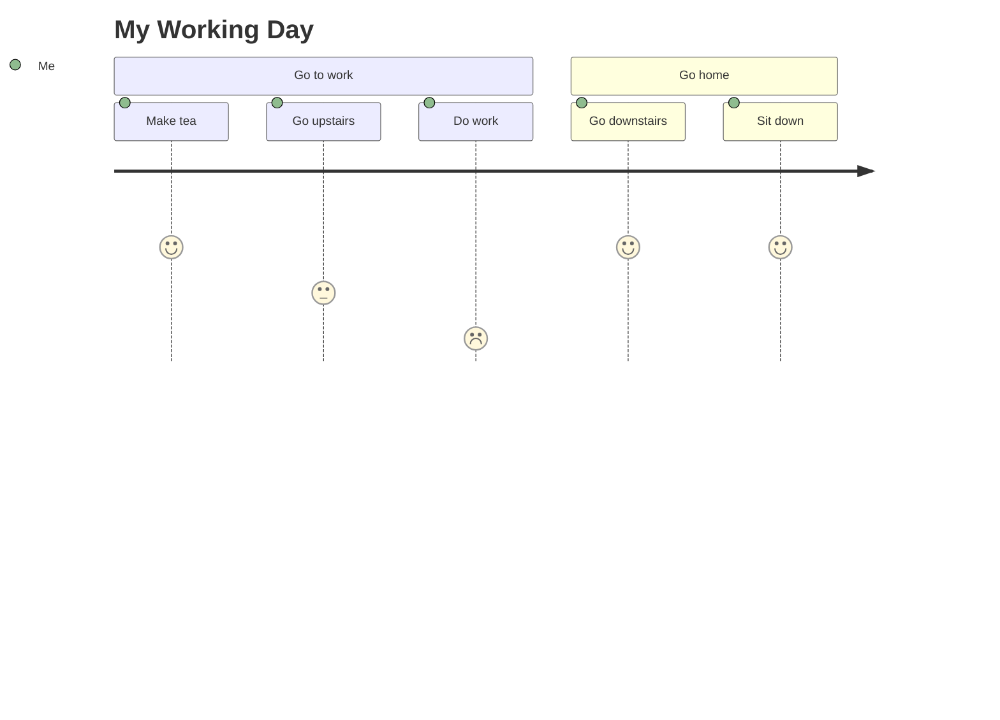
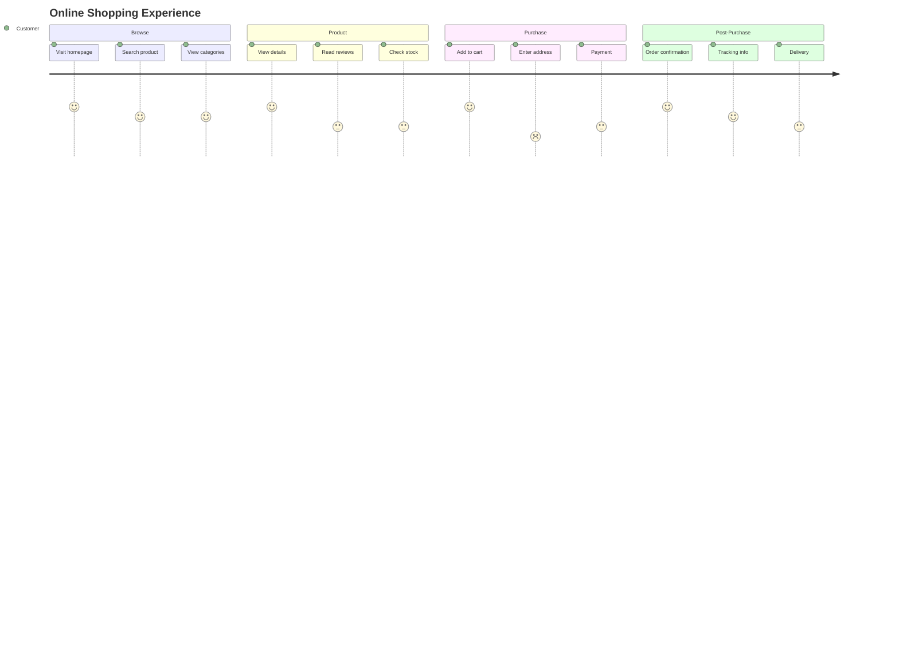
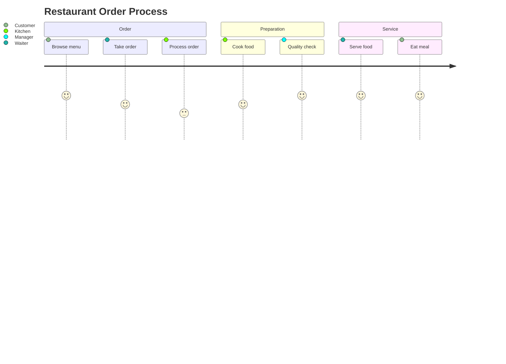

# User Journey

User Journey diagrams help visualize and analyze the user's experience through a process or service. They're excellent for mapping customer interactions and identifying pain points.

## Syntax

### Basic Elements
- Sections: Represented as columns
- Tasks: Activities within sections
- Scores: Numerical ratings for each task (1-5)

### Basic Structure
```
journey
    title [Journey Title]
    section [Section Name]
        [Task]: [Score]: [Actor]
```

## Basic Example



## Advanced Example

Here's a more complex user journey showing an e-commerce experience:



## Scoring System

The scoring system uses numbers 1-5:
1. Very Negative 😫
2. Negative 😟
3. Neutral 😐
4. Positive 😊
5. Very Positive 😄

## Additional Features

### Multiple Actors



## Styling

The diagram automatically:
- Colors sections differently
- Shows emoji for scores
- Aligns tasks in chronological order
- Groups related tasks in sections

## Tips
- Keep section names clear and concise
- Use meaningful task descriptions
- Be honest with scoring
- Include all key touchpoints
- Consider multiple user personas if relevant
- Focus on the user's perspective
- Use sections to group related activities
