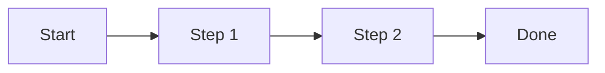
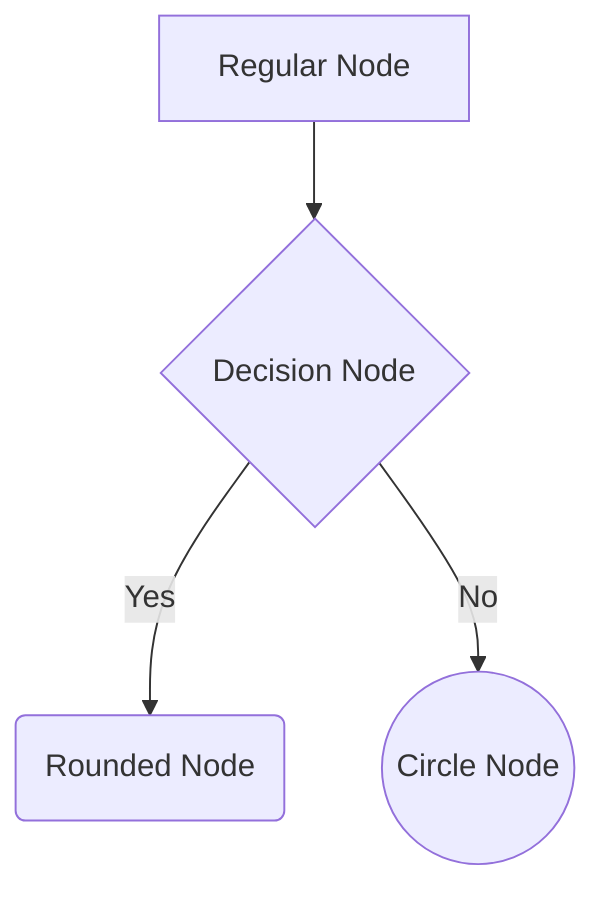

# Getting Started

This guide will help you quickly get started with Mermaid and Mermaid Viewer.

## Installation

No software installation needed to use Mermaid Viewer! All you need to do is:

1. Open your browser
2. Visit [Mermaid Viewer](https://mermaidviewer.com)

That's it!

## Create Your First Diagram

Let's start by creating a simple flowchart:

1. In [Mermaid Viewer](https://mermaidviewer.com), click "New Diagram"
2. Choose "Flowchart" type
3. Copy the following code into the editor:

That's it! You've created your first Mermaid diagram.

## Basic Syntax

Mermaid's basic syntax is very intuitive:

- Use `graph` to declare a flowchart
- Use `-->` to create connections
- Use `[]` for rectangular nodes
- Use `{}` for diamond nodes
- Use `()` for rounded nodes

For example:

## Next Steps

Now that you understand the basics, you can:

- Explore [different types of diagrams](/diagrams/flowchart)
- Learn how to [use Mermaid Viewer](/introduction/what-is-mermaid)
- Check out more [examples and usage](/diagrams/sequence)

## Tips and Tricks

1. Use the live preview feature to see your changes instantly
2. Take advantage of the auto-complete functionality
3. Use the share feature to collaborate with others
4. Save your diagrams for later editing

Ready to dive deeper? Let's explore [Mermaid Viewer's features](/introduction/what-is-mermaid)! 