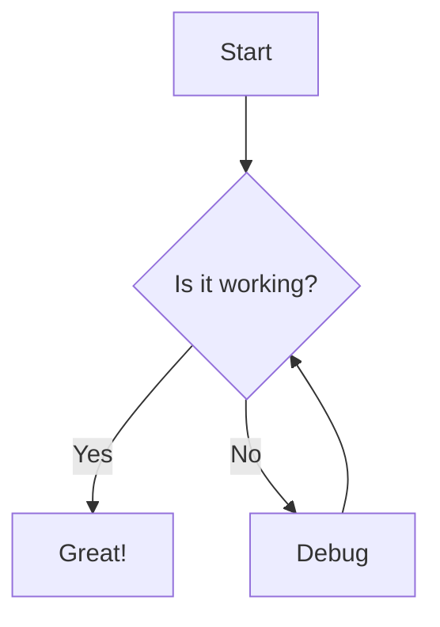
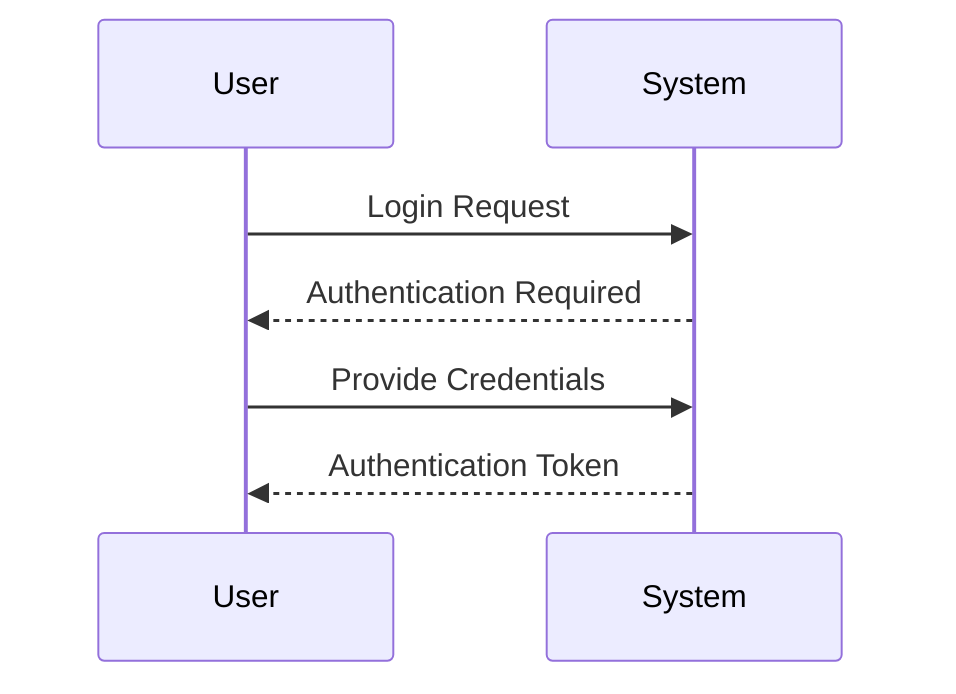

# What is Mermaid?

Mermaid is a JavaScript-based diagramming and charting tool that renders Markdown-inspired text definitions to create and modify diagrams dynamically. With Mermaid, you can create various types of diagrams using simple text-based descriptions.

## Example

Here's a simple flowchart example:

## Why Mermaid?

- **Simple Syntax**: Create diagrams using intuitive text-based syntax
- **Version Control Friendly**: Diagrams can be tracked in version control systems
- **Multiple Diagram Types**: Support for flowcharts, sequence diagrams, class diagrams, and more
- **Customizable**: Extensive styling and theming options
- **Web-based**: No need for special software installation

## Getting Started

To start creating diagrams with Mermaid Viewer:

1. Visit [Mermaid Viewer](https://mermaidviewer.com)
2. Choose your diagram type
3. Write your diagram code
4. See the preview in real-time

Here's another example showing a sequence diagram:

Ready to create your own diagrams? Check out our [Getting Started Guide](/introduction/getting-started) or try [Mermaid Viewer](https://mermaidviewer.com) now!
