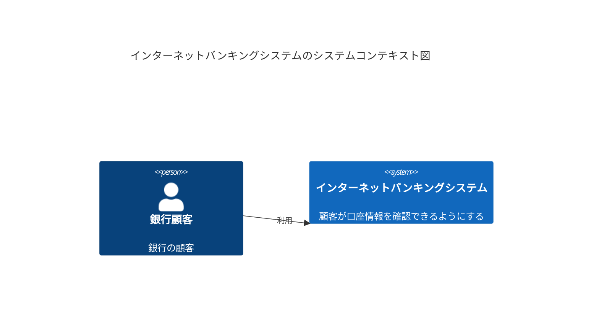
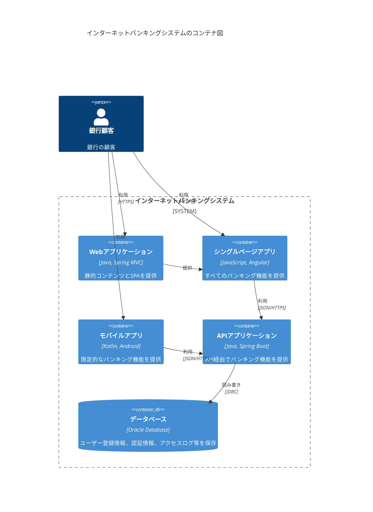
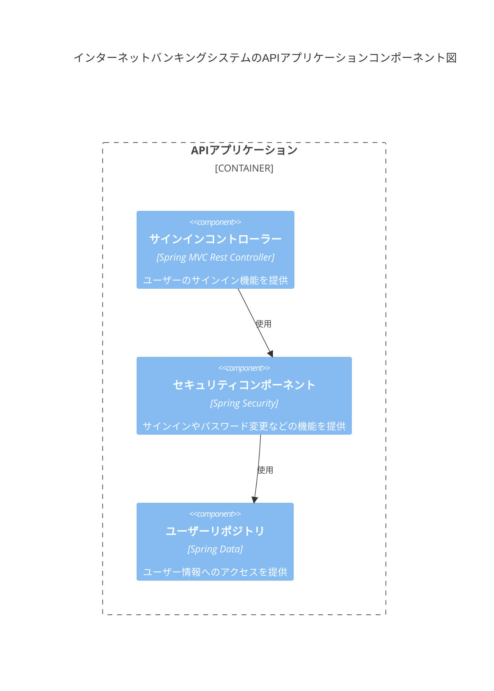
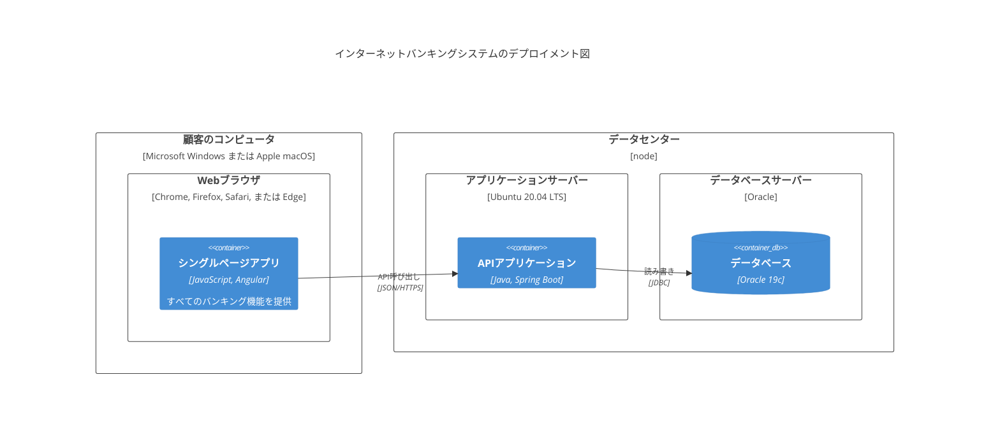
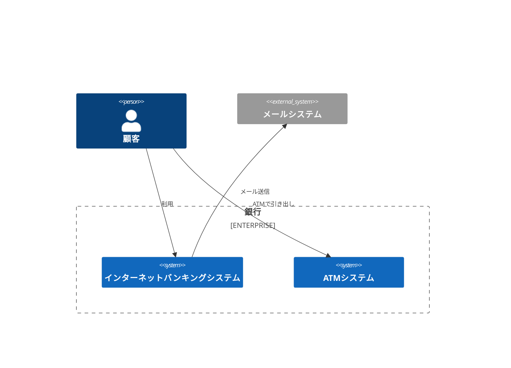

# C4 図

C4 図は、異なる抽象レベルでソフトウェアアーキテクチャを視覚化する方法を提供します。C4 モデルは、コンテキスト(Context)、コンテナ(Container)、コンポーネント(Component)、コード(Code)の4つのレベルの図で構成されています。

## 構文

### 基本要素
- 人: `Person(エイリアス, ラベル)`
- システム: `System(エイリアス, ラベル)`
- コンテナ: `Container(エイリアス, ラベル, 技術)`
- コンポーネント: `Component(エイリアス, ラベル, 技術)`
- 関係: `Rel(from, to, ラベル)`

## 基本例

## 応用例

より詳細なWebアプリケーションのコンテナ図：

## コンポーネントレベル

## デプロイメント図

## 追加機能

### 境界と企業

## スタイル設定

C4 図は自動的に：
- 異なる種類の要素をフォーマット
- 関係と依存関係を表示
- 技術スタックを表示
- 階層構造を整理
- 一貫した視覚言語を使用

## 実用的なヒント
- コンテキスト図から開始
- コンテナとコンポーネントビューで徐々に詳細を追加
- 図の焦点を明確に保つ
- 関連する技術的詳細を含める
- 重要な関係を表示
- 意味のある説明を使用
- 適切な場所に技術選択を含める
- 対象者の技術レベルを考慮

## よくある問題の解決

1. **複雑さの問題**
   - 適切な抽象レベルを選択
   - 複雑なシステムを分解
   - 境界を使用して要素を整理

2. **可読性の問題**
   - 明確な階層構造を維持
   - 過度な関係線を避ける
   - 意味のあるラベルを使用

3. **一貫性の問題**
   - C4モデルの規約に従う
   - 命名の一貫性を保つ
   - 統一された表現方法を使用

## ベストプラクティス
- 適切な抽象レベルを選択
- 図をシンプルに保つ
- 明確な命名を使用
- 必要な技術的詳細を含める
- 重要な関係を強調
- 図の対象者を考慮
- ビュー間の一貫性を保つ

## 次のステップ
- [マインドマップ](/ja/diagrams/mindmap)
- [タイムライン](/ja/diagrams/timeline)
- [Gitグラフ](/ja/diagrams/git) 