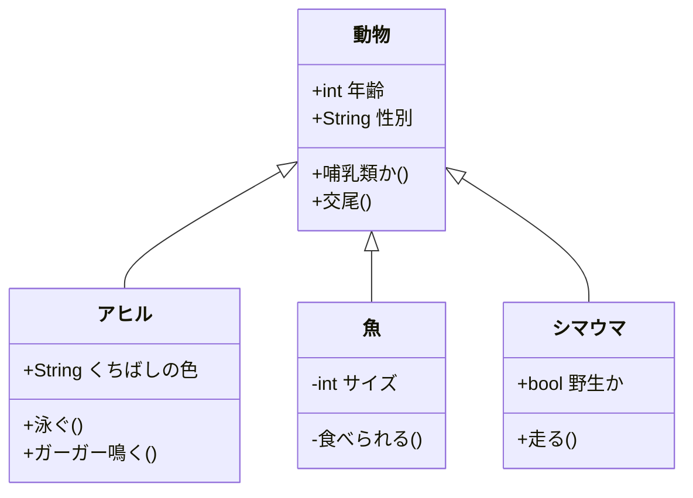
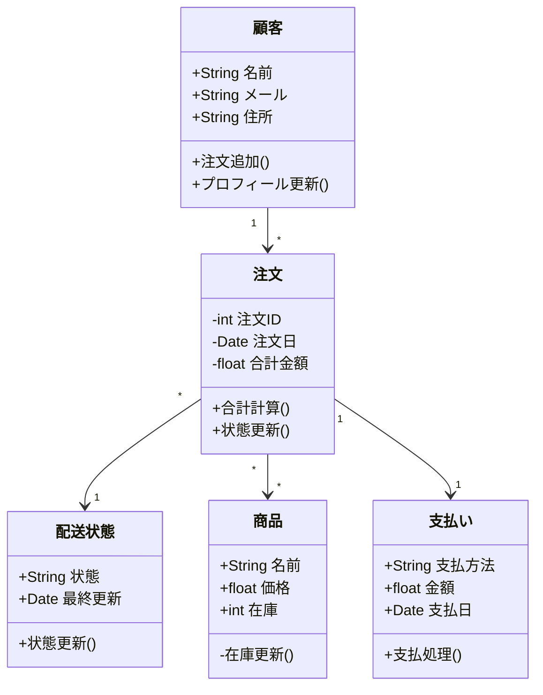
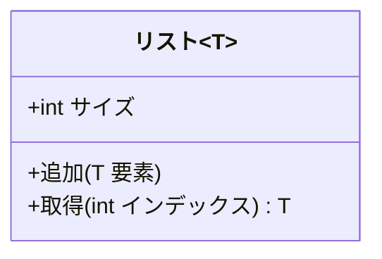
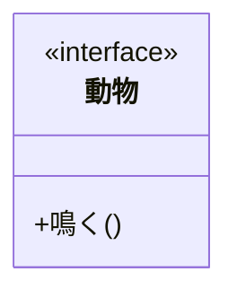
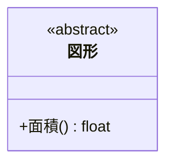

# クラス図

クラス図はオブジェクト指向モデリングの中心です。システム内のクラス、その属性、操作、およびクラス間の関係を示します。

## 構文

### クラスの定義
```
class クラス名 {
    +パブリックフィールド
    -プライベートフィールド
    #プロテクテッドフィールド
    +パブリックメソッド()
    -プライベートメソッド()
    #プロテクテッドメソッド()
}
```

### 関係の種類
- 継承: `<|--`
- コンポジション: `*--`
- 集約: `o--`
- 関連: `-->`
- 依存: `..>`
- 実装: `<|..`

## 基本例



## 応用例

様々な関係と機能を示す複雑なクラス図の例：



## 追加機能

### ジェネリック型


### インターフェース


### 抽象クラス


## スタイル設定

可視性を示す記号：
- `+` パブリック
- `-` プライベート
- `#` プロテクテッド
- `~` パッケージ/内部

## 実用的なヒント
- クラスは単一責任の原則に従う
- 意味のあるクラス名とメソッド名を使用
- 関連する属性とメソッドのみを表示
- 適切なクラス間の関係を使用
- インターフェースと抽象クラスを適切に使用
- カプセル化に注意
- 継承とコンポジションを適切に使用
- 過度な設計を避ける

## よくある問題の解決

1. **設計の問題**
   - クラスの責任が単一か確認
   - 継承関係が適切か確認
   - 過度な結合を避ける

2. **関係の表現**
   - 関係の種類を正しく使用
   - 関係の方向を明確に
   - 適切な関係の説明を追加

3. **可読性の問題**
   - 関連するクラスを適切にグループ化
   - 交差する関係を減らす
   - 明確な命名を使用

## 次のステップ
- [状態遷移図](/ja/diagrams/state)
- [ER図](/ja/diagrams/er)
- [ユーザージャーニー](/ja/diagrams/user-journey) 