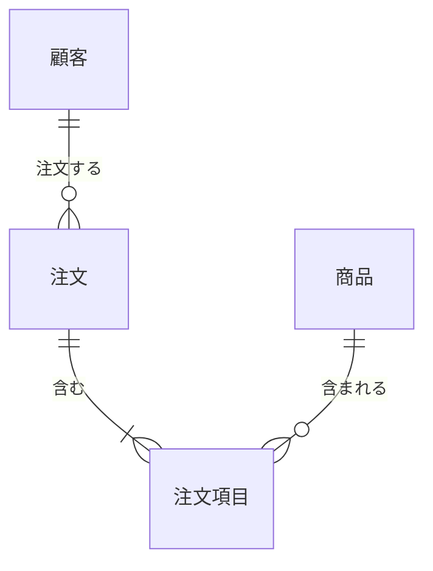
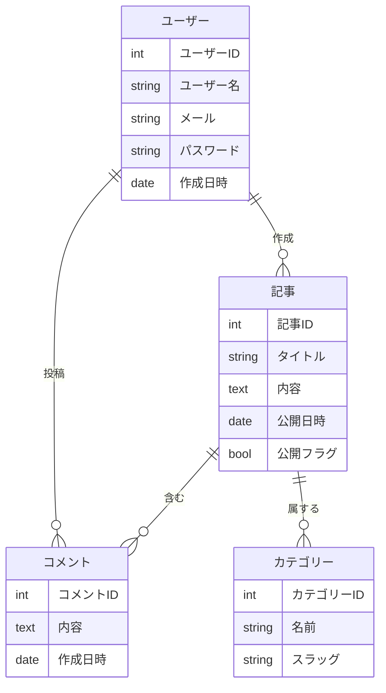
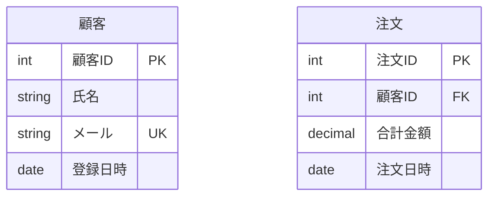
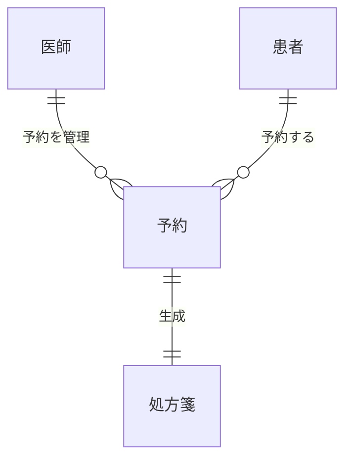
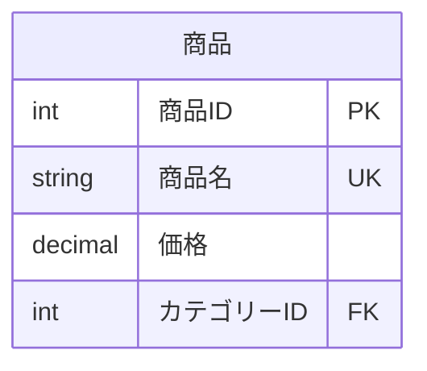

# 実体関係図

実体関係図（ER図）は、データベースシステムにおける実体間の関係をモデル化するために使用されます。データベースの論理構造を示します。

## 構文

### 基本要素
- 実体: `entity 実体名`
- 属性: 実体内にリスト化
- 関係: 実体間の様々な接続タイプ
- カーディナリティ: `|o--o|`, `}o--o{` など

### 関係タイプ
- 一対一: `||--||`
- 一対多: `||--o{`
- 多対一: `}o--||`
- 多対多: `}o--o{`

## 基本例

## 応用例

ブログシステムを示すより詳細なER図：

## 属性とデータ型

属性とそのデータ型を指定できます：

## 関係ラベル

関係を説明するラベルを追加できます：

## 追加機能

### キータイプ
- PK: 主キー
- FK: 外部キー
- UK: ユニークキー

## スタイル設定

外観は以下の方法でカスタマイズできます：
- 異なる関係タイプ
- 属性タイプ
- 関係ラベル
- 実体名と説明

## 実用的なヒント
- 明確で説明的な実体名を使用
- 重要な属性のみを含める
- 正しいカーディナリティで関係を表示
- 意味のある関係の説明を追加
- 正規化ルールを考慮
- 関連する実体をグループ化
- 標準的な命名規則を使用

## よくある問題の解決

1. **設計の問題**
   - 実体名が明確であることを確認
   - 関係のカーディナリティを検証
   - 属性の完全性をチェック

2. **関係の問題**
   - 関係タイプが正しいことを確認
   - 外部キー制約を検証
   - 循環依存をチェック

3. **属性の問題**
   - 属性名が明確であることを確認
   - データ型を検証
   - キーの正確性をチェック

## 次のステップ
- [ユーザージャーニー図](/ja/diagrams/user-journey)
- [ガントチャート](/ja/diagrams/gantt)
- [円グラフ](/ja/diagrams/pie) 