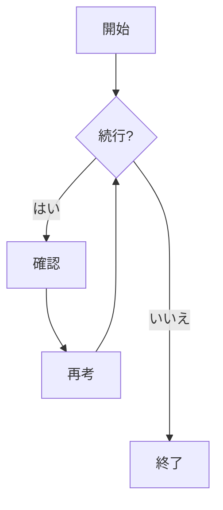
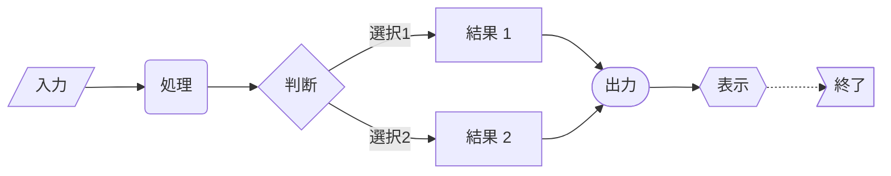
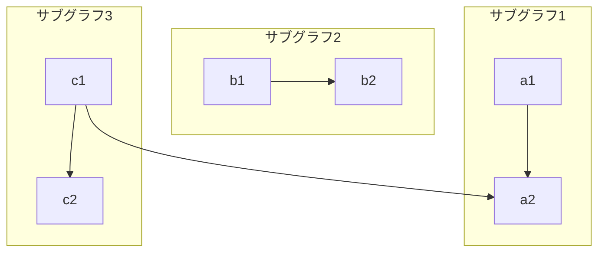
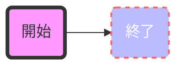
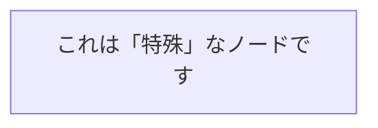

# フローチャート

フローチャートは、ワークフローやプロセスを表現する図です。Mermaid はテキストによる記述からフローチャートを生成することができます。

## 構文

### ノードの種類
- `id[テキスト]` - 四角形ノード
- `id(テキスト)` - 角丸四角形ノード
- `id([テキスト])` - スタジアム形ノード
- `id[[テキスト]]` - サブルーチン形ノード
- `id>テキスト]` - 非対称ノード
- `id{テキスト}` - ひし形ノード
- `id{{テキスト}}` - 六角形ノード
- `id[/テキスト/]` - 平行四辺形ノード
- `id[\テキスト\]` - 逆平行四辺形ノード

### 接続線
- `-->` - 矢印線
- `---` - 実線
- `-.->` - 点線矢印
- `==>` - 太線矢印
- `--テキスト-->` - テキスト付き矢印線
- `--テキスト---` - テキスト付き実線
- `==テキスト==>` - テキスト付き太線矢印

## 基本例

## 応用例

様々なノードタイプと接続方法を示す複雑なフローチャート：

## 方向設定

フローチャートの方向を指定できます：
- `TB` - 上から下
- `TD` - 上から下（TB と同じ）
- `BT` - 下から上
- `RL` - 右から左
- `LR` - 左から右

## サブグラフ

サブグラフを使用して複雑なフローチャートを整理できます：

## スタイル設定

ノードと接続線にスタイルを適用できます：

## 特殊構文

### エスケープ文字
特殊文字を含むテキストには二重引用符を使用します：

### 複数行テキスト
` ` を使用して改行を追加できます：

## 実用的なヒント
- フローチャートはシンプルに保つ
- 類似の要素には一貫したノードタイプを使用
- 接続線には意味のあるラベルを付ける
- フローを最も効果的に示す方向を選択
- サブグラフを使用して複雑なロジックを整理
- スタイルを適切に使用して重要なノードを強調
- 交差する接続を最小限に抑える
- 明確なノード名を使用する

## よくある問題の解決

1. **レイアウトの問題**
   - 図の方向を調整する
   - ノード間の接続を減らす
   - サブグラフで関連ノードをグループ化

2. **スタイルの問題**
   - 構文を確認
   - カラーコードが正しいか確認
   - スタイル属性名を確認

3. **レンダリングの問題**
   - 構文が正しいか確認
   - ノードIDの重複をチェック
   - 接続先のノードが存在するか確認

## 次のステップ
- [シーケンス図](/ja/diagrams/sequence)
- [状態遷移図](/ja/diagrams/state)
- [クラス図](/ja/diagrams/class) 