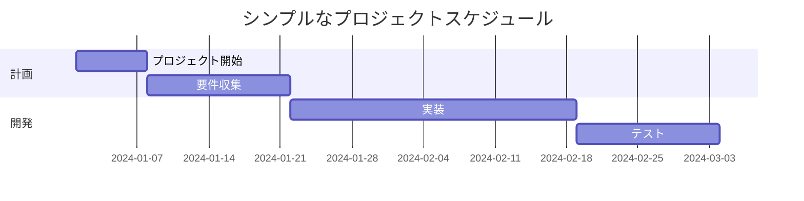
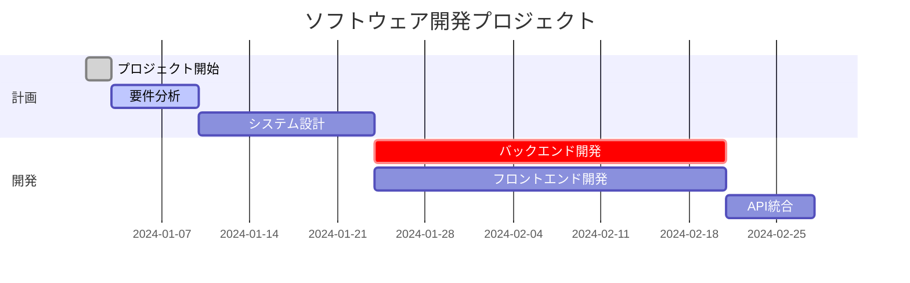

# ガントチャート

ガントチャートはプロジェクト計画とスケジュール管理に使用されます。タスク、期間、依存関係を視覚化できます。

## 構文

### 基本要素
- タイトル: `title [チャートタイトル]`
- 日付形式: `dateFormat YYYY-MM-DD`
- セクション: `section [セクション名]`
- タスク: `[タスク名] : [タスクID], [開始日], [期間]`
- 依存関係: `after [タスクID]`

### 時間単位
- 分: `1m`
- 時間: `1h`
- 日: `1d`
- 週: `1w`
- 月: `1M`

## 基本例

## 応用例

## タスクの状態

タスクには異なる状態を設定できます：
- `done` - 完了したタスク
- `active` - 現在進行中のタスク
- `crit` - 重要タスク

## 実用的なヒント
- タスク名は簡潔で説明的に
- 意味のあるセクション名を使用
- 重要な依存関係を表示
- 重要なマイルストーンを含める
- 関連タスクをセクションでグループ化

## よくある問題の解決

1. **レイアウトの問題**
   - タスク数を適切に調整
   - 適切な時間単位を使用
   - タスクを適切にグループ化

2. **依存関係の問題**
   - 依存関係の正確性を確認
   - 循環依存を避ける
   - タスクIDの一意性を確認

## ベストプラクティス
- 大規模プロジェクトを管理可能なタスクに分割
- 一貫した命名規則を使用
- 進捗状況を定期的に更新
- クリティカルパスを強調
- チャートをシンプルで明確に保つ

## 次のステップ
- [ユーザージャーニー図](/ja/diagrams/user-journey)
- [円グラフ](/ja/diagrams/pie)
- [Gitグラフ](/ja/diagrams/git) 