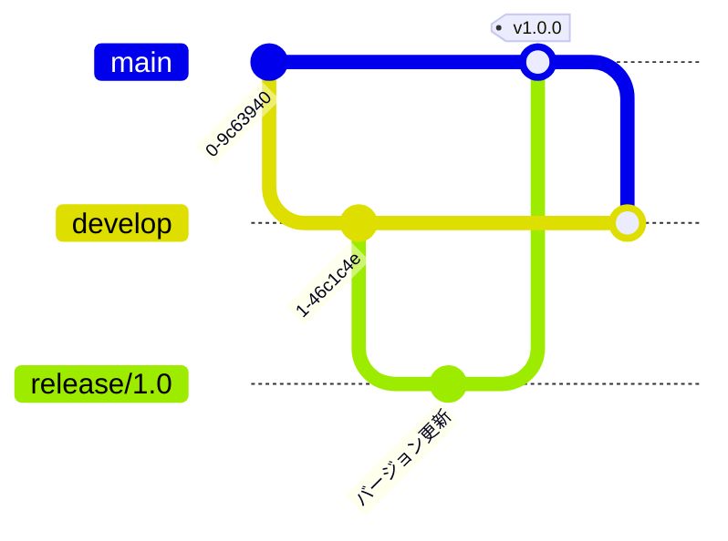
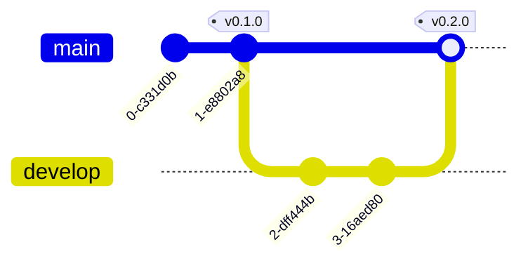

# Gitグラフ

Gitグラフは、Gitリポジトリの履歴を視覚化し、コミット、ブランチ、マージの関係を分かりやすく表示するために使用されます。

## 構文

### 基本要素
- コミット: `commit id: "メッセージ"`
- ブランチ: `branch [名前]`
- チェックアウト: `checkout [ブランチ]`
- マージ: `merge [ブランチ]`
- チェリーピック: `cherry-pick [id]`

## 基本例

## 応用例

フィーチャー開発ワークフローを示すより複雑なGitグラフ：

## ブランチ管理

## リリース管理

## 追加機能

### タグとリリース

### チェリーピック

## スタイル設定

Gitグラフは自動的に：
- コミット履歴を表示
- ブランチ名を表示
- マージポイントを表示
- タグとリリースを表示
- 異なるブランチに異なる色を使用

## 実用的なヒント
- コミットメッセージを明確で簡潔に
- 意味のあるブランチ名を使用
- 重要なタグとリリースを表示
- 重要なマージを含める
- ブランチ戦略を示す
- グラフをシンプルに保つ
- 一貫したブランチ命名規則を使用
- 必要に応じて関連コミットIDを含める

## よくある問題の解決

1. **ブランチの問題**
   - 過剰なブランチを避ける
   - 不要なブランチを適時マージまたは削除
   - ブランチ構造を明確に保つ

2. **可読性の問題**
   - 簡潔なコミットメッセージを使用
   - 重要なポイントにタグを適切に使用
   - 複雑なマージ関係を避ける

3. **ワークフローの問題**
   - 一貫したブランチ戦略に従う
   - 明確なマージプロセス
   - 適切なタグでバージョン管理

## ベストプラクティス
- Git Flowまたは類似のワークフローに従う
- 明確なコミットメッセージを使用
- 適切なタイミングでリリースタグを作成
- メインブランチを安定に保つ
- フィーチャーブランチを適時マージ
- 意味のあるブランチ名を使用
- 古いブランチを定期的にクリーンアップ

## 次のステップ
- [C4図](/ja/diagrams/c4)
- [マインドマップ](/ja/diagrams/mindmap)
- [タイムライン](/ja/diagrams/timeline) 