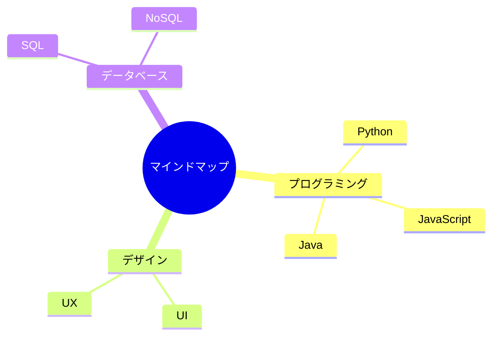
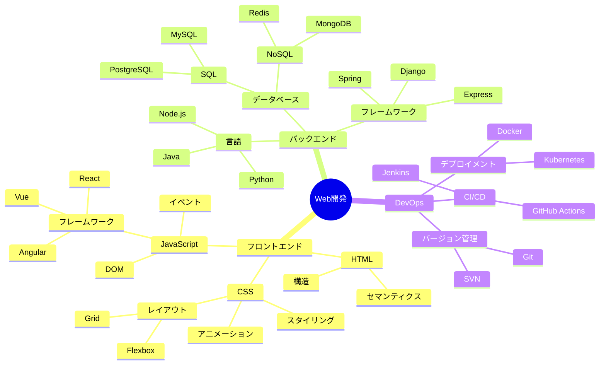
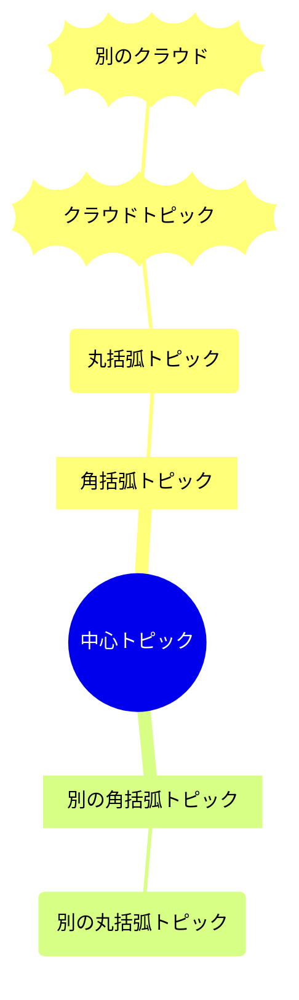
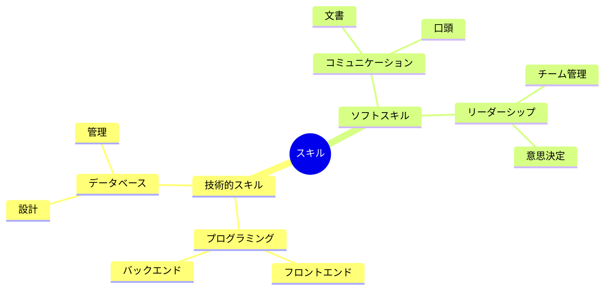

# マインドマップ

マインドマップは、情報を階層的に視覚化して整理するための図表です。ブレインストーミング、ノート作成、複雑なアイデアの整理に最適です。

## 構文

### 基本要素
- ルートノード：中心となるアイデア
- ブランチ：主要トピックとサブトピック
- 角括弧：`[テキスト]` による書式設定
- 丸括弧：`(テキスト)` による書式設定

## 基本例



## 応用例

Web開発プロジェクトのより詳細なマインドマップ：



## 書式設定オプション

### 形状とスタイル



### アイコンとマーカー

```mermaid
mindmap
    root((プロジェクト計画))
        [優先タスク]::icon(fa fa-star)
            タスク1
            タスク2
        [タイムライン]::icon(fa fa-calendar)
            週1
            週2
        [リソース]::icon(fa fa-users)
            チームA
            チームB
```

## 追加機能

### 複数レベル



## スタイリング

マインドマップは自動的に：
- ルートノードを中央に配置
- ブランチを階層的に配置
- ノードに異なる形状を使用
- 一貫した間隔を適用
- 関係を明確に表示

## ヒント
- 明確な中心アイデアから始める
- 簡潔なラベルを使用
- 関連する概念をまとめる
- ブランチの深さを制限する
- 一貫した書式を使用
- 構造のバランスを保つ
- 形状で視覚的な階層を追加
- 重要な関係に焦点を当てる
- 意味のあるグループ化を使用

## 実用的なヒント
- 階層構造を明確に保つ
- 簡潔な説明を使用
- 関連する概念を適切にグループ化
- 深すぎる階層を避ける
- 枝のバランスを保つ
- アイコンで可読性を向上
- 適切なレイアウト方向を選択

## よくある問題の解決

1. **構造の問題**
   - 過剰な枝を避ける
   - 階層の深さを制御
   - ロジックを明確に保つ

2. **可読性の問題**
   - 短いテキストを使用
   - 適切なアイコンを使用
   - ノード間の間隔に注意

3. **レイアウトの問題**
   - 各枝のバランスを取る
   - ノードの位置を調整
   - スペースの利用を最適化

## ベストプラクティス
- 中心トピックから開始
- キーワードを使用
- 階層を明確に保つ
- 論理関係に注意
- 色を適切に使用
- 定期的な見直しと更新
- 対象読者のニーズを考慮

## 次のステップ
- [フローチャート](/ja/diagrams/flowchart)
- [シーケンス図](/ja/diagrams/sequence)
- [ガントチャート](/ja/diagrams/gantt) 