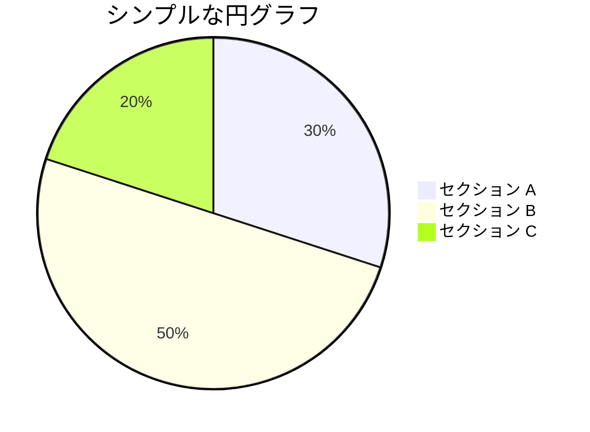
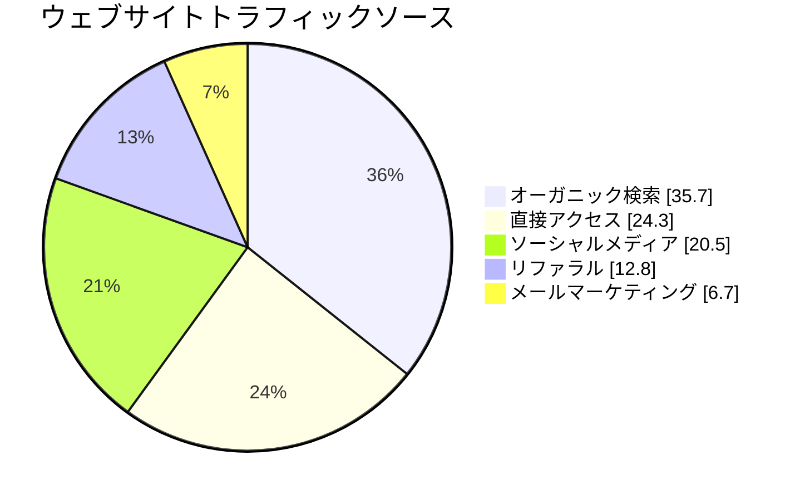
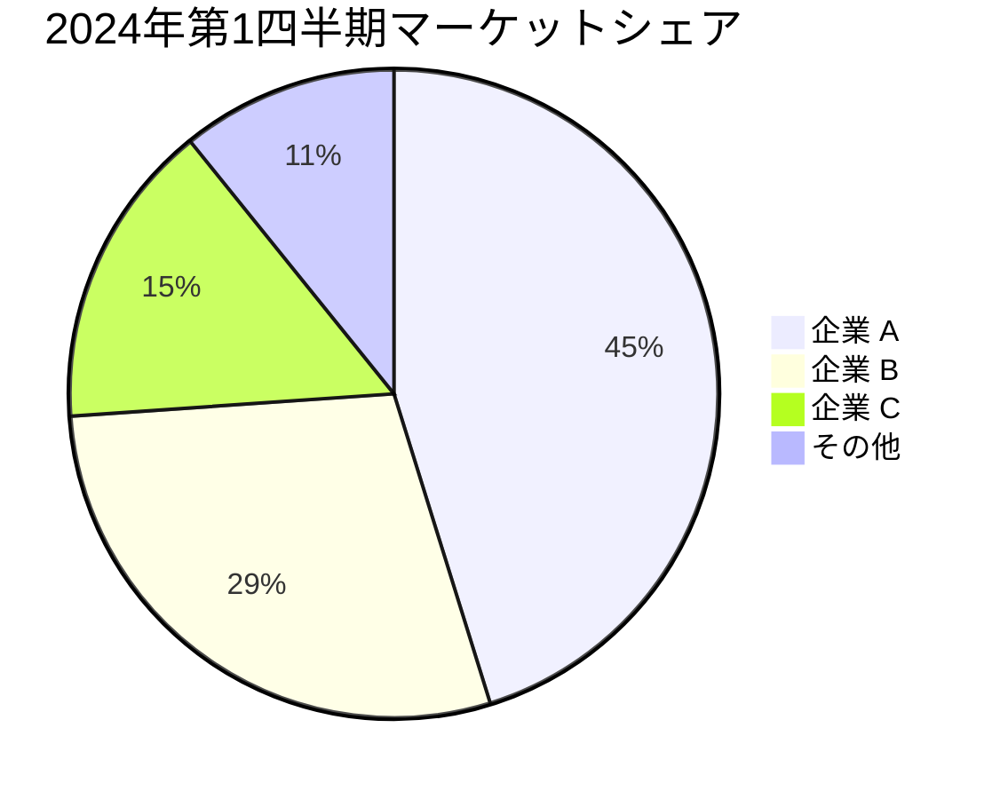
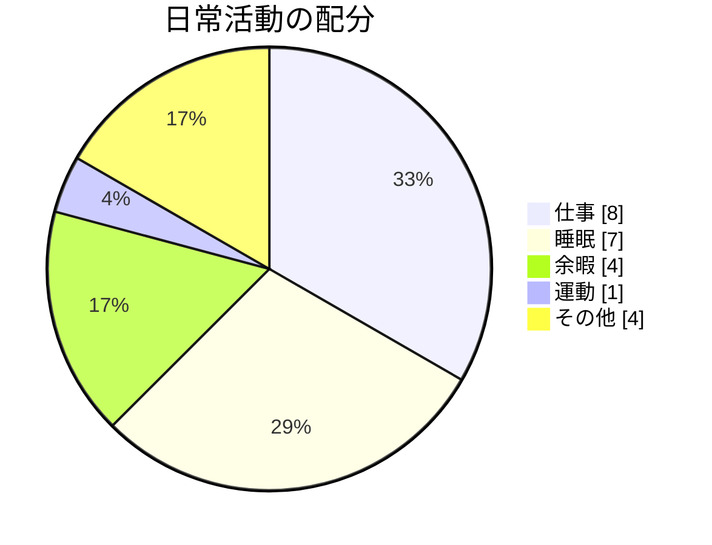
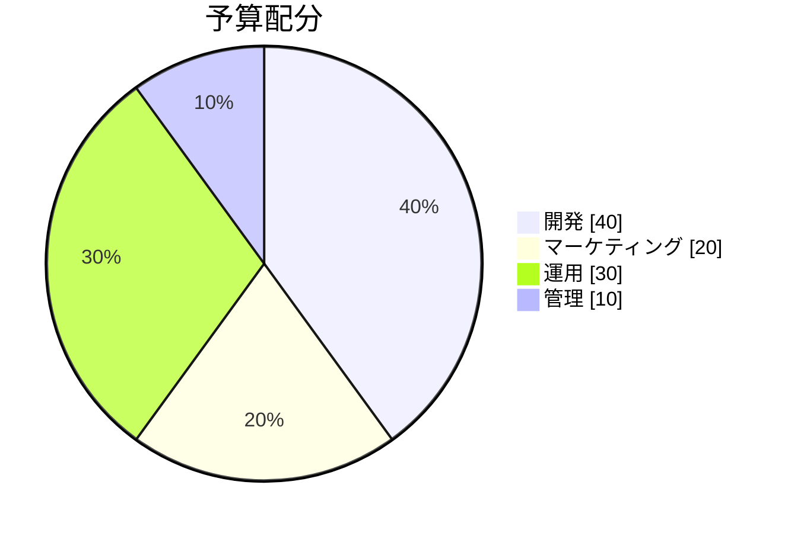

# 円グラフ

円グラフは、数値の比率を表示する円形の統計グラフで、円を比例的な扇形に分割してデータを表示します。

## 構文

### 基本要素
- タイトル: `pie title [グラフタイトル]`
- データ項目: `"[ラベル]" : [値]`
- オプション: `showData` - 値を表示

## 基本例

## 応用例

ウェブサイトのトラフィックソースを示すより詳細な円グラフ：

## データの可視化

### マーケットシェアの例

### 時間配分

## 機能

### データ値の表示

`showData` を使用して実際の値を表示できます：

## スタイル設定

円グラフは自動的に：
- 扇形に異なる色を割り当て
- 比率を計算
- ラベルを表示
- パーセンテージや値を表示（showData使用時）

## 実用的なヒント
- 扇形の数を管理（7個以下を推奨）
- 明確で簡潔なラベルを使用
- 大きさでの並び替えを検討
- 意味のあるタイトルを使用
- 値が重要な場合は `showData` を追加
- 合計値が意味を持つことを確認
- 小数点以下の桁数を統一

## よくある問題の解決

1. **可読性の問題**
   - 扇形が多すぎないようにする
   - 明確なラベルを使用
   - 適切な色のコントラストを確保

2. **データの問題**
   - 合計値を確認
   - 比率の計算をチェック
   - データ形式が正しいことを確認

3. **表示の問題**
   - ラベルの位置を調整
   - 色の選択を最適化
   - 重なりの問題に対処

## ベストプラクティス
- データは簡潔明瞭に
- 色は明確に区別
- ラベルは理解しやすく
- 比率は正確に
- 合計は意味のある値に
- 並び順は論理的に
- 凡例は見やすく

## 次のステップ
- [要求図](/ja/diagrams/requirement)
- [Gitグラフ](/ja/diagrams/git)
- [C4図](/ja/diagrams/c4) 