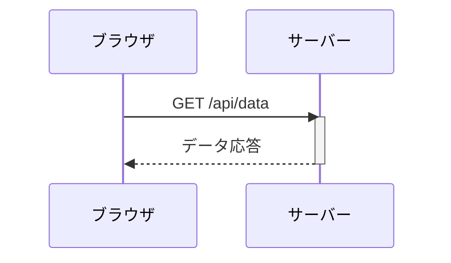
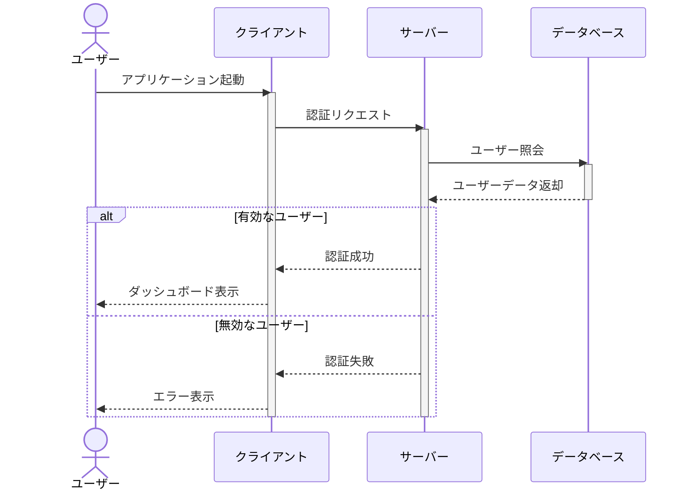
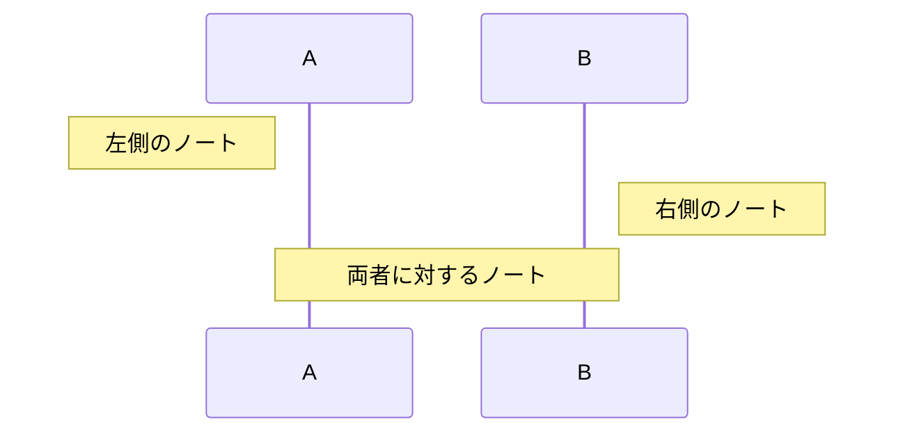
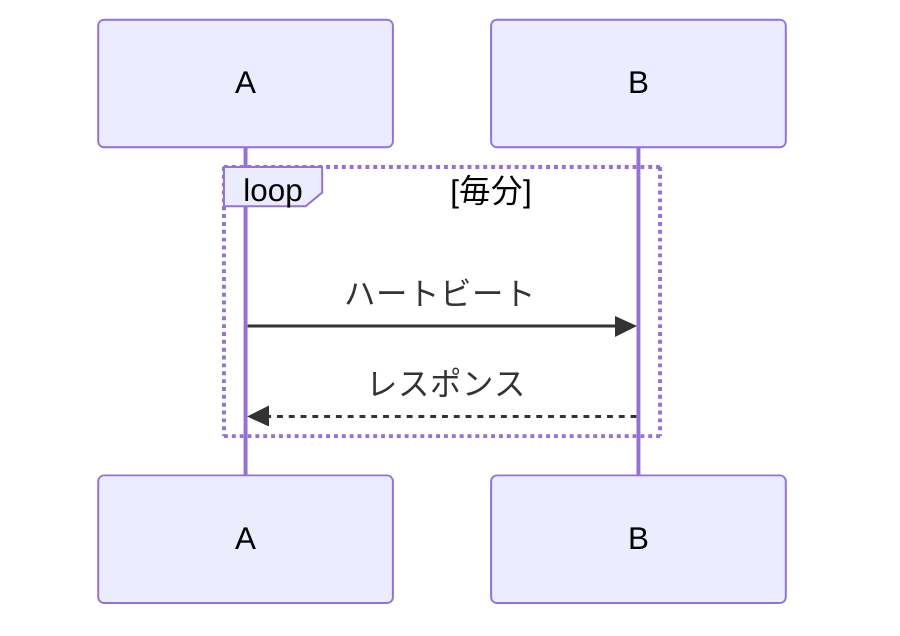

# シーケンス図

シーケンス図は、プロセス間の操作とその順序を示すために使用されます。システム間の相互作用を文書化するのに最適です。

## 構文

### 基本要素
- 参加者: `participant A` または `actor A`
- メッセージ: 
  - 実線: `->` 
  - 点線: `-->`
  - 実線矢印: `->>` 
  - 点線矢印: `-->>`
- アクティベーション: `activate` と `deactivate`
- ノート: `Note left of`, `Note right of`, `Note over`
- ループ: `loop [テキスト]`
- 代替パス: `alt [テキスト]` と `else [テキスト]`
- オプション: `opt [テキスト]`
- 並行: `par [テキスト]`

## 基本例

## 応用例

様々な機能を示す複雑なシーケンス図の例：

## 追加機能

### ノート

### ループ

## スタイル設定

以下のディレクティブでスタイルをカスタマイズできます：
- `autonumber` - メッセージに自動番号付け
- `participant A as "表示名"` - エイリアスの使用
- CSSで色やその他のスタイルを適用可能

## 実用的なヒント
- 重要な相互作用に焦点を当てる
- 明確で簡潔なメッセージ記述を使用
- ループやalt/optブロックで関連する相互作用をグループ化
- 複雑な相互作用にはノートを追加
- 長い参加者名にはエイリアスの使用を検討

## よくある問題の解決

1. **レイアウトの問題**
   - 参加者の数を減らす
   - 長いメッセージはノートで代用
   - 適切なグループ化でメッセージを整理

2. **可読性の問題**
   - 意味のある参加者名を使用
   - メッセージの説明は簡潔に
   - 適切な空間とグループ化を活用

3. **複雑さの管理**
   - 複雑な相互作用を複数の図に分割
   - 重要なポイントにノートを使用
   - 適切なグループ化メカニズムを使用

## 次のステップ
- [クラス図](/ja/diagrams/class)
- [状態遷移図](/ja/diagrams/state)
- [ER図](/ja/diagrams/er) 