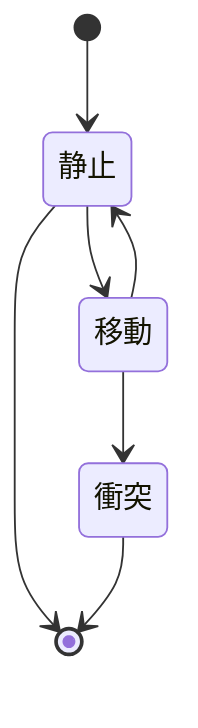
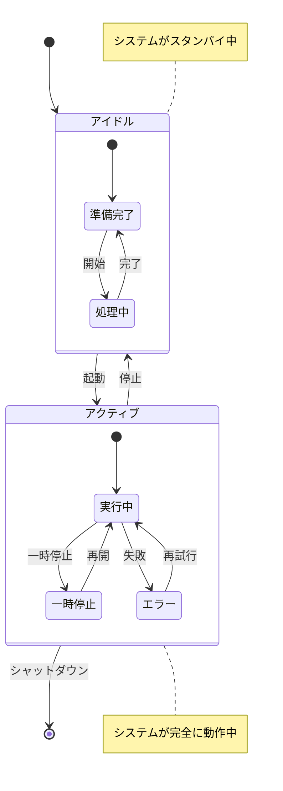
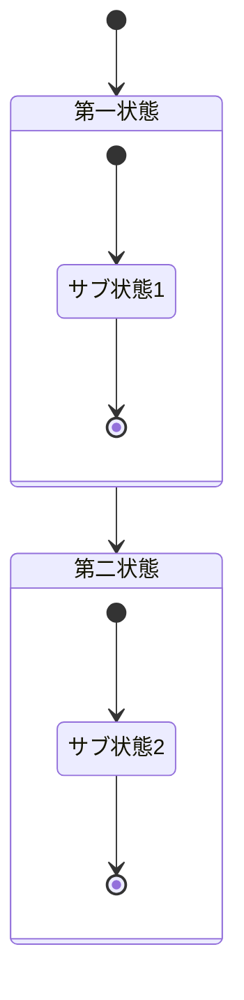
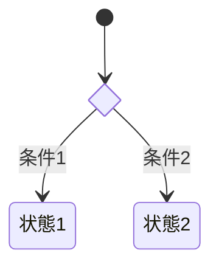
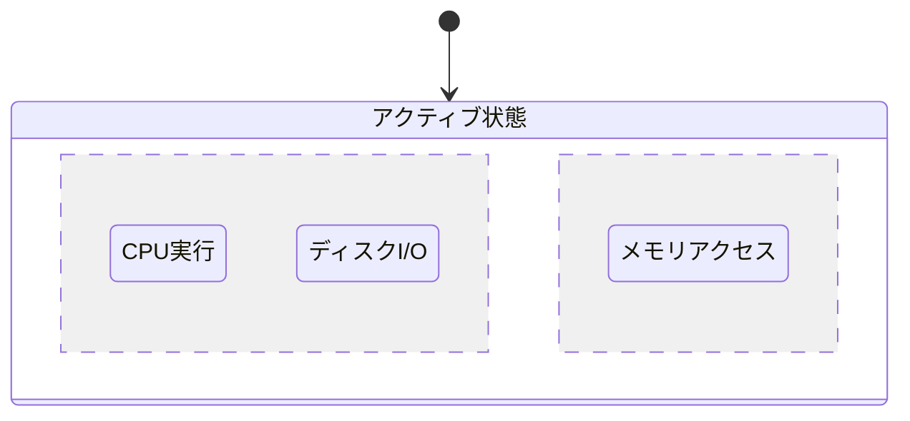

# 状態遷移図

状態遷移図は、システムの異なる状態とその状態間の遷移を記述します。リアクティブシステムの動作をモデル化するのに特に適しています。

## 構文

### 基本要素
- 状態: `state 状態名`
- 遷移: `-->` 
- 開始状態: `[*]`
- 終了状態: `[*]`
- 複合状態: ネストされた状態を含むことができる
- 選択点: `<<choice>>`
- ノート: `note left/right of`

## 基本例

## 応用例

様々な機能を示す複雑な状態遷移図の例：

## 複合状態

## 選択点

## 並行状態

## スタイル設定

外観をカスタマイズできます：
- 異なる矢印タイプ
- 状態の説明
- ノート
- 方向（LRまたはTB）

## 実用的なヒント
- システムの主要な状態から始める
- 明確で簡潔な状態名を使用
- すべての可能な遷移を含める
- 必要に応じて遷移に条件を追加
- 複合状態を使用して複雑さを管理
- 重要な状態の動作をノートで記録
- 状態図が複雑になりすぎないようにする
- サブ状態を適切にグループ化する

## よくある問題の解決

1. **レイアウトの問題**
   - 図の方向を調整
   - 状態の数を減らす
   - 複合状態で関連する状態を整理

2. **可読性の問題**
   - 意味のある状態名を使用
   - 遷移の説明を簡潔に
   - ノートを適切に使用して説明

3. **複雑さの管理**
   - 複雑な状態図を複数の図に分割
   - 複合状態を使用
   - 交差する遷移を避ける

## 次のステップ
- [ER図](/ja/diagrams/er)
- [ユーザージャーニー](/ja/diagrams/user-journey)
- [ガントチャート](/ja/diagrams/gantt) 