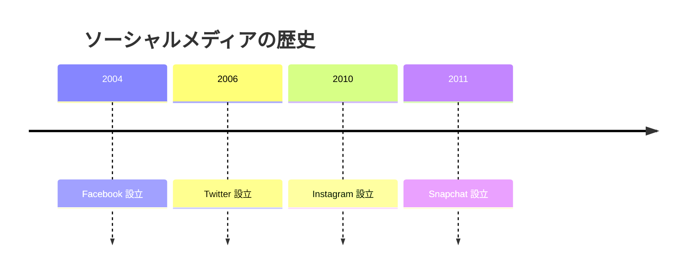
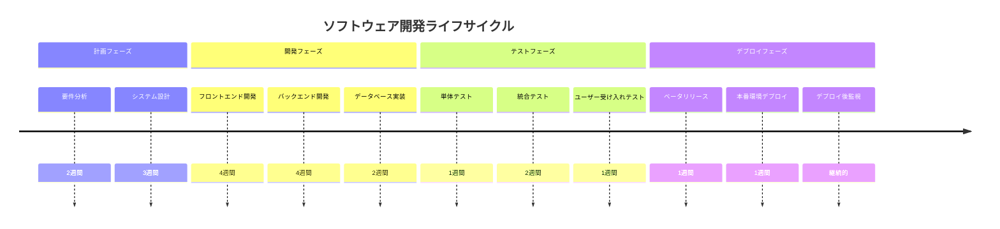
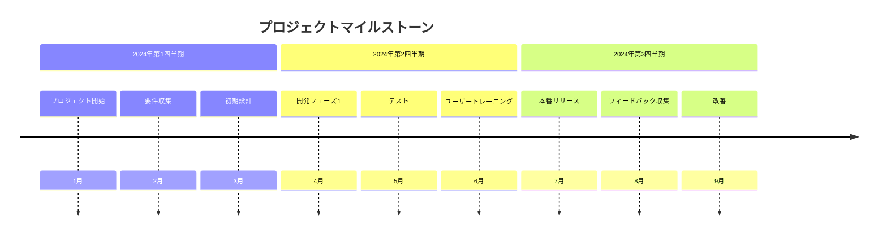
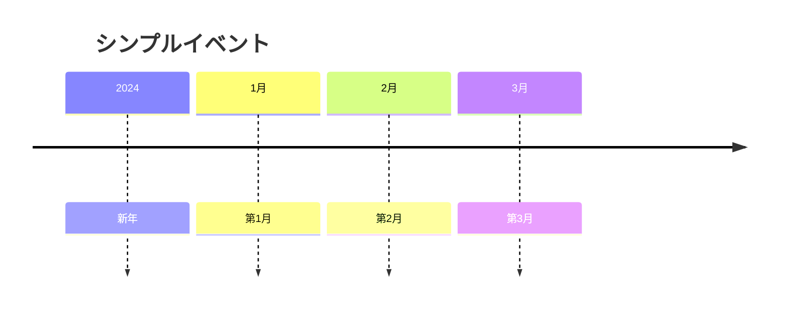
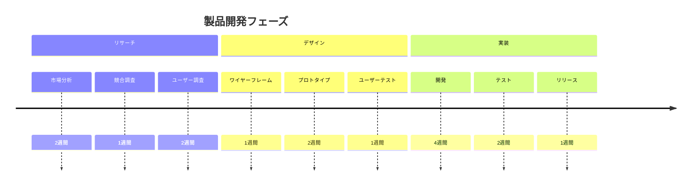

# タイムライン

タイムライン図は、時系列に沿ってイベントを視覚化するためのツールです。プロジェクト計画、歴史的出来事、プロセスの文書化に最適です。

## 構文

### 基本要素
- タイトル: オプションのタイムラインタイトル
- セクション: イベントのグループ化
- イベント: 個々のタイムラインエントリ

## 基本例

## 応用例

ソフトウェア開発ライフサイクルを示すより詳細なタイムライン：

## プロジェクトタイムライン

## イベントタイプ

### シンプルイベント

### グループ化されたイベント

## スタイル設定

タイムラインは自動的に：
- イベントを時系列で配置
- 関連イベントをセクションでグループ化
- 期間を表示（指定時）
- 一貫した間隔を維持
- 明確な関係性を表示

## 実用的なヒント
- イベントの説明を簡潔に
- 意味のあるセクション名を使用
- 重要な日付を含める
- 関連イベントをグループ化
- 進捗を明確に表示
- 適切に期間を含める
- 一貫したフォーマットを使用
- 重要なマイルストーンに注目

## よくある問題の解決

1. **構造の問題**
   - セクションの論理性を確認
   - イベントの順序が正しいか確認
   - 時間範囲が適切か確認

2. **可読性の問題**
   - 簡潔な説明を使用
   - セクション数を適切に
   - イベント数を管理可能に

3. **時間管理の問題**
   - 時間範囲を適切に設定
   - イベント間隔に注意
   - 並行イベントの処理

## ベストプラクティス

1. **タイムライン計画**
   - 適切な時間範囲を決定
   - 適切な詳細レベルを選択
   - 時間の流れを明確に保持

2. **コンテンツ整理**
   - 明確なイベント説明を使用
   - 関連イベントを適切にグループ化
   - 重要なマイルストーンを強調

3. **視覚表現**
   - レイアウトを整理
   - 一貫したフォーマットを使用
   - 情報を読みやすく

## 次のステップ
- [マインドマップ](/ja/diagrams/mindmap)
- [ガントチャート](/ja/diagrams/gantt)
- [Gitグラフ](/ja/diagrams/git) 