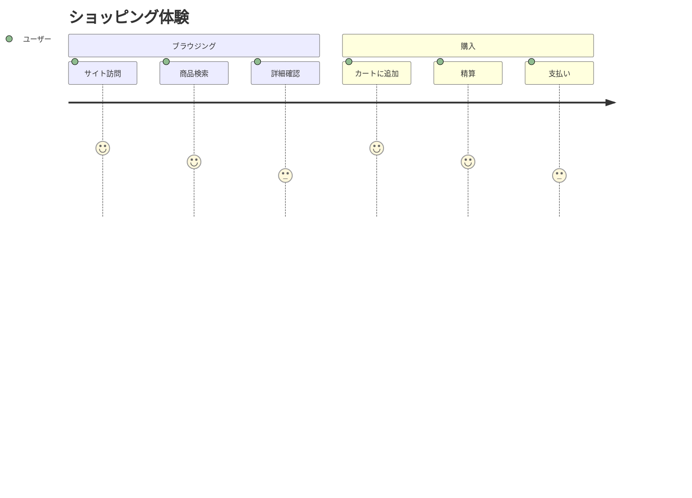
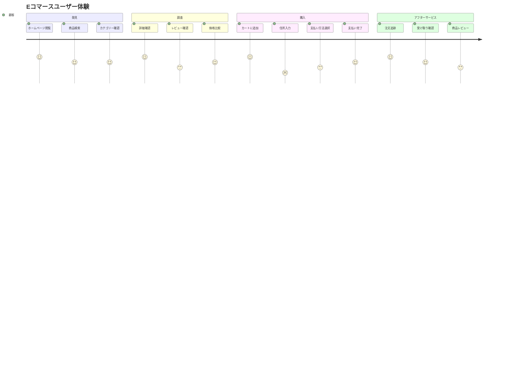
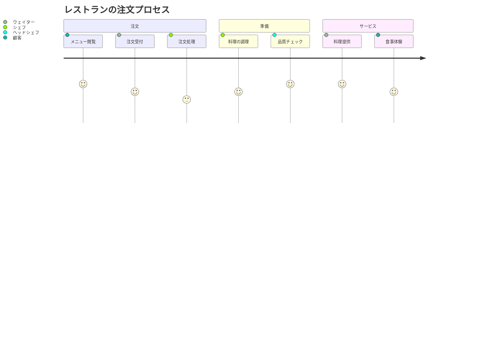

# ユーザージャーニー図

ユーザージャーニー図は、プロセスやサービスにおけるユーザー体験を視覚化し分析するのに役立ちます。顧客との接点を把握し、問題点を特定するのに最適です。

## 構文

### 基本要素
- タイトル: `journey title [ジャーニータイトル]`
- セクション: `section [セクション名]`
- タスク: `[タスク名]: [スコア]: [役割]`
- スコア: 1-5段階（1が最低、5が最高）

## 基本例

## 応用例

より詳細なEコマース体験を示す例：

## スコアシステム

スコアの基準：
1. 非常に不満 😫
2. 不満 😟
3. 普通 😐
4. 満足 😊
5. 非常に満足 😄

## 複数の役割の例

## スタイル設定

図は自動的に：
- セクションごとに異なる色を使用
- スコアに応じた絵文字を表示
- タスクを時系列で配置
- 関連タスクをセクションでグループ化

## 実用的なヒント
- セクション名を明確で簡潔に
- 意味のあるタスク説明を使用
- 実際のユーザーフィードバックに基づくスコア
- すべての重要な接点を含める
- 複数の役割を考慮
- ユーザーの視点から考える
- セクションで関連活動をグループ化

## よくある問題の解決

1. **構造の問題**
   - セクションの論理性を確認
   - タスクの順序が正しいか確認
   - 役割の割り当てが適切か確認

2. **スコアの問題**
   - 客観的なスコアを維持
   - ユーザーフィードバックに基づく
   - 定期的なスコアの更新

3. **可読性の問題**
   - 簡潔な説明を使用
   - セクション数を適切に保つ
   - タスク数を管理可能に保つ

## ベストプラクティス
- ユーザーの視点からジャーニーを設計
- 重要な接点を特定
- 問題点と機会を強調
- 定期的な更新と最適化
- ユーザーフィードバックの収集
- 感情の変化に注目
- 図をシンプルに保つ

## 次のステップ
- [ガントチャート](/ja/diagrams/gantt)
- [円グラフ](/ja/diagrams/pie)
- [Gitグラフ](/ja/diagrams/git) 