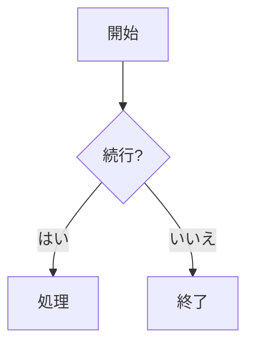
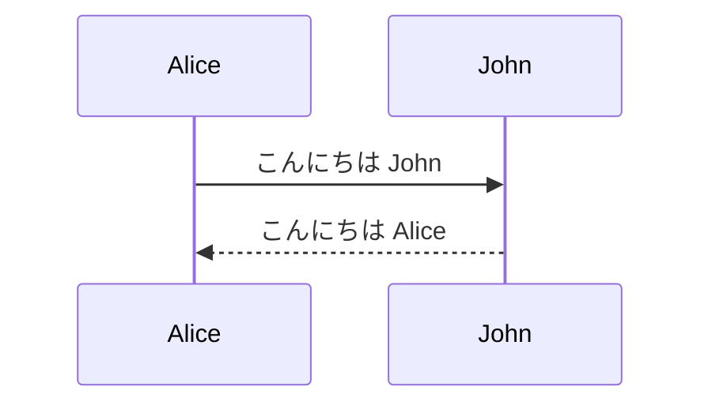
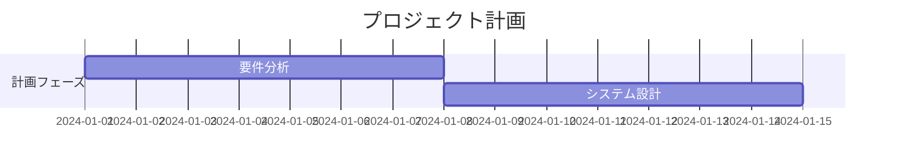

# 始め方

このガイドでは、Mermaid を使用して図を作成する方法を簡単に説明します。

## 基本的な手順

1. [Mermaid Viewer](https://mermaidviewer.com) にアクセス
2. 図の種類を選択
3. 図のコードを記述
4. リアルタイムでプレビュー

## 基本的な構文

すべての Mermaid 図は、図の種類の宣言から始まり、その後に具体的な図の定義が続きます。

### フローチャートの例



コードの説明：
- `graph TD` は上から下への図を表します
- 角括弧 `[]` で四角形のノードを作成
- 波括弧 `{}` でひし形のノードを作成
- `-->` で接続線を作成
- `|テキスト|` で接続線にテキストを追加

### シーケンス図の例



コードの説明：
- `sequenceDiagram` はシーケンス図を宣言
- `->>` で実線矢印を作成
- `-->>` で破線矢印を作成

### ガントチャートの例



コードの説明：
- `gantt` でガントチャートを宣言
- `dateFormat` で日付形式を定義
- `section` でタスクのグループを作成
- タスクは名前、開始日、期間を定義

## よく使うテクニック

1. **コメント**
   ```
   %% これはコメントです
   ```

2. **スタイル**
   ```mermaid
   graph LR
      A[赤いノード]
      style A fill:#f00
   ```

3. **サブグラフ**
   ```mermaid
   graph TB
      subgraph サブグラフのタイトル
          A --> B
      end
   ```

## 統合方法

### Markdown での統合

Markdown ファイルでの使用：

    ```mermaid
    graph LR
        A --> B
    ```

### HTML での統合

ウェブページへの埋め込み：

```html
<div class="mermaid">
    graph LR
        A --> B
</div>
```

## よくある問題

1. **構文エラー**
   - 括弧の対応を確認
   - 矢印の方向が正しいか確認
   - ノードIDの重複をチェック

2. **レイアウトの問題**
   - 図の方向を調整（TD、LR など）
   - ノード間の接続を減らす
   - サブグラフで複雑な図を整理

3. **レンダリングの問題**
   - Mermaid の最新バージョンを使用
   - ブラウザの互換性を確認
   - ブラウザのキャッシュをクリア

## 次のステップ

- [フローチャートの詳細](/ja/diagrams/flowchart)
- [シーケンス図のチュートリアル](/ja/diagrams/sequence)
- [図の種類の一覧](/ja/diagrams/overview)

## オンラインリソース

- [公式ドキュメント](https://mermaid.js.org/)
- [オンラインエディタ](/ja/mermaid-viewer/live-editor)
- [サンプル集](/ja/examples) 