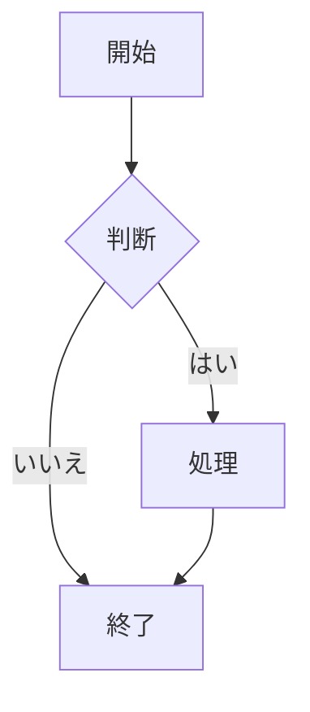
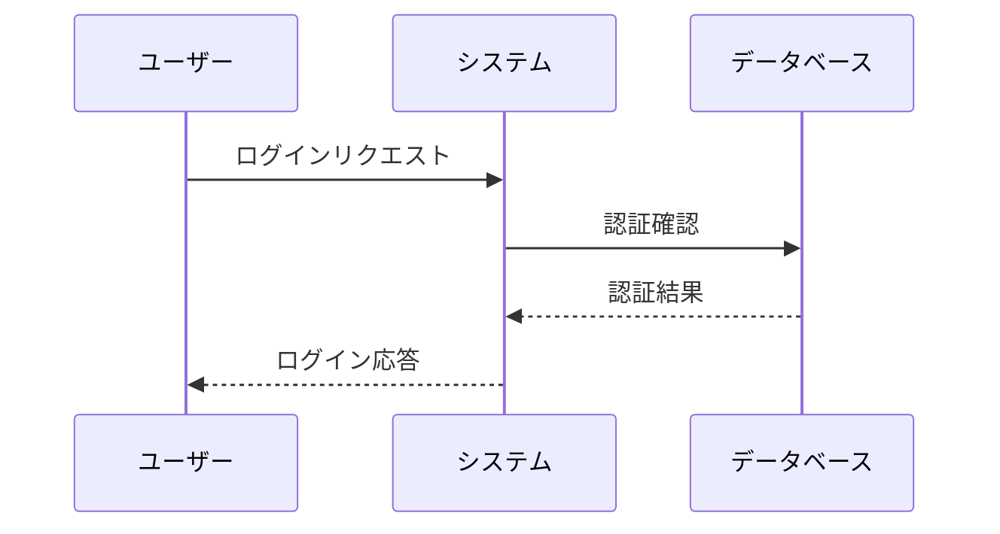
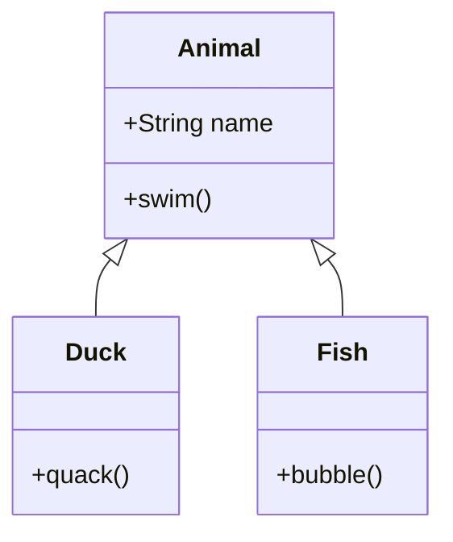

# Mermaid とは？

Mermaid は JavaScript ベースのダイアグラムおよび可視化ツールで、テキストとコードを使用して図を生成することができます。その主な目的は、ドキュメントを開発のペースに合わせて維持することです。

## 主な特徴

- 📝 テキストベースの図の定義
- 🔄 バージョン管理との親和性
- 🎨 多様な図の種類をサポート
- 🛠 容易な統合と使用
- 📱 レスポンシブデザイン

## サポートされている図の種類

### フローチャート
フローチャートは最も基本的で一般的な図の種類の一つです：

### シーケンス図
オブジェクトやシステム間の相互作用を示すために使用されます：

### クラス図
システムの静的構造を表示します：

## なぜ Mermaid を選ぶのか？

1. **学習が容易**
   - シンプルなテキスト構文
   - 豊富なドキュメントと例
   - アクティブなコミュニティサポート

2. **バージョン管理との相性が良い**
   - 図の定義がテキスト形式で保存
   - 変更の追跡が容易
   - チーム協業をサポート

3. **多様な統合オプション**
   - Markdown との統合
   - 様々なプラットフォームへの埋め込み
   - API インターフェースの提供

4. **リアルタイムプレビュー**
   - 即時に変更を確認
   - 迅速な反復と調整
   - WYSIWYG 編集体験

## 使い始める

Mermaid を使い始めるには：

1. [Mermaid Viewer](https://mermaidviewer.com) にアクセス
2. 作成したい図の種類を選択
3. 提供されている例を参考に
4. 必要に応じて修正と調整

## 次のステップ

- [始め方](/ja/introduction/getting-started) - 基本的な構文と使用方法を学ぶ
- [フローチャート](/ja/diagrams/flowchart) - 最も一般的な図の種類について詳しく学ぶ
- [オンラインエディタ](/ja/mermaid-viewer/full-screen-editor) - オンラインツールで図を作成 