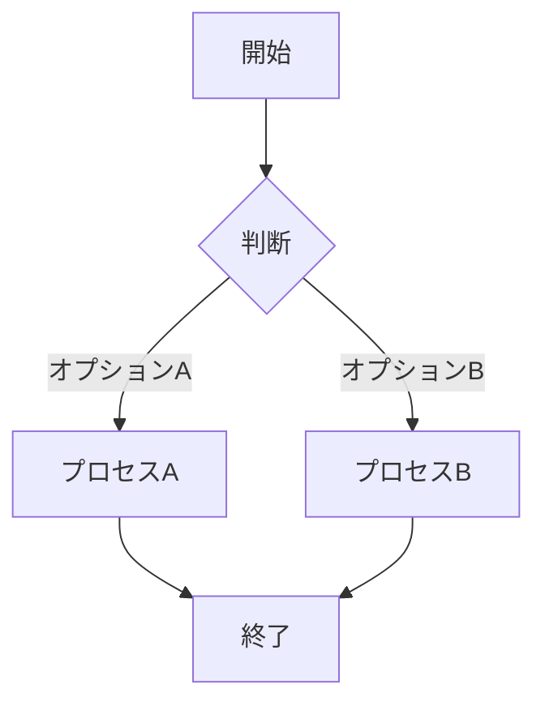

# [Mermaid Viewer](https://mermaidviewer.com) 使用ガイド

[Mermaid Viewer](https://mermaidviewer.com)は、パワフルで直感的なダイアグラム編集ツールであり、わずか3つの簡単なステップでプロフェッショナルな図を作成できます。

### 基本的な使用手順

#### 1. Mermaidコードを入力

[Mermaid Viewer](https://mermaidviewer.com)のエディタペインにダイアグラムコードを入力します。初心者の方は、デフォルトの例を参考にしてください：

エディタは構文ハイライトをサポートしており、コードの記述と管理が容易になります。

#### 2. リアルタイムプレビュー

コードを入力または修正すると、右側のプレビューペインが自動的に更新され、図の変更がリアルタイムで表示されます。このような即時フィードバックにより、図のデザインを素早く繰り返し改良することができます。

#### 3. エクスポートと共有

図が完成したら、以下のことができます：
- SVG形式でエクスポート（スケーラブルベクターグラフィックス）
- PNG形式でエクスポート（ラスター画像）
- PDF形式でエクスポート（印刷用ドキュメント）
- 共有リンクを作成してチームメンバーと協力

### 高度な機能

#### 図の保存
図はブラウザのローカルストレージに自動的に保存され、いつでも戻って編集を続けることができます。また、共有機能を使用して永続的なリンクを作成することもできます。

#### 共有とコラボレーション
「共有」ボタンをクリックすると、チームメンバーが図を閲覧・編集できる一意のリンクが生成されます。すべての変更はリアルタイムで同期され、複数ユーザーによる協力作業をサポートします。

#### 他のプラットフォームへの埋め込み
生成された図は、ウェブサイト、ブログ、ドキュメント、プレゼンテーションに埋め込むことができます。システムは複数の埋め込みコード形式を提供します：
- HTML埋め込みコード
- Markdownコード
- 画像リンク

### よくある質問

**質問：図を保存するにはどうすればよいですか？**  
回答：図は複数の方法で保存できます：1) SVG/PNGファイルとしてエクスポート 2) 共有リンクをコピー 3) ブラウザのローカルストレージに保存。エディタは最新の変更を自動的に保存するため、作業内容が失われることはありません。

**質問：インストールは必要ですか？**  
回答：いいえ！[Mermaid Viewer](https://mermaidviewer.com)はブラウザベースのオンラインツールであり、インストールは不要です。ブラウザを開いてウェブサイトにアクセスするだけで、図の作成を開始できます。

**質問：高品質な図をエクスポートするにはどうすればよいですか？**  
回答：複数のエクスポートオプションを提供しています：1) スケーラブルなSVG形式 2) すぐに使えるPNG形式 3) 高解像度エクスポートオプション。これにより、あらゆる状況で図が鮮明に表示されます。サイズや背景色などのエクスポート設定もカスタマイズできます。

シンプルな図を素早く作成する必要がある場合でも、複雑な技術文書を作成する場合でも、[Mermaid Viewer](https://mermaidviewer.com)はあなたのニーズを満たし、アイデアをプロフェッショナルな方法で視覚化するのに役立ちます。 