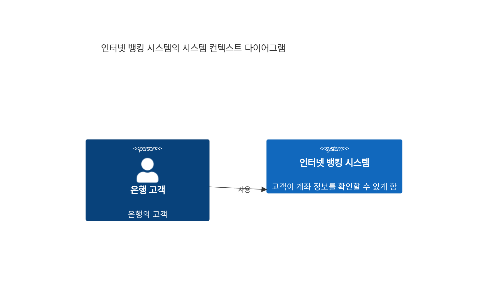
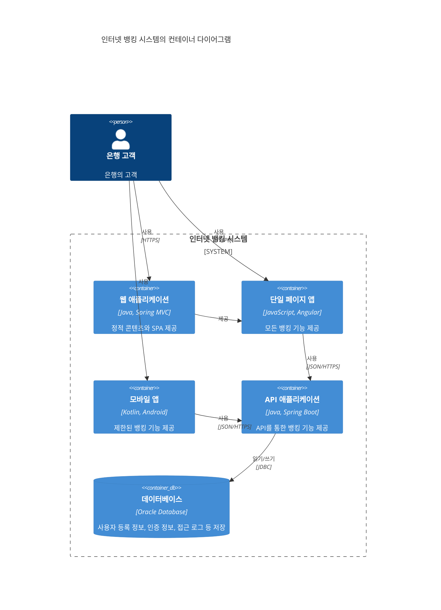
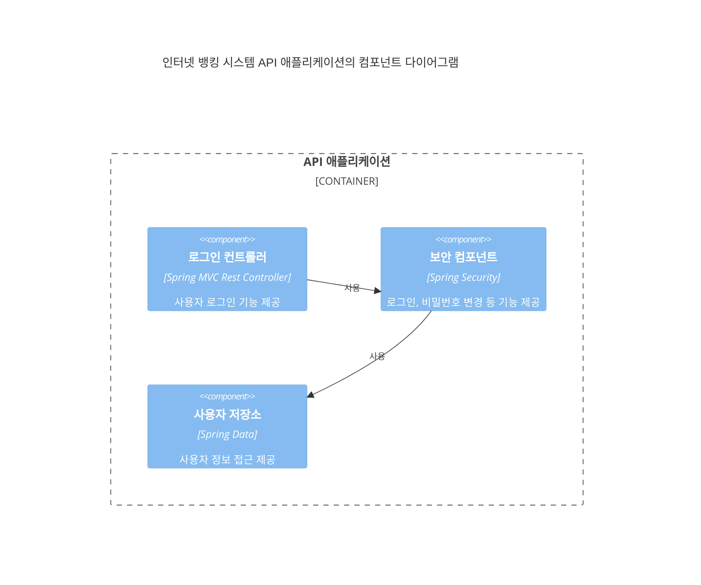
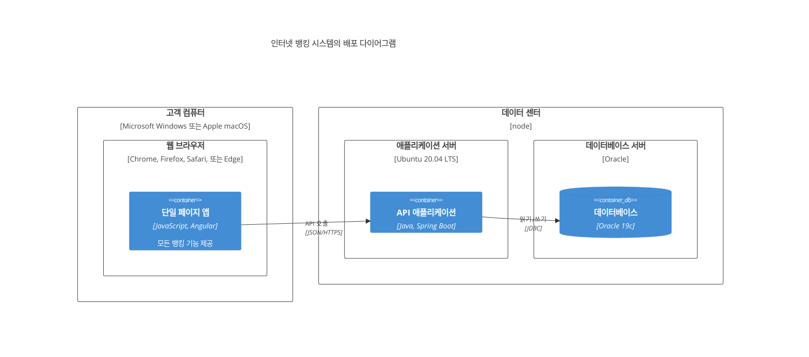
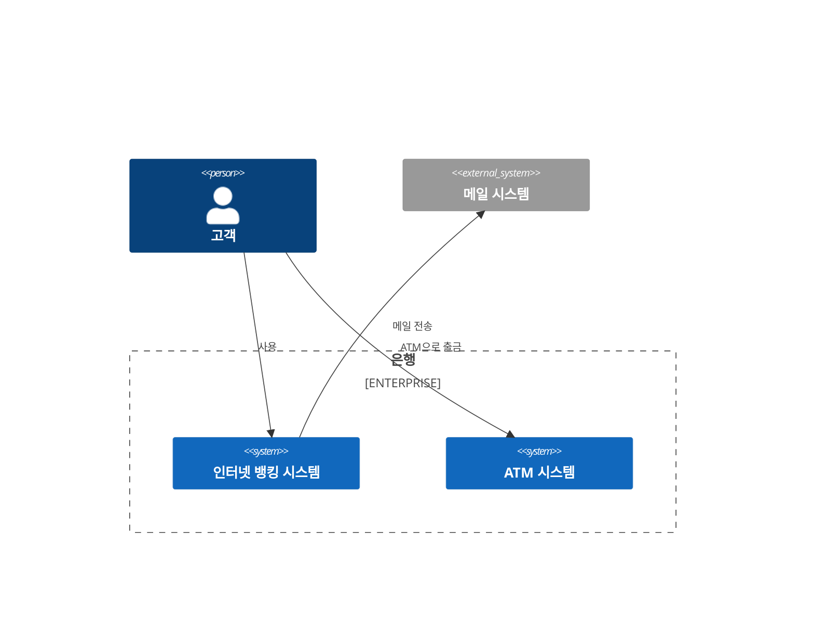

# C4 다이어그램

C4 다이어그램은 다양한 추상화 수준에서 소프트웨어 아키텍처를 시각화하는 방법을 제공합니다. C4 모델은 컨텍스트(Context), 컨테이너(Container), 컴포넌트(Component), 코드(Code)의 4가지 수준의 다이어그램으로 구성됩니다.

## 문법

### 기본 요소
- 사람: `Person(별칭, 레이블)`
- 시스템: `System(별칭, 레이블)`
- 컨테이너: `Container(별칭, 레이블, 기술)`
- 컴포넌트: `Component(별칭, 레이블, 기술)`
- 관계: `Rel(from, to, 레이블)`

## 기본 예제

## 고급 예제

더 자세한 웹 애플리케이션의 컨테이너 다이어그램:

## 컴포넌트 수준

## 배포 다이어그램

## 추가 기능

### 경계와 기업

## 스타일 설정

C4 다이어그램은 자동으로:
- 다른 유형의 요소 포맷
- 관계와 의존성 표시
- 기술 스택 표시
- 계층 구조 구성
- 일관된 시각적 언어 사용

## 유용한 팁
- 컨텍스트 다이어그램부터 시작
- 컨테이너와 컴포넌트 뷰로 점진적으로 세부 사항 추가
- 다이어그램의 초점을 명확하게 유지
- 관련 기술 세부 사항 포함
- 중요한 관계 표시
- 의미 있는 설명 사용
- 적절한 곳에 기술 선택 포함
- 대상 독자의 기술 수준 고려

## 일반적인 문제 해결

1. **복잡성 문제**
   - 적절한 추상화 수준 선택
   - 복잡한 시스템 분해
   - 경계를 사용하여 요소 구성

2. **가독성 문제**
   - 명확한 계층 구조 유지
   - 과도한 관계선 피하기
   - 의미 있는 레이블 사용

3. **일관성 문제**
   - C4 모델 규약 준수
   - 명명 일관성 유지
   - 통일된 표현 방식 사용

## 모범 사례
- 적절한 추상화 수준 선택
- 다이어그램을 단순하게 유지
- 명확한 명명 사용
- 필요한 기술 세부 사항 포함
- 중요한 관계 강조
- 다이어그램 대상자 고려
- 뷰 간의 일관성 유지

## 다음 단계
- [마인드맵](/ko/diagrams/mindmap)
- [타임라인](/ko/diagrams/timeline)
- [Git 그래프](/ko/diagrams/git) 