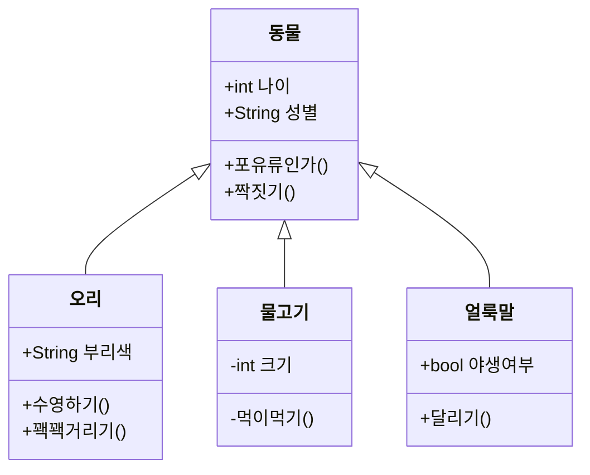
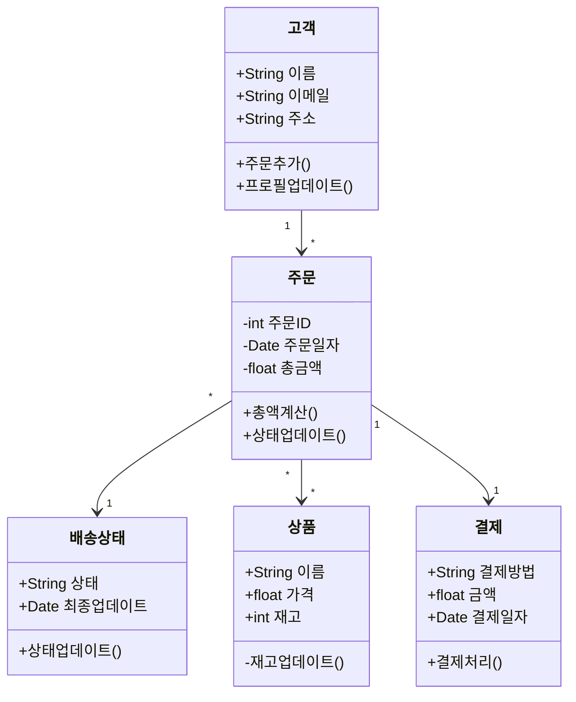
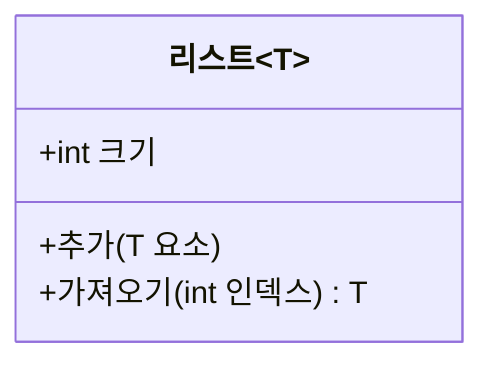
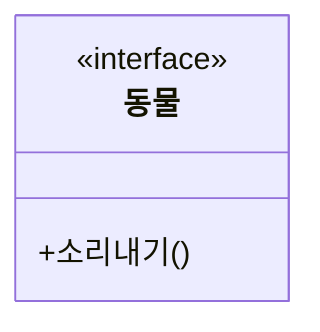
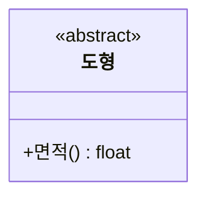

# 클래스 다이어그램

클래스 다이어그램은 객체 지향 모델링의 핵심입니다. 시스템의 클래스, 속성, 연산 및 클래스 간의 관계를 보여줍니다.

## 문법

### 클래스 정의
```
class 클래스명 {
    +공용 필드
    -비공개 필드
    #보호된 필드
    +공용 메서드()
    -비공개 메서드()
    #보호된 메서드()
}
```

### 관계 유형
- 상속: `<|--`
- 합성: `*--`
- 집합: `o--`
- 연관: `-->`
- 의존: `..>`
- 구현: `<|..`

## 기본 예제



## 고급 예제

다양한 관계와 기능을 보여주는 복잡한 클래스 다이어그램:



## 추가 기능

### 제네릭 타입


### 인터페이스


### 추상 클래스


## 스타일 설정

가시성을 나타내는 기호:
- `+` 공용
- `-` 비공개
- `#` 보호됨
- `~` 패키지/내부

## 유용한 팁
- 클래스는 단일 책임 원칙을 따르기
- 의미 있는 클래스명과 메서드명 사용
- 관련된 속성과 메서드만 표시
- 적절한 클래스 간 관계 사용
- 인터페이스와 추상 클래스 적절히 활용
- 캡슐화에 주의
- 상속과 합성을 적절히 사용
- 과도한 설계 피하기

## 일반적인 문제 해결

1. **설계 문제**
   - 클래스의 책임이 단일한지 확인
   - 상속 관계가 적절한지 확인
   - 과도한 결합 피하기

2. **관계 표현**
   - 관계 유형을 올바르게 사용
   - 관계의 방향을 명확히
   - 적절한 관계 설명 추가

3. **가독성 문제**
   - 관련 클래스를 적절히 그룹화
   - 교차하는 관계 줄이기
   - 명확한 이름 사용

## 다음 단계
- [상태 다이어그램](/ko/diagrams/state)
- [ER 다이어그램](/ko/diagrams/er)
- [사용자 여정](/ko/diagrams/user-journey) 