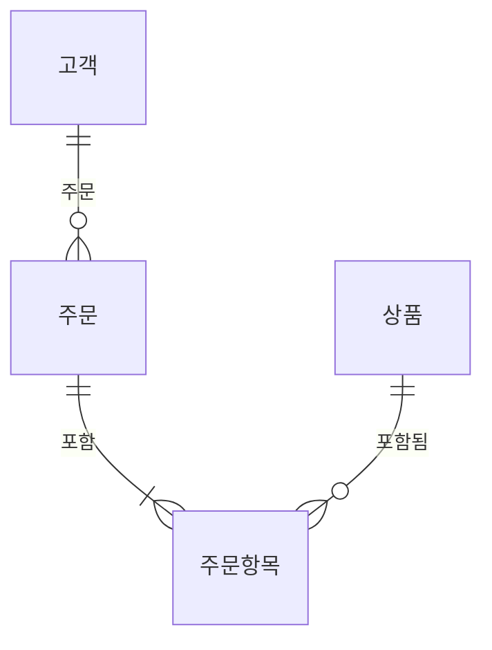
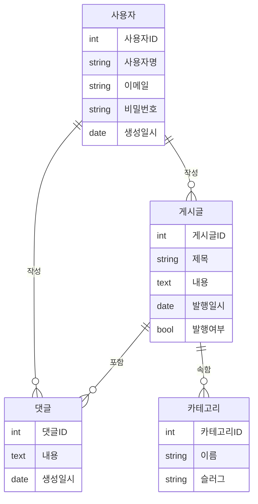
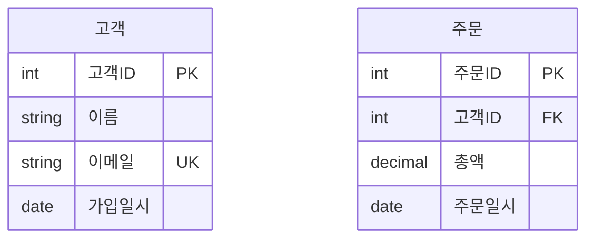
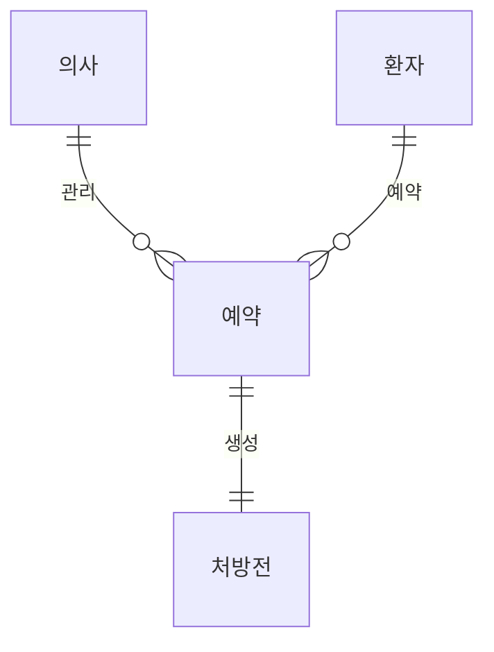
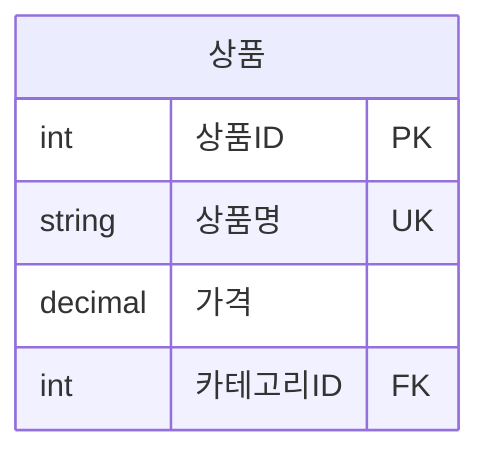

# 엔티티 관계 다이어그램

엔티티 관계 다이어그램(ER 다이어그램)은 데이터베이스 시스템에서 엔티티 간의 관계를 모델링하는 데 사용됩니다. 데이터베이스의 논리적 구조를 보여줍니다.

## 문법

### 기본 요소
- 엔티티: `entity 엔티티명`
- 속성: 엔티티 내에 나열
- 관계: 엔티티 간의 다양한 연결 유형
- 카디널리티: `|o--o|`, `}o--o{` 등

### 관계 유형
- 일대일: `||--||`
- 일대다: `||--o{`
- 다대일: `}o--||`
- 다대다: `}o--o{`

## 기본 예제

## 고급 예제

블로그 시스템을 보여주는 더 자세한 ER 다이어그램:

## 속성과 데이터 타입

속성과 해당 데이터 타입을 지정할 수 있습니다:

## 관계 레이블

관계를 설명하는 레이블을 추가할 수 있습니다:

## 추가 기능

### 키 타입
- PK: 기본 키
- FK: 외래 키
- UK: 고유 키

## 스타일 설정

외관은 다음과 같은 방법으로 사용자 정의할 수 있습니다:
- 다양한 관계 유형
- 속성 타입
- 관계 레이블
- 엔티티 이름과 설명

## 유용한 팁
- 명확하고 설명적인 엔티티 이름 사용
- 중요한 속성만 포함
- 올바른 카디널리티로 관계 표시
- 의미 있는 관계 설명 추가
- 정규화 규칙 고려
- 관련 엔티티 그룹화
- 표준 명명 규칙 사용

## 일반적인 문제 해결

1. **설계 문제**
   - 엔티티 이름이 명확한지 확인
   - 관계의 카디널리티 검증
   - 속성의 완전성 확인

2. **관계 문제**
   - 관계 유형이 올바른지 확인
   - 외래 키 제약 조건 검증
   - 순환 종속성 확인

3. **속성 문제**
   - 속성 이름이 명확한지 확인
   - 데이터 타입 검증
   - 키의 정확성 확인

## 다음 단계
- [사용자 여정 다이어그램](/ko/diagrams/user-journey)
- [간트 차트](/ko/diagrams/gantt)
- [파이 차트](/ko/diagrams/pie) 