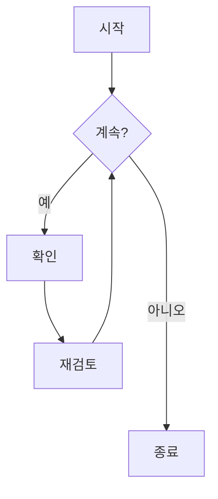
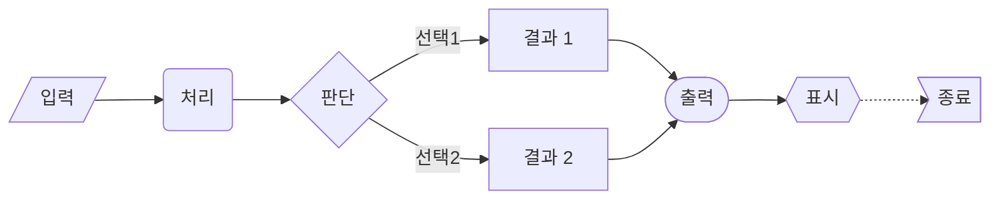
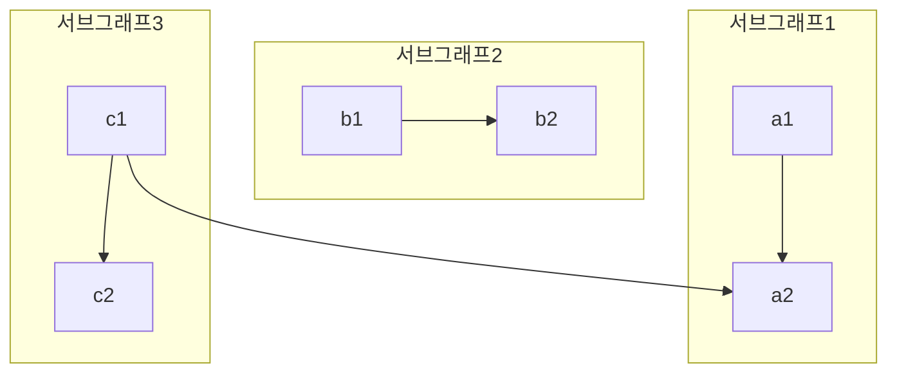
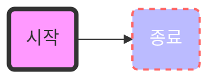

# 순서도

순서도는 워크플로우나 프로세스를 표현하는 다이어그램입니다. Mermaid는 텍스트 설명을 통해 순서도를 생성할 수 있습니다.

## 문법

### 노드 유형
- `id[텍스트]` - 사각형 노드
- `id(텍스트)` - 둥근 사각형 노드
- `id([텍스트])` - 경기장 모양 노드
- `id[[텍스트]]` - 서브루틴 모양 노드
- `id>텍스트]` - 비대칭 노드
- `id{텍스트}` - 마름모 노드
- `id{{텍스트}}` - 육각형 노드
- `id[/텍스트/]` - 평행사변형 노드
- `id[\텍스트\]` - 역평행사변형 노드

### 연결선
- `-->` - 화살표 연결
- `---` - 실선 연결
- `-.->` - 점선 화살표
- `==>` - 굵은 화살표
- `--텍스트-->` - 텍스트가 있는 화살표
- `--텍스트---` - 텍스트가 있는 실선
- `==텍스트==>` - 텍스트가 있는 굵은 화살표

## 기본 예제

## 고급 예제

다양한 노드 유형과 연결 방식을 보여주는 복잡한 순서도:

## 방향 설정

순서도의 방향을 지정할 수 있습니다:
- `TB` - 위에서 아래로
- `TD` - 위에서 아래로(TB와 동일)
- `BT` - 아래에서 위로
- `RL` - 오른쪽에서 왼쪽으로
- `LR` - 왼쪽에서 오른쪽으로

## 서브그래프

서브그래프를 사용하여 복잡한 순서도를 구성할 수 있습니다:

## 스타일 설정

노드와 연결선에 스타일을 적용할 수 있습니다:

## 특수 구문

### 이스케이프 문자
특수 문자가 포함된 텍스트는 큰따옴표를 사용합니다:

### 여러 줄 텍스트
` `을 사용하여 줄바꿈을 추가할 수 있습니다:

## 유용한 팁
- 순서도를 단순하게 유지
- 유사한 요소에 일관된 노드 유형 사용
- 연결선에 의미 있는 레이블 추가
- 흐름을 가장 잘 보여주는 방향 선택
- 서브그래프로 복잡한 로직 구성
- 스타일을 적절히 사용하여 중요 노드 강조
- 교차 연결 최소화
- 명확한 노드 이름 사용

## 일반적인 문제 해결

1. **레이아웃 문제**
   - 다이어그램 방향 조정
   - 노드 간 연결 줄이기
   - 서브그래프로 관련 노드 그룹화

2. **스타일 문제**
   - 구문 확인
   - 색상 코드 정확성 확인
   - 스타일 속성 이름 확인

3. **렌더링 문제**
   - 구문 정확성 확인
   - 노드 ID 중복 확인
   - 연결된 노드 존재 여부 확인

## 다음 단계
- [시퀀스 다이어그램](/ko/diagrams/sequence)
- [상태 다이어그램](/ko/diagrams/state)
- [클래스 다이어그램](/ko/diagrams/class) 