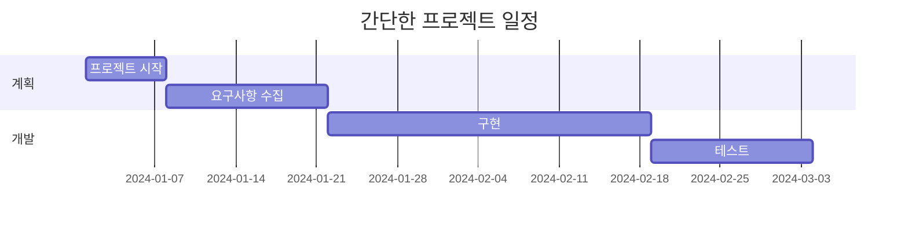
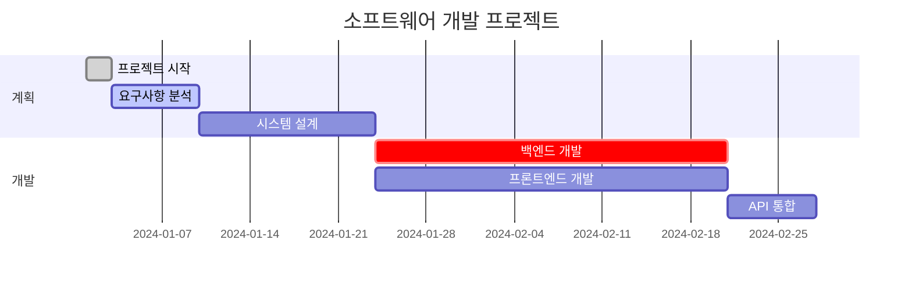

# 간트 차트

간트 차트는 프로젝트 계획과 일정 관리에 사용됩니다. 작업, 기간, 의존성을 시각화할 수 있습니다.

## 문법

### 기본 요소
- 제목: `title [차트 제목]`
- 날짜 형식: `dateFormat YYYY-MM-DD`
- 섹션: `section [섹션 이름]`
- 작업: `[작업 이름] : [작업 ID], [시작일], [기간]`
- 의존성: `after [작업 ID]`

### 시간 단위
- 분: `1m`
- 시간: `1h`
- 일: `1d`
- 주: `1w`
- 월: `1M`

## 기본 예제

## 고급 예제

## 작업 상태

작업에는 다양한 상태를 설정할 수 있습니다:
- `done` - 완료된 작업
- `active` - 현재 진행 중인 작업
- `crit` - 중요 작업

## 실용적인 팁
- 작업 이름은 간결하고 설명적으로
- 의미 있는 섹션 이름 사용
- 중요한 의존성 표시
- 중요한 마일스톤 포함
- 관련 작업을 섹션으로 그룹화

## 일반적인 문제 해결

1. **레이아웃 문제**
   - 작업 수를 적절히 조정
   - 적절한 시간 단위 사용
   - 작업을 적절히 그룹화

2. **의존성 문제**
   - 의존성의 정확성 확인
   - 순환 의존성 피하기
   - 작업 ID의 고유성 확인

## 모범 사례
- 대규모 프로젝트를 관리 가능한 작업으로 분할
- 일관된 명명 규칙 사용
- 진행 상황 정기적 업데이트
- 중요 경로 강조
- 차트를 단순하고 명확하게 유지

## 다음 단계
- [사용자 여정 다이어그램](/ko/diagrams/user-journey)
- [파이 차트](/ko/diagrams/pie)
- [Git 그래프](/ko/diagrams/git) 