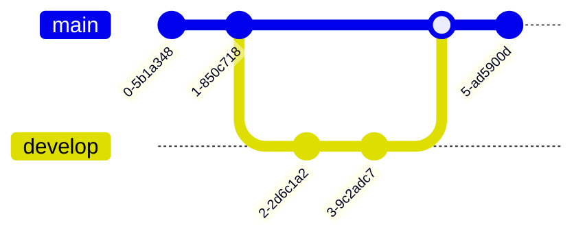
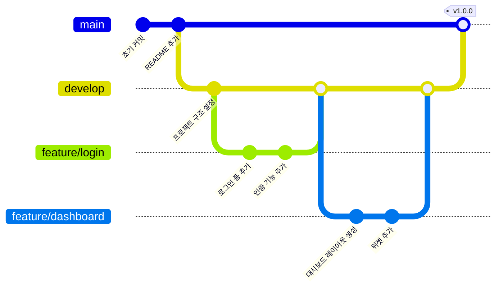
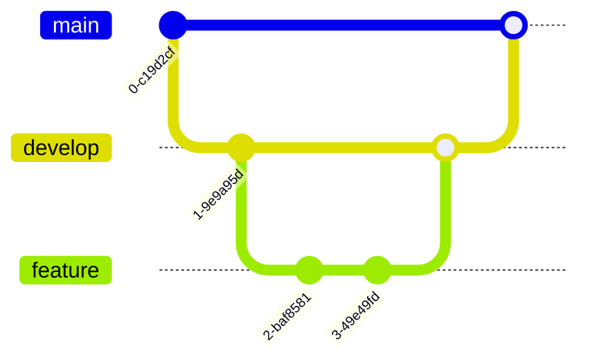
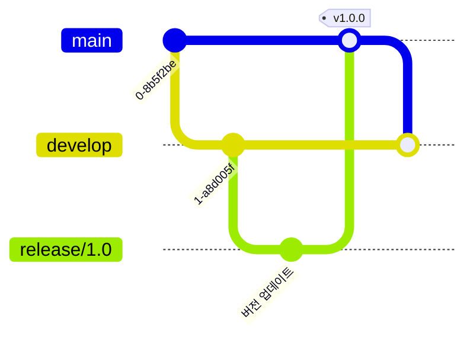
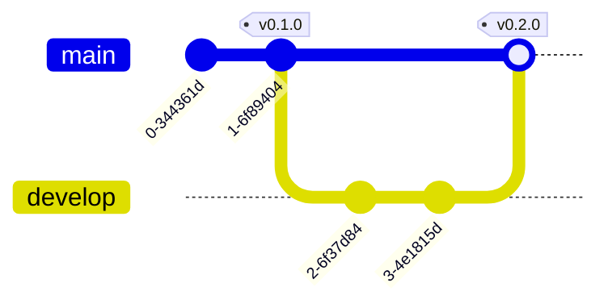
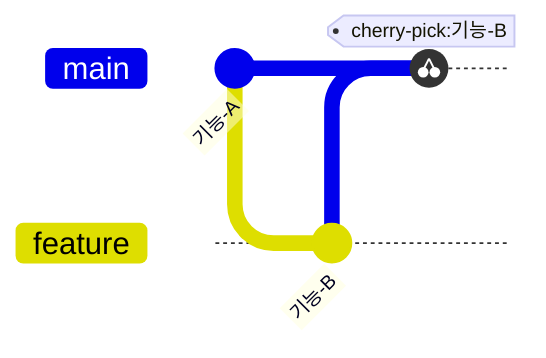

# Git 그래프

Git 그래프는 Git 저장소의 히스토리를 시각화하여 커밋, 브랜치, 병합의 관계를 명확하게 보여줍니다.

## 문법

### 기본 요소
- 커밋: `commit id: "메시지"`
- 브랜치: `branch [이름]`
- 체크아웃: `checkout [브랜치]`
- 병합: `merge [브랜치]`
- 체리픽: `cherry-pick [id]`

## 기본 예제

## 고급 예제

기능 개발 워크플로우를 보여주는 더 복잡한 Git 그래프:

## 브랜치 관리

## 릴리스 관리

## 추가 기능

### 태그와 릴리스

### 체리픽

## 스타일 설정

Git 그래프는 자동으로:
- 커밋 히스토리 표시
- 브랜치 이름 표시
- 병합 지점 표시
- 태그와 릴리스 표시
- 다른 브랜치에 다른 색상 사용

## 유용한 팁
- 커밋 메시지를 명확하고 간결하게 유지
- 의미 있는 브랜치 이름 사용
- 중요한 태그와 릴리스 표시
- 중요한 병합 포함
- 브랜치 전략 보여주기
- 그래프를 단순하게 유지
- 일관된 브랜치 명명 규칙 사용
- 필요한 경우 관련 커밋 ID 포함

## 일반적인 문제 해결

1. **브랜치 문제**
   - 과도한 브랜치 피하기
   - 불필요한 브랜치 적시에 병합 또는 삭제
   - 브랜치 구조를 명확하게 유지

2. **가독성 문제**
   - 간결한 커밋 메시지 사용
   - 중요 지점에 태그 적절히 사용
   - 복잡한 병합 관계 피하기

3. **워크플로우 문제**
   - 일관된 브랜치 전략 따르기
   - 명확한 병합 프로세스
   - 적절한 태그로 버전 관리

## 모범 사례
- Git Flow 또는 유사한 워크플로우 따르기
- 명확한 커밋 메시지 사용
- 적절한 시점에 릴리스 태그 생성
- 메인 브랜치 안정성 유지
- 기능 브랜치 적시에 병합
- 의미 있는 브랜치 이름 사용
- 오래된 브랜치 정기적으로 정리

## 다음 단계
- [C4 다이어그램](/ko/diagrams/c4)
- [마인드맵](/ko/diagrams/mindmap)
- [타임라인](/ko/diagrams/timeline) 