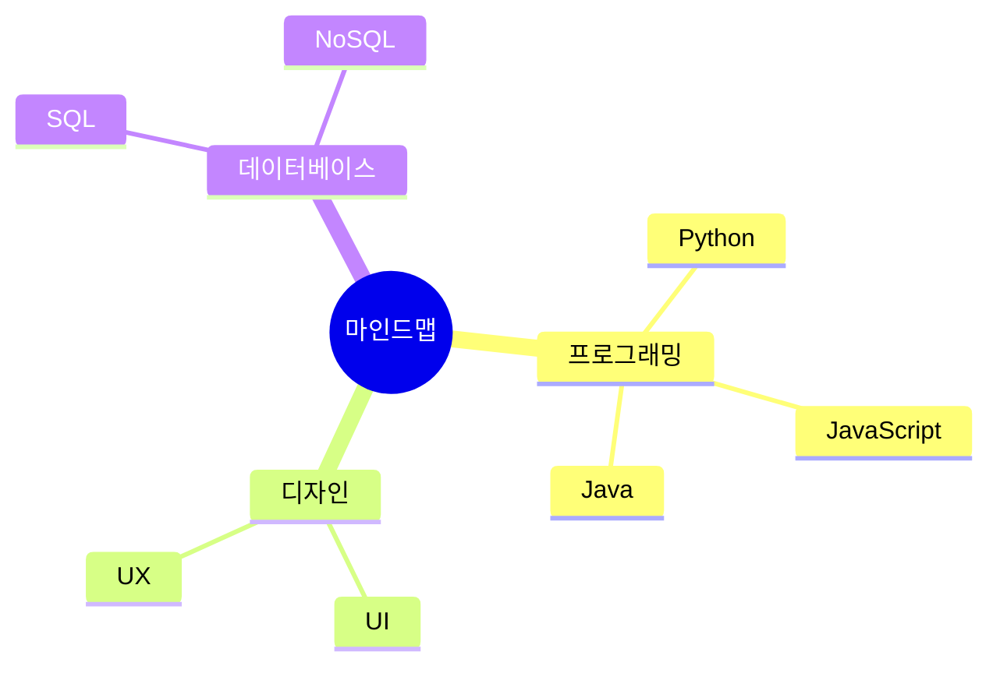
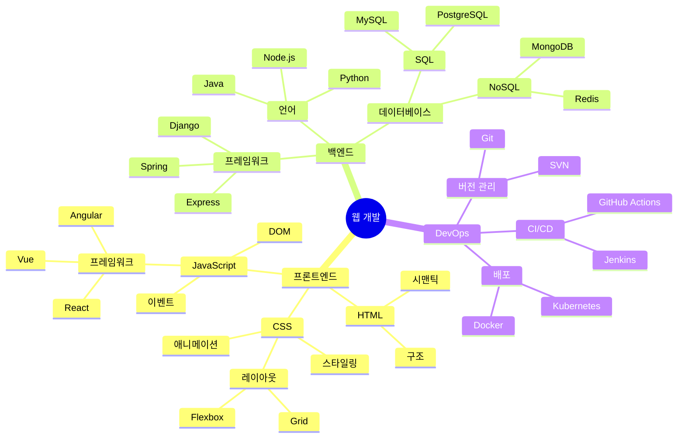
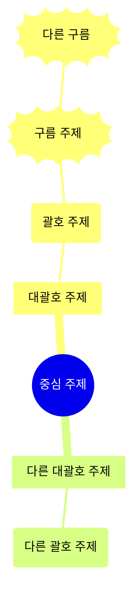
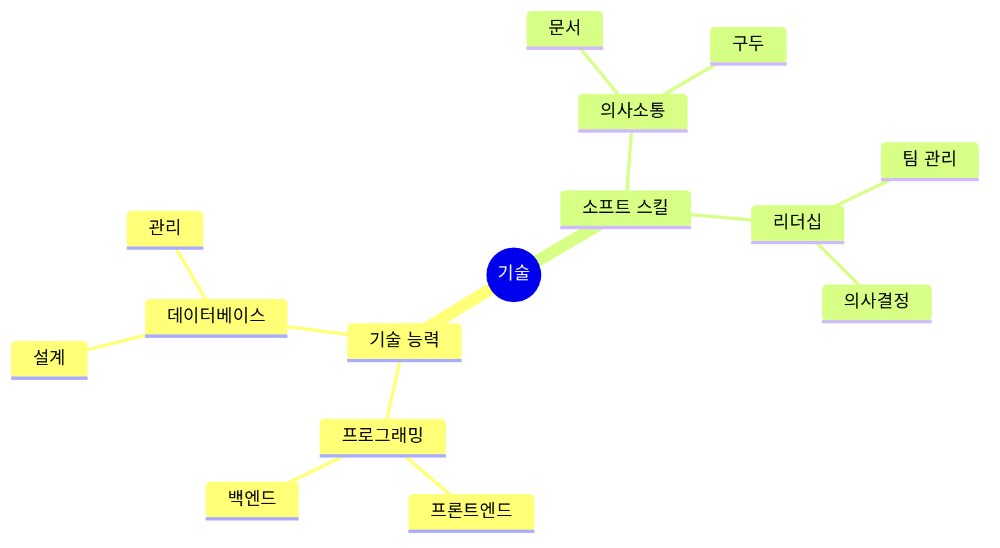

# 마인드맵

마인드맵은 정보를 계층적으로 시각화하여 구성하는 다이어그램입니다. 브레인스토밍, 노트 작성, 복잡한 아이디어 구성에 매우 적합합니다.

## 구문

### 기본 요소
- 루트 노드: 중심 아이디어
- 브랜치: 주요 주제와 하위 주제
- 대괄호: `[텍스트]`로 서식 지정
- 괄호: `(텍스트)`로 서식 지정

## 기본 예제



## 고급 예제

웹 개발 프로젝트의 더 자세한 마인드맵:



## 서식 옵션

### 모양과 스타일



### 아이콘과 마커

```mermaid
mindmap
    root((프로젝트 계획))
        [우선순위 작업]::icon(fa fa-star)
            작업1
            작업2
        [타임라인]::icon(fa fa-calendar)
            1주차
            2주차
        [리소스]::icon(fa fa-users)
            팀A
            팀B
```

## 추가 기능

### 다중 레벨



## 스타일링

마인드맵은 자동으로:
- 루트 노드를 중앙에 배치
- 브랜치를 계층적으로 배열
- 노드에 다른 모양 사용
- 일관된 간격 적용
- 관계를 명확하게 표시

## 팁
- 명확한 중심 아이디어로 시작
- 간결한 레이블 사용
- 관련 개념을 함께 구성
- 브랜치 깊이 제한
- 일관된 서식 사용
- 구조의 균형 유지
- 모양으로 시각적 계층 추가
- 주요 관계에 초점
- 의미 있는 그룹화 사용

## 일반적인 문제 해결

1. **구조 문제**
   - 과도한 가지 피하기
   - 계층 깊이 제어
   - 로직을 명확하게 유지

2. **가독성 문제**
   - 짧은 텍스트 사용
   - 적절한 아이콘 사용
   - 노드 간 간격 주의

3. **레이아웃 문제**
   - 각 가지의 균형 맞추기
   - 노드 위치 조정
   - 공간 활용 최적화

## 모범 사례
- 중심 주제에서 시작
- 키워드 사용
- 계층을 명확하게 유지
- 논리 관계에 주의
- 색상을 적절히 사용
- 정기적인 검토와 업데이트
- 대상 독자의 요구 고려

## 다음 단계
- [순서도](/ko/diagrams/flowchart)
- [시퀀스 다이어그램](/ko/diagrams/sequence)
- [간트 차트](/ko/diagrams/gantt) 