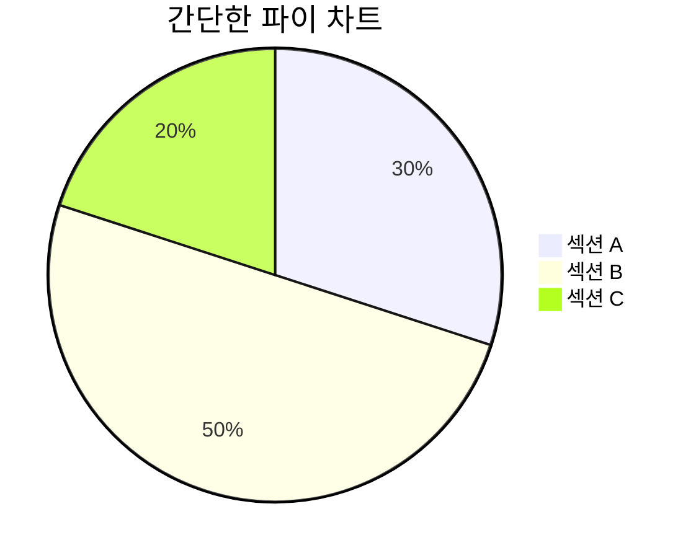
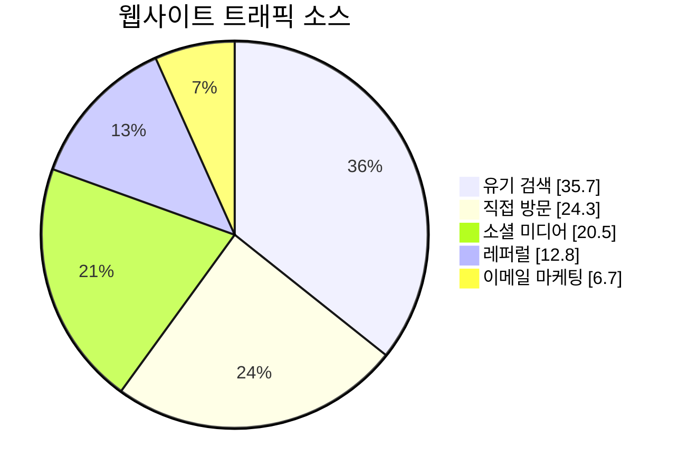
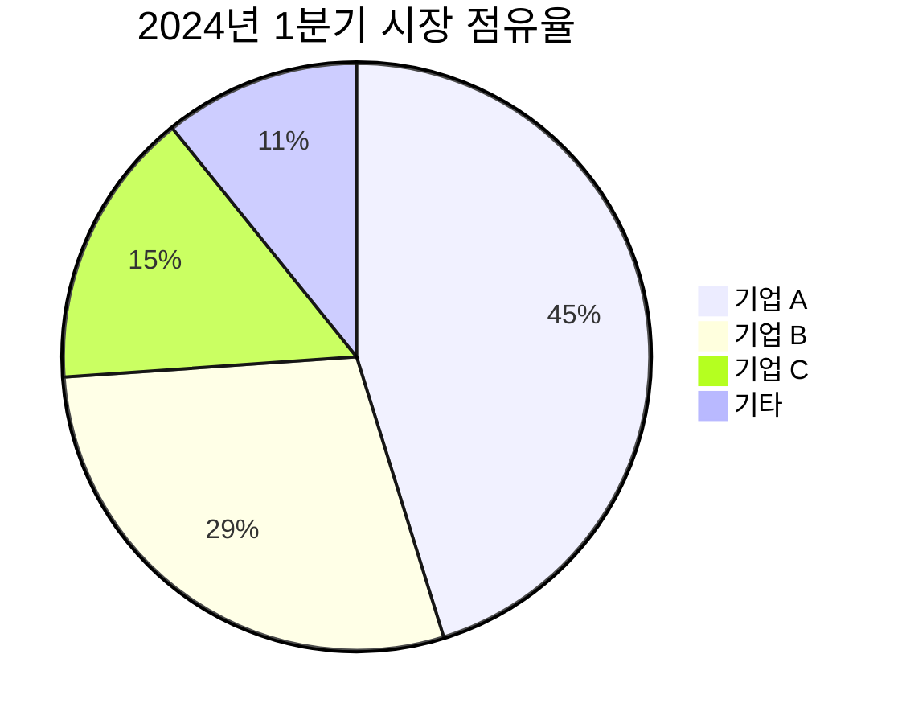
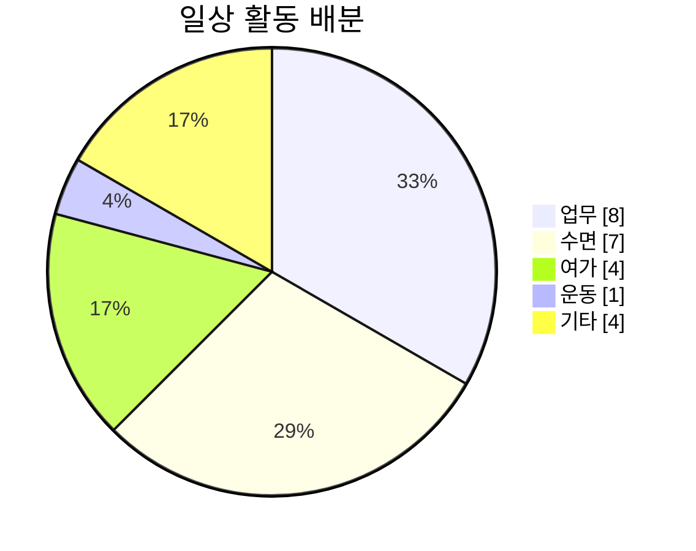
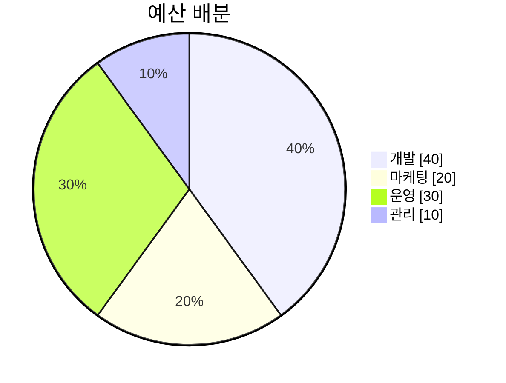

# 파이 차트

파이 차트는 수치의 비율을 표시하는 원형 통계 그래프로, 원을 비례적인 부채꼴로 나누어 데이터를 표시합니다.

## 문법

### 기본 요소
- 제목: `pie title [차트 제목]`
- 데이터 항목: `"[레이블]" : [값]`
- 옵션: `showData` - 값 표시

## 기본 예제

## 고급 예제

웹사이트 트래픽 소스를 보여주는 더 자세한 파이 차트:

## 데이터 시각화

### 시장 점유율 예제

### 시간 배분

## 기능

### 데이터 값 표시

`showData`를 사용하여 실제 값을 표시할 수 있습니다:

## 스타일 설정

파이 차트는 자동으로:
- 부채꼴에 다른 색상 할당
- 비율 계산
- 레이블 표시
- 백분율 및 값 표시(showData 사용 시)

## 유용한 팁
- 부채꼴 수 관리(7개 이하 권장)
- 명확하고 간결한 레이블 사용
- 크기순 정렬 고려
- 의미 있는 제목 사용
- 값이 중요한 경우 `showData` 추가
- 합계가 의미 있는지 확인
- 소수점 자릿수 통일

## 일반적인 문제 해결

1. **가독성 문제**
   - 부채꼴이 너무 많지 않도록 주의
   - 명확한 레이블 사용
   - 적절한 색상 대비 확보

2. **데이터 문제**
   - 합계 확인
   - 비율 계산 검사
   - 데이터 형식 정확성 확인

3. **표시 문제**
   - 레이블 위치 조정
   - 색상 선택 최적화
   - 중첩 문제 처리

## 모범 사례
- 데이터는 간결하고 명확하게
- 색상은 명확히 구분
- 레이블은 이해하기 쉽게
- 비율은 정확하게
- 합계는 의미 있는 값으로
- 정렬 순서는 논리적으로
- 범례는 보기 쉽게

## 다음 단계
- [요구사항 다이어그램](/ko/diagrams/requirement)
- [Git 그래프](/ko/diagrams/git)
- [C4 다이어그램](/ko/diagrams/c4) 