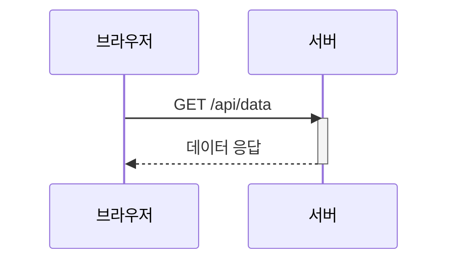
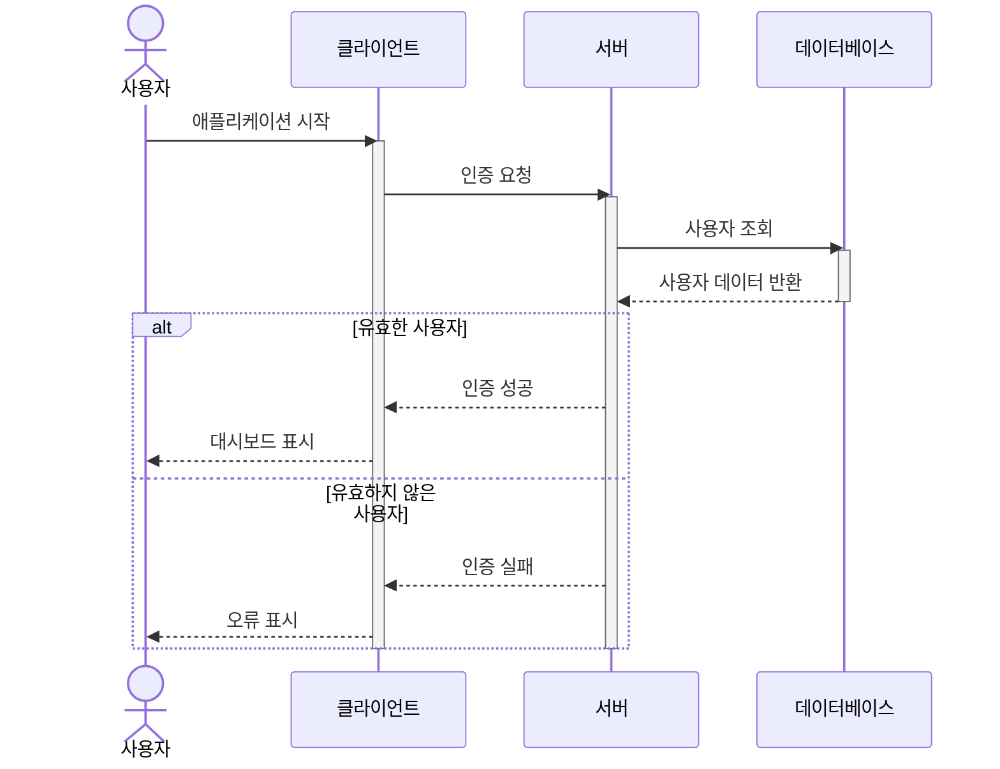
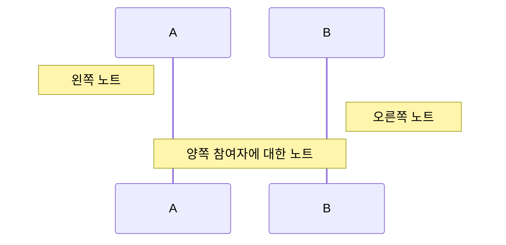
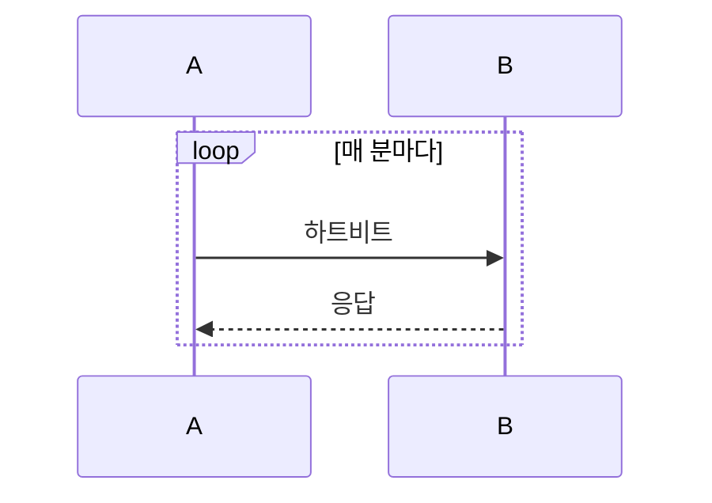

# 시퀀스 다이어그램

시퀀스 다이어그램은 프로세스 간의 동작 방식과 순서를 보여줍니다. 시스템 간의 상호작용을 문서화하는 데 매우 적합합니다.

## 문법

### 기본 요소
- 참여자: `participant A` 또는 `actor A`
- 메시지: 
  - 실선: `->` 
  - 점선: `-->`
  - 실선 화살표: `->>` 
  - 점선 화살표: `-->>`
- 활성화: `activate`와 `deactivate`
- 노트: `Note left of`, `Note right of`, `Note over`
- 반복: `loop [텍스트]`
- 대체 경로: `alt [텍스트]`와 `else [텍스트]`
- 선택 경로: `opt [텍스트]`
- 병렬 경로: `par [텍스트]`

## 기본 예제

## 고급 예제

다양한 기능을 보여주는 복잡한 시퀀스 다이어그램:

## 추가 기능

### 노트

### 반복

## 스타일 설정

다음 지시어를 사용하여 스타일을 사용자 정의할 수 있습니다:
- `autonumber` - 메시지 자동 번호 매기기
- `participant A as "표시 이름"` - 별칭 사용
- CSS를 사용하여 색상 및 기타 스타일 적용 가능

## 유용한 팁
- 중요한 상호작용에 초점 맞추기
- 명확하고 간결한 메시지 설명 사용
- 반복 또는 alt/opt 블록으로 관련 상호작용 그룹화
- 복잡한 상호작용에 노트 추가
- 긴 참여자 이름은 별칭 사용 고려

## 일반적인 문제 해결

1. **레이아웃 문제**
   - 참여자 수 줄이기
   - 긴 메시지는 노트로 대체
   - 적절한 그룹화로 메시지 구성

2. **가독성 문제**
   - 의미 있는 참여자 이름 사용
   - 메시지 설명을 간결하게 유지
   - 적절한 공간과 그룹화 활용

3. **복잡성 관리**
   - 복잡한 상호작용을 여러 다이어그램으로 분할
   - 중요 포인트에 노트 사용
   - 적절한 그룹화 메커니즘 사용

## 다음 단계
- [클래스 다이어그램](/ko/diagrams/class)
- [상태 다이어그램](/ko/diagrams/state)
- [ER 다이어그램](/ko/diagrams/er) 