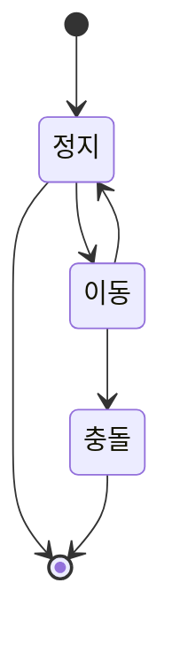
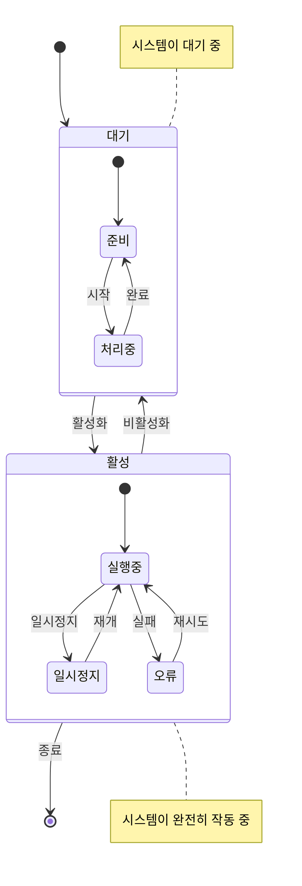
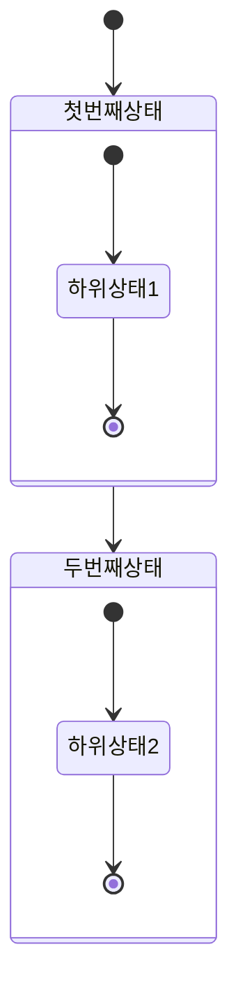
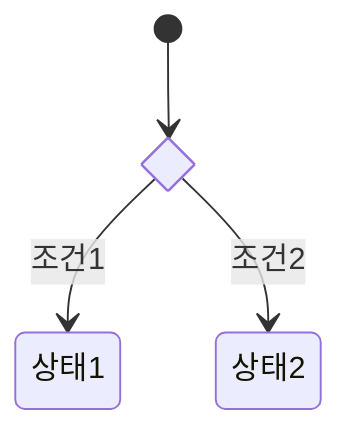
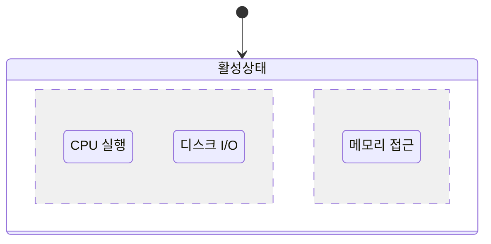

# 상태 다이어그램

상태 다이어그램은 시스템의 다양한 상태와 상태 간의 전환을 설명합니다. 반응형 시스템의 동작을 모델링하는 데 특히 적합합니다.

## 문법

### 기본 요소
- 상태: `state 상태명`
- 전환: `-->` 
- 시작 상태: `[*]`
- 종료 상태: `[*]`
- 복합 상태: 중첩된 상태를 포함할 수 있음
- 선택점: `<<choice>>`
- 노트: `note left/right of`

## 기본 예제

## 고급 예제

다양한 기능을 보여주는 복잡한 상태 다이어그램:

## 복합 상태

## 선택점

## 병렬 상태

## 스타일 설정

외관을 사용자 정의할 수 있습니다:
- 다양한 화살표 유형
- 상태 설명
- 노트
- 방향(LR 또는 TB)

## 유용한 팁
- 시스템의 주요 상태부터 시작
- 명확하고 간결한 상태 이름 사용
- 모든 가능한 전환 포함
- 필요한 경우 전환에 조건 추가
- 복합 상태를 사용하여 복잡성 관리
- 중요한 상태 동작을 노트로 기록
- 상태 다이어그램이 너무 복잡해지지 않도록 주의
- 하위 상태를 적절히 그룹화

## 일반적인 문제 해결

1. **레이아웃 문제**
   - 다이어그램 방향 조정
   - 상태 수 줄이기
   - 복합 상태로 관련 상태 구성

2. **가독성 문제**
   - 의미 있는 상태 이름 사용
   - 전환 설명을 간결하게 유지
   - 노트를 적절히 사용하여 설명

3. **복잡성 관리**
   - 복잡한 상태 다이어그램을 여러 개로 분할
   - 복합 상태 사용
   - 교차하는 전환 피하기

## 다음 단계
- [ER 다이어그램](/ko/diagrams/er)
- [사용자 여정](/ko/diagrams/user-journey)
- [간트 차트](/ko/diagrams/gantt) 