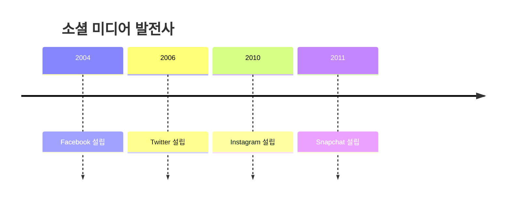
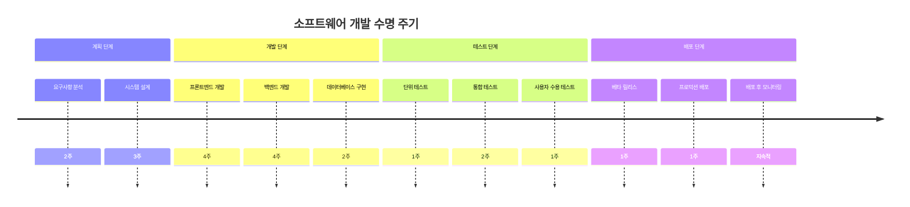
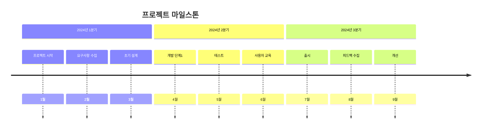
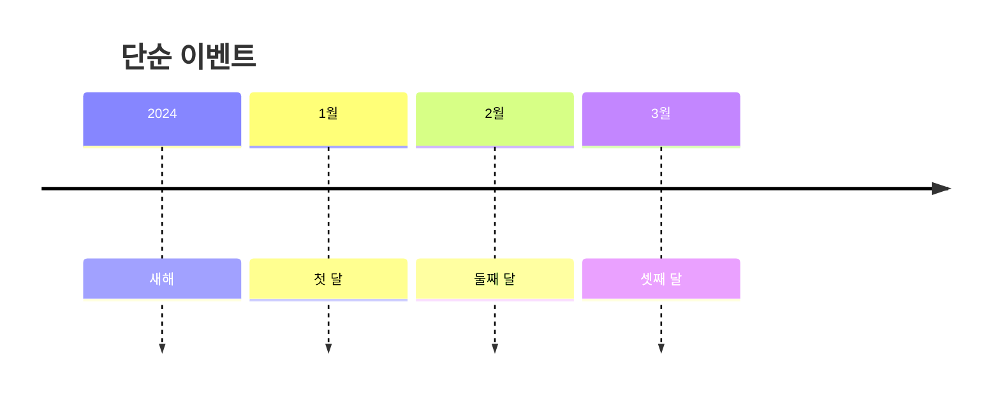
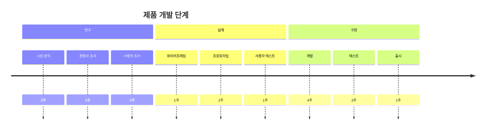

# 타임라인

타임라인 다이어그램은 시간 순서대로 정렬된 이벤트 시퀀스를 시각화하는 도구입니다. 프로젝트 계획, 역사적 사건, 프로세스 문서화에 매우 적합합니다.

## 문법

### 기본 요소
- 제목: 선택적 타임라인 제목
- 섹션: 이벤트 그룹화
- 이벤트: 개별 타임라인 항목

## 기본 예제

## 고급 예제

소프트웨어 개발 수명 주기를 보여주는 더 자세한 타임라인:

## 프로젝트 타임라인

## 이벤트 유형

### 단순 이벤트

### 그룹화된 이벤트

## 스타일 설정

타임라인은 자동으로:
- 시간순으로 이벤트 배치
- 관련 이벤트를 섹션으로 그룹화
- 기간 표시(지정된 경우)
- 일관된 간격 유지
- 명확한 관계 표시

## 실용적인 팁
- 이벤트 설명을 간결하게 유지
- 의미 있는 섹션 이름 사용
- 중요한 날짜 포함
- 관련 이벤트 그룹화
- 진행 상황을 명확하게 표시
- 적절한 기간 포함
- 일관된 형식 사용
- 주요 마일스톤에 집중

## 일반적인 문제 해결

1. **구조 문제**
   - 섹션의 논리성 확인
   - 이벤트 순서의 정확성
   - 시간 범위의 적절성

2. **가독성 문제**
   - 간결한 설명 사용
   - 적절한 섹션 수 유지
   - 이벤트 수 관리

3. **시간 관리 문제**
   - 적절한 시간 범위 설정
   - 이벤트 간격 주의
   - 병렬 이벤트 처리

## 모범 사례

1. **타임라인 계획**
   - 적절한 시간 범위 결정
   - 적절한 상세도 선택
   - 시간 흐름을 명확하게 유지

2. **콘텐츠 구성**
   - 명확한 이벤트 설명 사용
   - 관련 이벤트 적절히 그룹화
   - 중요 마일스톤 강조

3. **시각적 표현**
   - 레이아웃 정돈
   - 일관된 형식 사용
   - 정보의 가독성 확보

## 다음 단계
- [마인드맵](/ko/diagrams/mindmap)
- [간트 차트](/ko/diagrams/gantt)
- [Git 그래프](/ko/diagrams/git) 