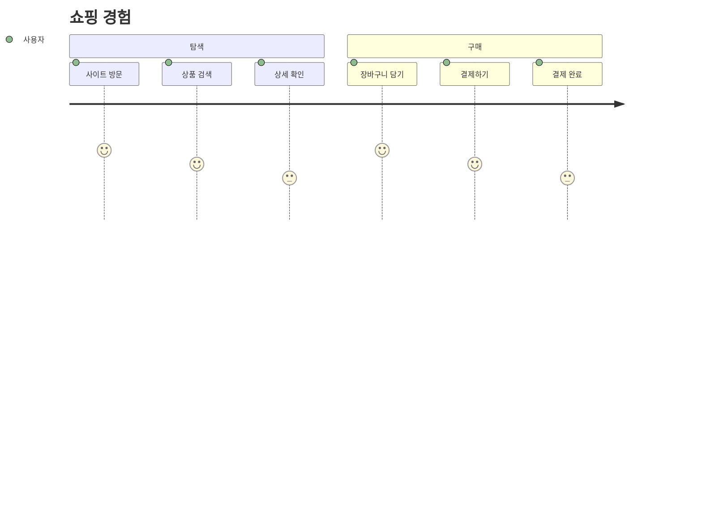
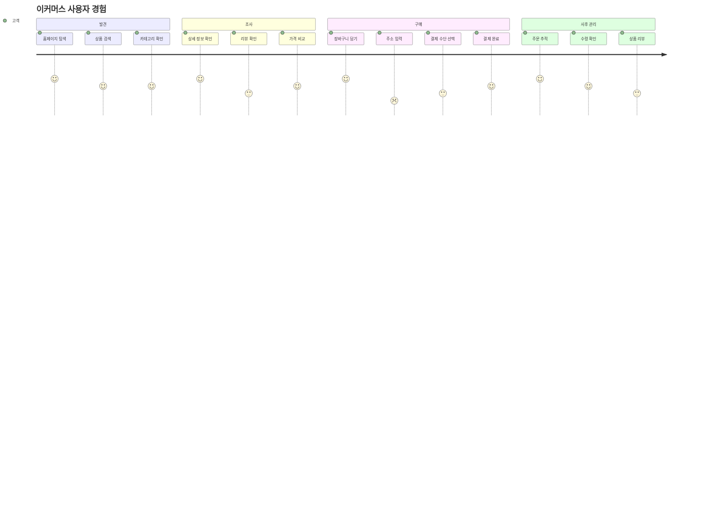
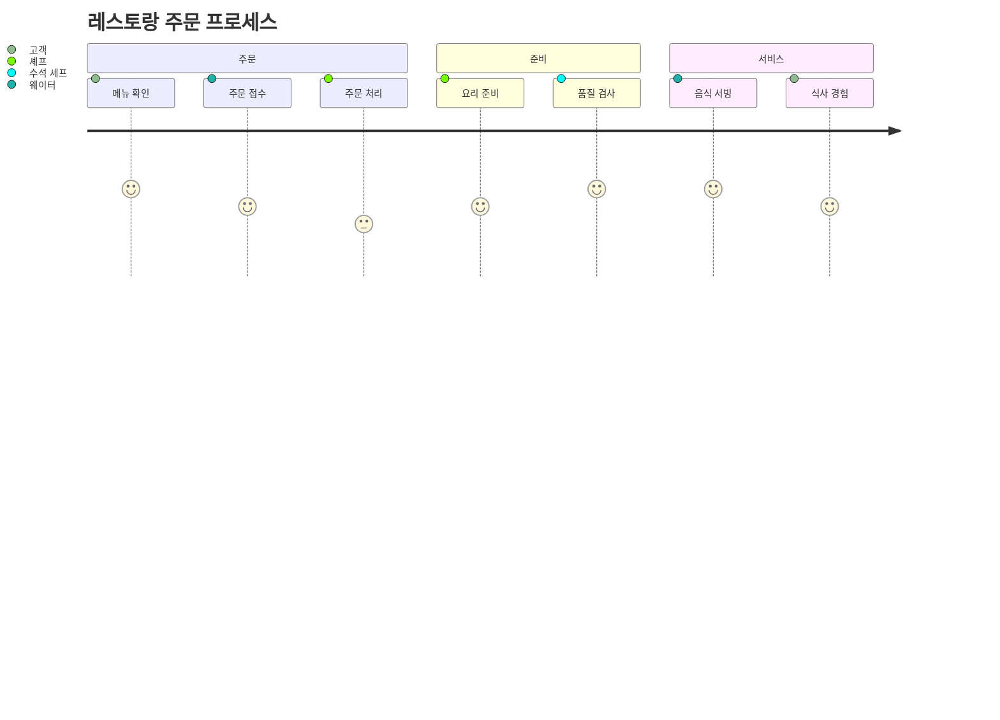

# 사용자 여정 다이어그램

사용자 여정 다이어그램은 프로세스나 서비스에서 사용자의 경험을 시각화하고 분석하는 데 도움을 줍니다. 고객 상호작용을 매핑하고 문제점을 식별하는 데 매우 적합합니다.

## 문법

### 기본 요소
- 제목: `journey title [여정 제목]`
- 섹션: `section [섹션 이름]`
- 작업: `[작업 이름]: [점수]: [역할]`
- 점수: 1-5점 척도(1점 최저, 5점 최고)

## 기본 예제

## 고급 예제

더 자세한 이커머스 경험을 보여주는 예제:

## 점수 시스템

점수 기준:
1. 매우 불만족 😫
2. 불만족 😟
3. 보통 😐
4. 만족 😊
5. 매우 만족 😄

## 다중 역할 예제

## 스타일 설정

다이어그램은 자동으로:
- 섹션별로 다른 색상 사용
- 점수에 따른 이모티콘 표시
- 작업을 시간순으로 배치
- 관련 작업을 섹션으로 그룹화

## 실용적인 팁
- 섹션 이름을 명확하고 간결하게 유지
- 의미 있는 작업 설명 사용
- 실제 사용자 피드백 기반 점수
- 모든 주요 접점 포함
- 다중 역할 고려
- 사용자 관점에서 접근
- 섹션으로 관련 활동 그룹화

## 일반적인 문제 해결

1. **구조 문제**
   - 섹션의 논리성 확인
   - 작업 순서의 정확성 확인
   - 역할 할당의 적절성 확인

2. **점수 문제**
   - 객관적인 점수 유지
   - 사용자 피드백 기반
   - 정기적인 점수 업데이트

3. **가독성 문제**
   - 간결한 설명 사용
   - 적절한 섹션 수 유지
   - 관리 가능한 작업 수 유지

## 모범 사례
- 사용자 관점에서 여정 설계
- 주요 접점 식별
- 문제점과 기회 강조
- 정기적인 업데이트와 최적화
- 사용자 피드백 수집
- 감정 변화에 주목
- 다이어그램을 단순하게 유지

## 다음 단계
- [간트 차트](/ko/diagrams/gantt)
- [파이 차트](/ko/diagrams/pie)
- [Git 그래프](/ko/diagrams/git) 