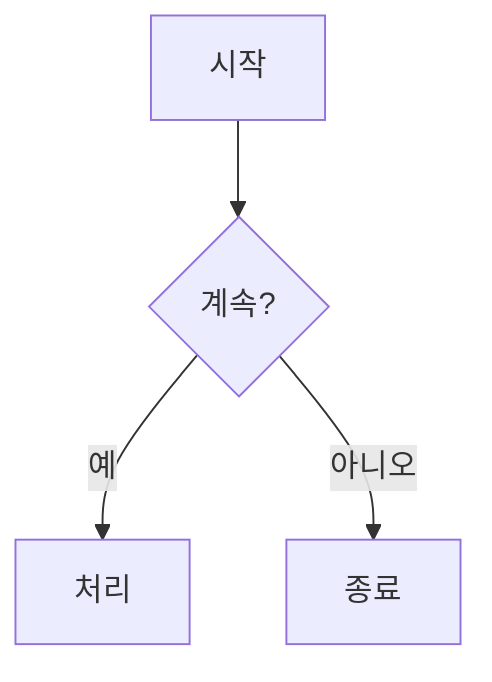
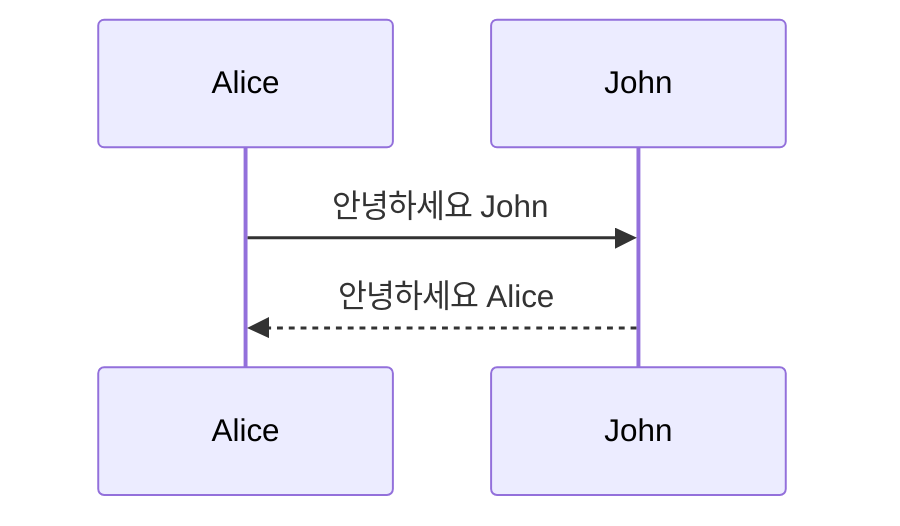
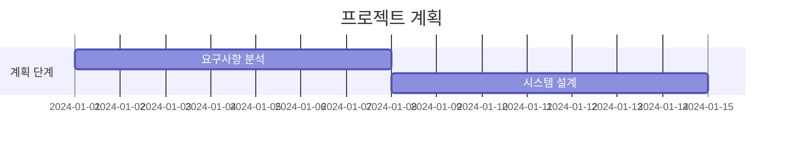

# 시작하기

이 가이드는 Mermaid를 사용하여 다이어그램을 만드는 방법을 빠르게 익힐 수 있도록 도와줍니다.

## 기본 단계

1. [Mermaid Viewer](https://mermaidviewer.com) 방문
2. 다이어그램 유형 선택
3. 다이어그램 코드 작성
4. 실시간 미리보기 확인

## 기본 문법

모든 Mermaid 다이어그램은 다이어그램 유형 선언으로 시작하고, 그 다음에 구체적인 다이어그램 정의가 이어집니다.

### 순서도 예시



코드 설명:
- `graph TD`는 위에서 아래로의 그래프를 나타냅니다
- 대괄호 `[]`로 사각형 노드 생성
- 중괄호 `{}`로 마름모 노드 생성
- `-->`로 연결선 생성
- `|텍스트|`로 연결선에 텍스트 추가

### 시퀀스 다이어그램 예시



코드 설명:
- `sequenceDiagram`으로 시퀀스 다이어그램 선언
- `->>`로 실선 화살표 생성
- `-->>`로 점선 화살표 생성

### 간트 차트 예시



코드 설명:
- `gantt`로 간트 차트 선언
- `dateFormat`으로 날짜 형식 정의
- `section`으로 작업 그룹 생성
- 작업은 이름, 시작일, 기간을 정의

## 자주 사용하는 기법

1. **주석**
   ```
   %% 이것은 주석입니다
   ```

2. **스타일**
   ```mermaid
   graph LR
      A[빨간 노드]
      style A fill:#f00
   ```

3. **서브그래프**
   ```mermaid
   graph TB
      subgraph 서브그래프 제목
          A --> B
      end
   ```

## 통합 방법

### Markdown 통합

Markdown 파일에서 사용:

    ```mermaid
    graph LR
        A --> B
    ```

### HTML 통합

웹페이지에 삽입:

```html
<div class="mermaid">
    graph LR
        A --> B
</div>
```

## 자주 발생하는 문제

1. **구문 오류**
   - 괄호 쌍 확인
   - 화살표 방향 확인
   - 노드 ID 중복 확인

2. **레이아웃 문제**
   - 다이어그램 방향 조정(TD, LR 등)
   - 노드 간 연결 수 줄이기
   - 서브그래프로 복잡한 다이어그램 구성

3. **렌더링 문제**
   - Mermaid 최신 버전 사용 확인
   - 브라우저 호환성 확인
   - 브라우저 캐시 삭제

## 다음 단계

- [순서도 상세 설명](/ko/diagrams/flowchart)
- [시퀀스 다이어그램 튜토리얼](/ko/diagrams/sequence)
- [전체 다이어그램 유형 목록](/ko/diagrams/overview)

## 온라인 리소스

- [공식 문서](https://mermaid.js.org/)
- [온라인 에디터](/ko/mermaid-viewer/full-screen-editor)
- [예제 모음](/ko/examples) 