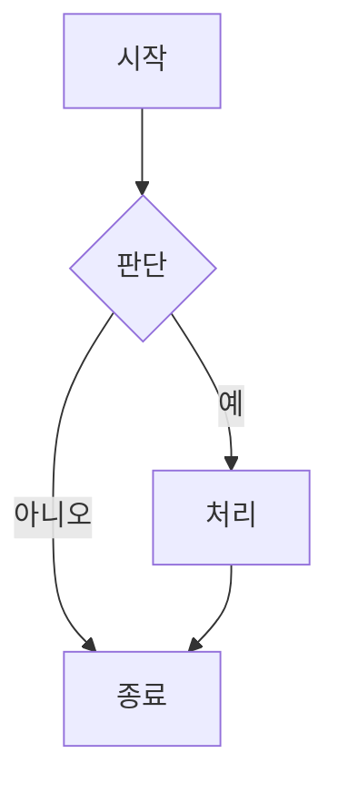
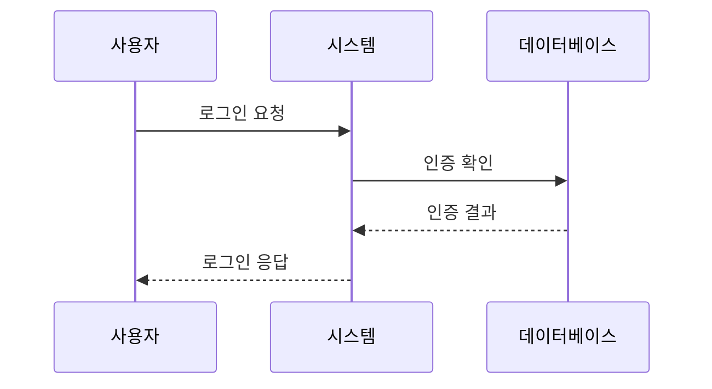
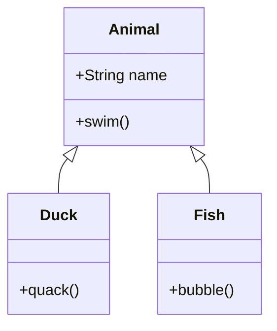

# Mermaid란?

Mermaid는 JavaScript 기반의 다이어그램 및 시각화 도구로, 텍스트와 코드를 사용하여 도표를 생성할 수 있습니다. 주요 목적은 문서화가 개발 속도를 따라갈 수 있도록 돕는 것입니다.

## 주요 특징

- 📝 텍스트 기반 도표 정의
- 🔄 버전 관리 친화적
- 🎨 다양한 도표 유형 지원
- 🛠 쉬운 통합과 사용
- 📱 반응형 디자인

## 지원하는 도표 유형

### 순서도
순서도는 가장 기본적이고 일반적인 도표 유형 중 하나입니다:

### 시퀀스 다이어그램
객체나 시스템 간의 상호작용을 보여주는 데 사용됩니다:

### 클래스 다이어그램
시스템의 정적 구조를 표시합니다:

## Mermaid를 선택하는 이유

1. **배우기 쉬움**
   - 간단한 텍스트 구문
   - 풍부한 문서와 예제
   - 활발한 커뮤니티 지원

2. **버전 관리와 호환성**
   - 텍스트 형식으로 도표 정의 저장
   - 변경 사항 추적 용이
   - 팀 협업 지원

3. **다양한 통합 옵션**
   - Markdown 통합
   - 다양한 플랫폼에 임베딩
   - API 인터페이스 제공

4. **실시간 미리보기**
   - 즉각적인 변경 확인
   - 빠른 반복과 조정
   - WYSIWYG 편집 경험

## 시작하기

Mermaid를 시작하려면:

1. [Mermaid Viewer](https://mermaidviewer.com) 방문
2. 만들고 싶은 도표 유형 선택
3. 제공된 예제 참고
4. 필요에 따라 수정 및 조정

## 다음 단계

- [시작하기](/ko/introduction/getting-started) - 기본 구문과 사용법 학습
- [순서도](/ko/diagrams/flowchart) - 가장 일반적인 도표 유형 자세히 알아보기
- [온라인 에디터](/ko/mermaid-viewer/full-screen-editor) - 온라인 도구로 도표 만들기 