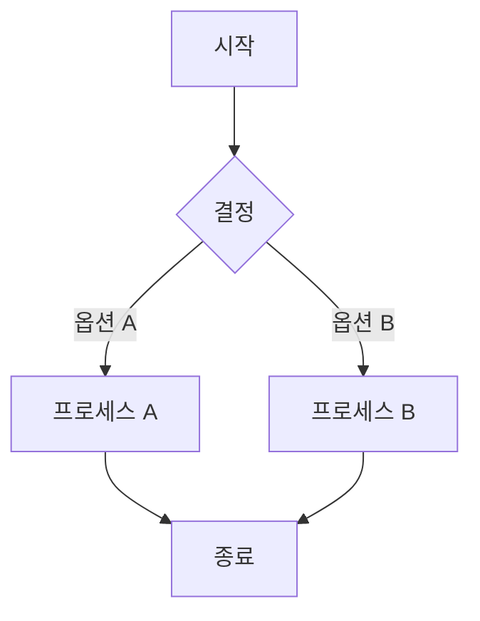

# [Mermaid Viewer](https://mermaidviewer.com) 사용 가이드

[Mermaid Viewer](https://mermaidviewer.com)는 강력하고 직관적인 다이어그램 편집 도구로, 단 세 가지 간단한 단계로 전문적인 다이어그램을 만들 수 있습니다.

### 기본 사용 과정

#### 1. Mermaid 코드 입력

[Mermaid Viewer](https://mermaidviewer.com)의 편집기 창에 다이어그램 코드를 입력합니다. 초보자라면 기본 예제 코드를 시작점으로 사용할 수 있습니다:

편집기는 구문 강조 기능을 지원하여 코드 작성과 관리를 더 쉽게 만들어 줍니다.

#### 2. 실시간 미리보기

코드를 입력하거나 수정하면 오른쪽 미리보기 창이 자동으로 업데이트되어 다이어그램 변경 사항을 실시간으로 보여줍니다. 이러한 즉각적인 피드백을 통해 다이어그램 디자인을 빠르게 반복하고 개선할 수 있습니다.

#### 3. 내보내기 및 공유

다이어그램이 완성되면 다음과 같은 작업을 할 수 있습니다:
- SVG 형식으로 내보내기(확장 가능한 벡터 그래픽)
- PNG 형식으로 내보내기(래스터 이미지)
- PDF 형식으로 내보내기(인쇄 문서)
- 팀원과 협업할 수 있는 공유 링크 생성

### 고급 기능

#### 다이어그램 저장
다이어그램은 브라우저의 로컬 스토리지에 자동으로 저장되어 언제든지 돌아와서 편집을 계속할 수 있습니다. 또한 공유 기능을 사용하여 영구 링크를 만들 수도 있습니다.

#### 공유 및 협업
"공유" 버튼을 클릭하면 팀원이 다이어그램을 보고 편집할 수 있는 고유 링크가 생성됩니다. 모든 변경 사항은 실시간으로 동기화되어 다중 사용자 협업을 지원합니다.

#### 다른 플랫폼에 임베딩
생성된 다이어그램은 웹사이트, 블로그, 문서 또는 프레젠테이션에 임베드할 수 있습니다. 시스템은 여러 임베드 코드 형식을 제공합니다:
- HTML 임베드 코드
- 마크다운 코드
- 이미지 링크

### 자주 묻는 질문

**질문: 다이어그램을 어떻게 저장하나요?**  
답변: 다이어그램은 여러 방법으로 저장할 수 있습니다: 1) SVG/PNG 파일로 내보내기 2) 공유 링크 복사 3) 브라우저 로컬 스토리지에 저장. 편집기는 최신 변경 사항을 자동으로 저장하므로 작업 내용을 잃어버리지 않습니다.

**질문: 설치가 필요한가요?**  
답변: 아니요! [Mermaid Viewer](https://mermaidviewer.com)는 브라우저 기반 온라인 도구로 설치가 필요 없습니다. 브라우저를 열고 웹사이트에 접속하기만 하면 다이어그램 생성을 시작할 수 있습니다.

**질문: 고품질 다이어그램을 어떻게 내보내나요?**  
답변: 여러 내보내기 옵션을 제공합니다: 1) 확장 가능한 SVG 형식 2) 바로 사용 가능한 PNG 형식 3) 고해상도 내보내기 옵션으로 모든 상황에서 다이어그램이 선명하게 보입니다. 크기와 배경색 등의 내보내기 설정도 사용자 정의할 수 있습니다.

간단한 다이어그램을 빠르게 만들어야 하든, 복잡한 기술 문서를 제작해야 하든, [Mermaid Viewer](https://mermaidviewer.com)는 여러분의 요구를 충족하고 아이디어를 전문적인 방식으로 시각화하는 데 도움을 줍니다. 