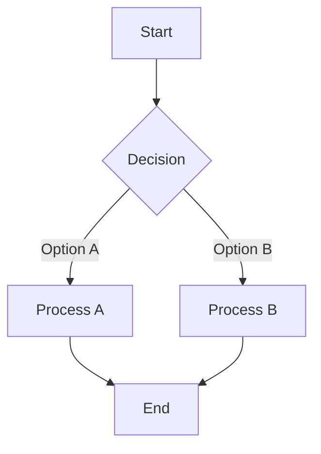

# [Mermaid Viewer](https://mermaidviewer.com) User Guide

[Mermaid Viewer](https://mermaidviewer.com) is a powerful and intuitive diagram editing tool that allows you to create professional diagrams in just three simple steps.

### Basic Usage Process

#### 1. Enter Mermaid Code

Enter your diagram code in the [Mermaid Viewer](https://mermaidviewer.com) editor pane. If you're a beginner, you can use the default example code as a starting point:

The editor supports syntax highlighting, making it easier for you to write and manage your code.

#### 2. Real-time Preview

As you type or modify your code, the preview pane on the right automatically updates, showing your diagram changes in real-time. This immediate feedback allows you to quickly iterate and refine your diagram design.

#### 3. Export and Share

Once your diagram is complete, you can:
- Export as SVG format (scalable vector graphics)
- Export as PNG format (raster image)
- Export as PDF format (print document)
- Create a share link to collaborate with team members

### Advanced Features

#### Saving Diagrams
Diagrams are automatically saved in your browser's local storage, allowing you to return and continue editing at any time. You can also create permanent links using the share feature.

#### Sharing and Collaboration
Click the "Share" button to generate a unique link that team members can use to view and edit the diagram. All changes are synchronized in real-time, supporting multi-user collaboration.

#### Embedding in Other Platforms
Generated diagrams can be embedded in websites, blogs, documents, or presentations. The system provides multiple embedding code formats:
- HTML embedding code
- Markdown code
- Image links

### Frequently Asked Questions

**Q: How do I save my diagram?**  
A: Diagrams can be saved in multiple ways: 1) Export as SVG/PNG files 2) Copy the share link 3) Save to browser local storage. The editor automatically saves your latest changes, so you won't lose any work.

**Q: Do I need to install anything?**  
A: No! [Mermaid Viewer](https://mermaidviewer.com) is a browser-based online tool that requires no installation. Simply open your browser, visit the website, and start creating diagrams.

**Q: How can I export high-quality diagrams?**  
A: We offer multiple export options: 1) Scalable SVG format 2) Ready-to-use PNG format 3) High-resolution export options, ensuring your diagrams are clear in any context. You can also customize export settings such as size and background color.

Whether you need to quickly create simple diagrams or produce complex technical documentation, [Mermaid Viewer](https://mermaidviewer.com) can meet your needs, helping you visualize ideas in a professional way.