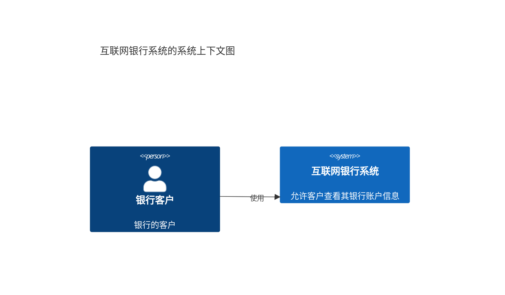
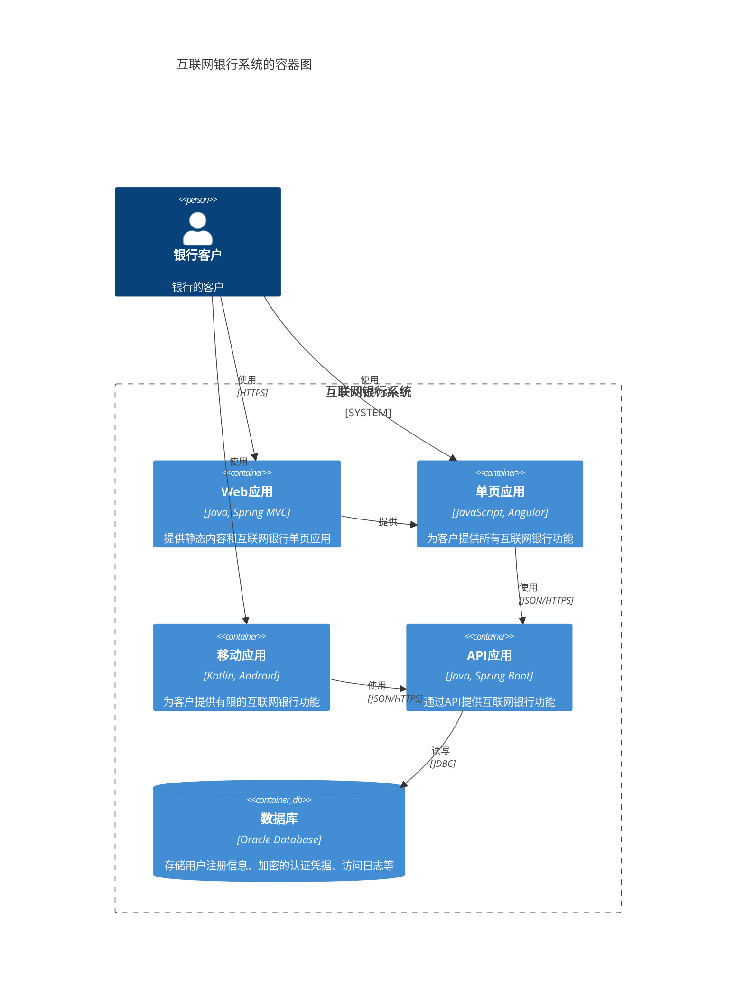
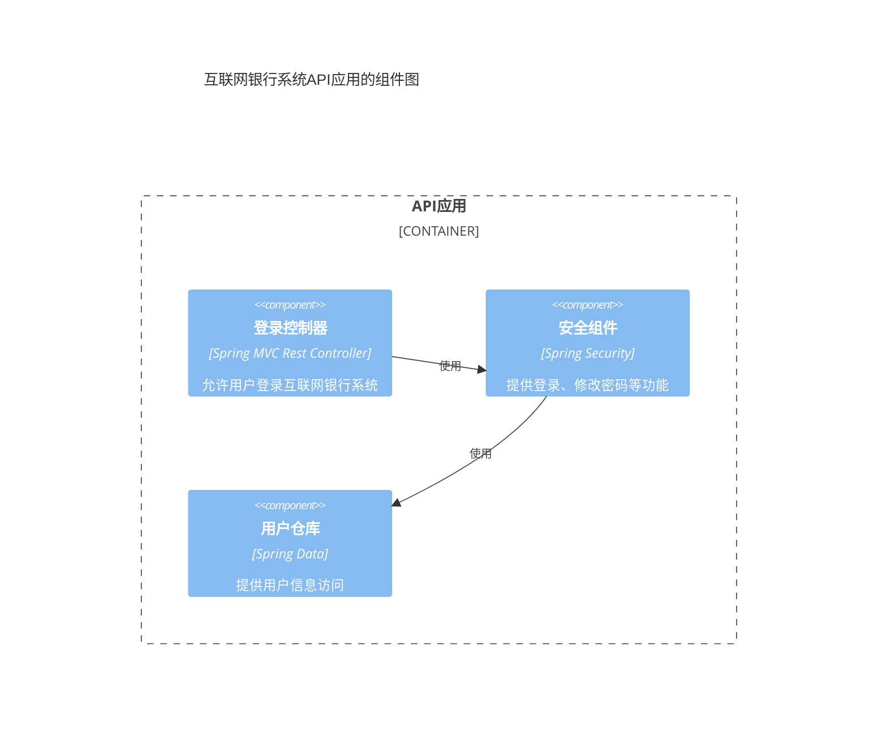
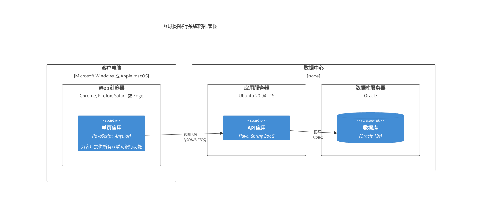
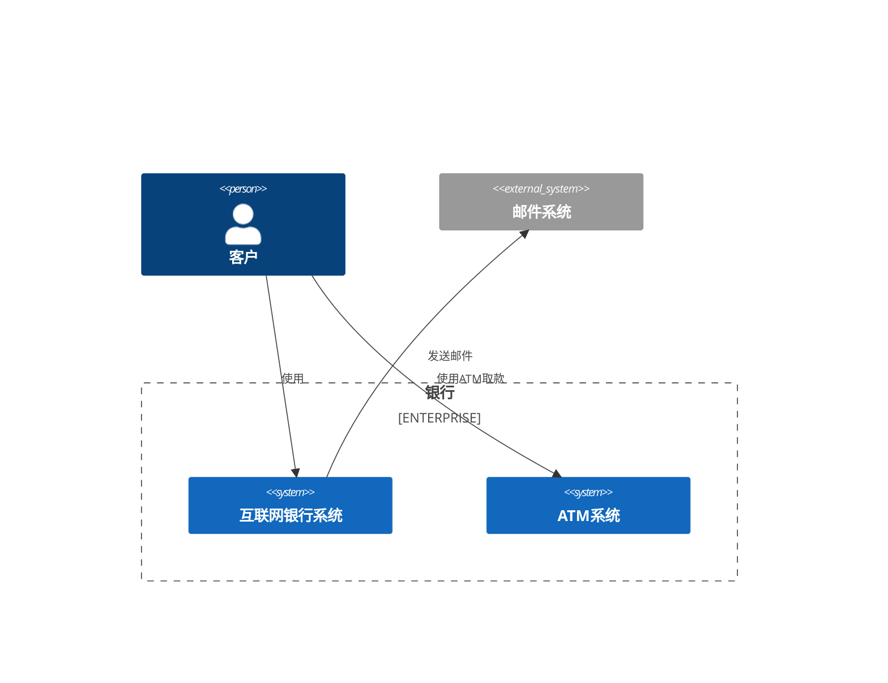

# C4 架构图

C4 架构图提供了一种在不同抽象层次上可视化软件架构的方法。C4 模型包括上下文(Context)、容器(Container)、组件(Component)和代码(Code)四个层次的图。

## 语法

### 基本元素
- 人员: `Person(别名, 标签)`
- 系统: `System(别名, 标签)`
- 容器: `Container(别名, 标签, 技术)`
- 组件: `Component(别名, 标签, 技术)`
- 关系: `Rel(从, 到, 标签)`

## 基础示例

## 高级示例

这是一个更详细的 Web 应用程序容器图：

## 组件级别

## 部署图

## 附加功能

### 边界和企业

## 样式设置

C4 图表会自动：
- 格式化不同类型的元素
- 显示关系和依赖
- 显示技术栈
- 组织层次结构
- 使用一致的视觉语言

## 实用技巧
- 从上下文图开始
- 通过容器和组件视图逐步添加细节
- 保持图表重点明确
- 包含相关技术细节
- 显示关键关系
- 使用有意义的描述
- 在相关处包含技术选择
- 考虑受众的技术水平

## 常见问题解决

1. **复杂性问题**
   - 适当选择抽象级别
   - 分解复杂系统
   - 使用边界组织元素

2. **可读性问题**
   - 保持清晰的层次结构
   - 避免过多的关系线
   - 使用有意义的标签

3. **一致性问题**
   - 遵循C4模型约定
   - 保持命名一致
   - 使用统一的表示方式

## 最佳实践
- 选择合适的抽象级别
- 保持图表简洁明了
- 使用清晰的命名
- 包含必要的技术细节
- 突出重要关系
- 考虑图表的目标受众
- 保持视图之间的一致性

## 下一步
- [思维导图](/zh/diagrams/mindmap)
- [时间线](/zh/diagrams/timeline)
- [Git图](/zh/diagrams/git) 