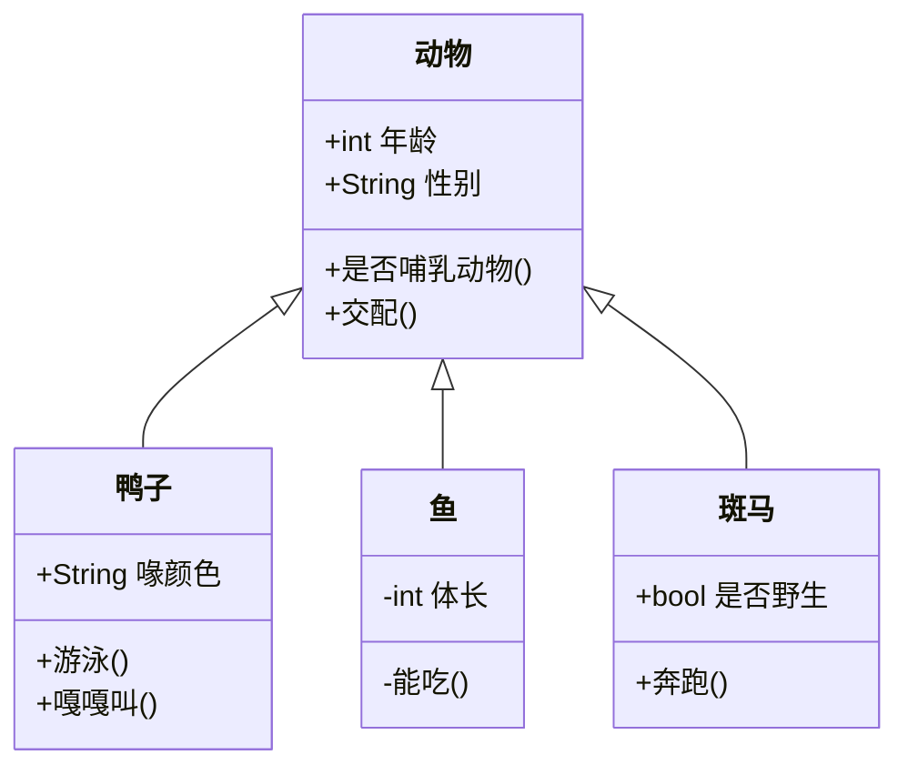
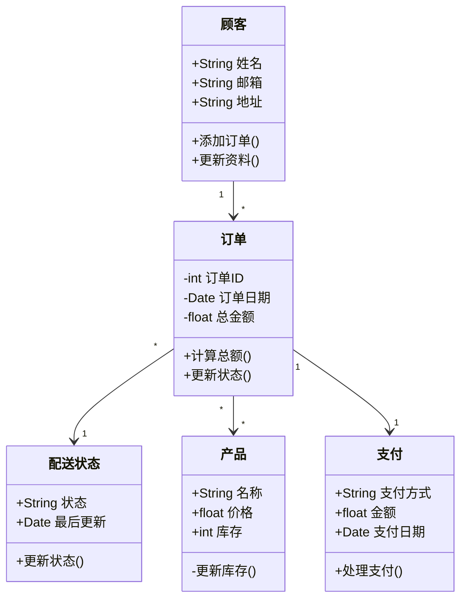
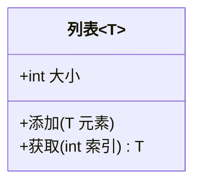
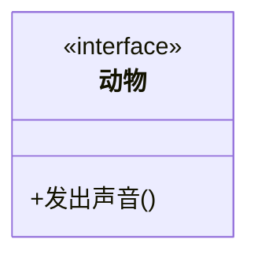

# 类图

类图是面向对象建模的核心。它们展示了系统中的类、它们的属性、操作以及类之间的关系。

## 语法

### 类的定义
```
class 类名 {
    +公有字段
    -私有字段
    #受保护字段
    +公有方法()
    -私有方法()
    #受保护方法()
}
```

### 关系类型
- 继承: `<|--`
- 组合: `*--`
- 聚合: `o--`
- 关联: `-->`
- 依赖: `..>`
- 实现: `<|..`

## 基础示例



## 高级示例

这是一个展示各种关系和特性的复杂类图：



## 附加功能

### 泛型类型


### 接口


### 抽象类


## 样式设置

可以使用不同的符号表示可见性：
- `+` 公有
- `-` 私有
- `#` 受保护
- `~` 包/内部

## 实用技巧
- 保持类的专注性，遵循单一职责原则
- 使用有意义的类名和方法名
- 只显示相关的属性和方法
- 使用适当的类之间关系
- 适当使用接口和抽象类
- 注意类的封装性
- 合理使用继承和组合
- 避免过度设计

## 常见问题解决

1. **设计问题**
   - 检查类的职责是否单一
   - 确保继承关系合理
   - 避免过度耦合

2. **关系表示**
   - 正确使用关系类型
   - 明确关系的方向
   - 添加适当的关系描述

3. **可读性问题**
   - 适当分组相关类
   - 减少交叉关系
   - 使用清晰的命名

## 下一步
- [状态图](/zh/diagrams/state)
- [实体关系图](/zh/diagrams/er)
- [用户旅程图](/zh/diagrams/user-journey) 