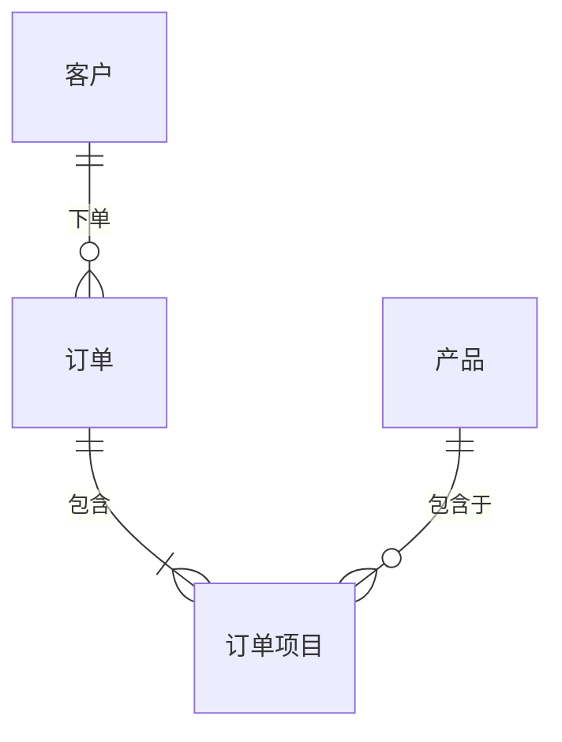
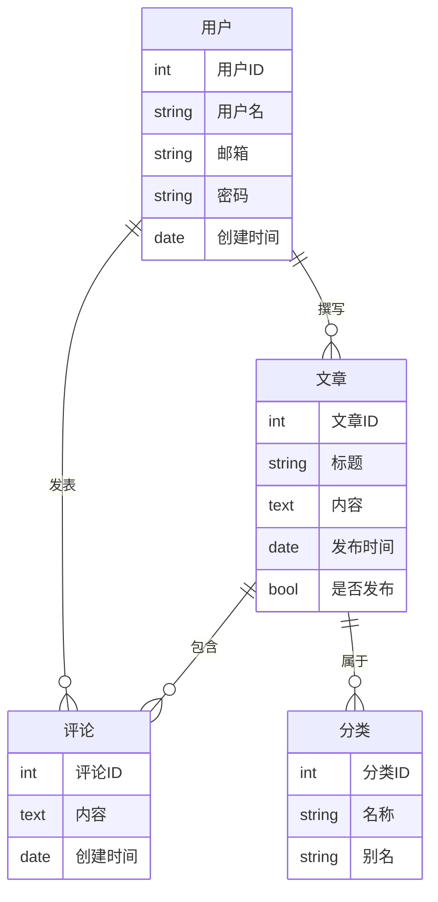
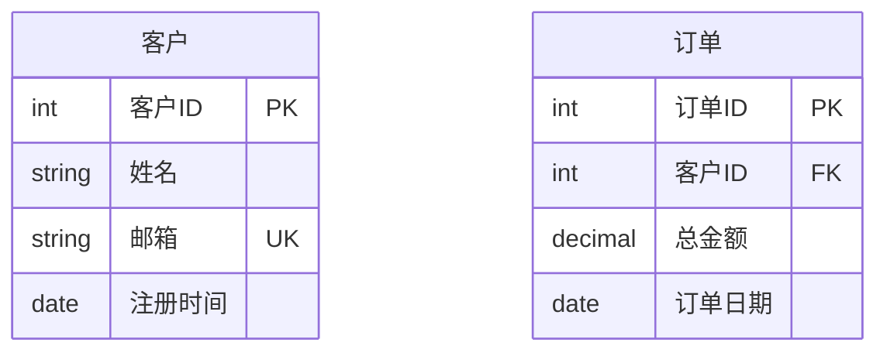
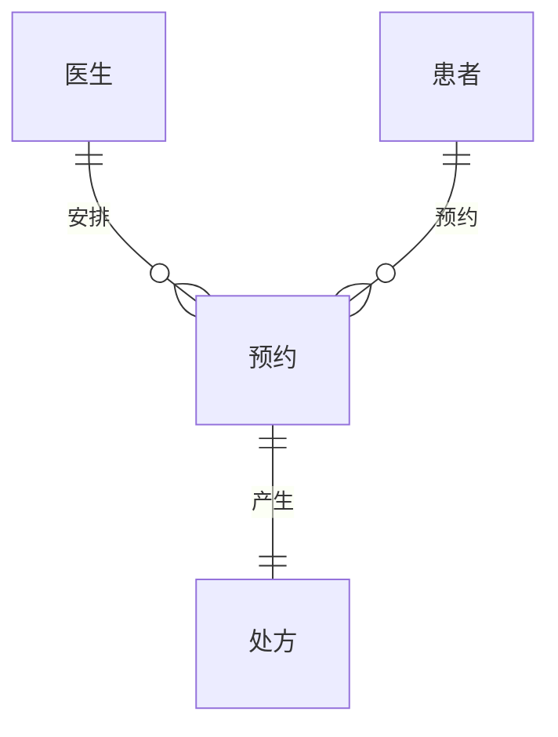
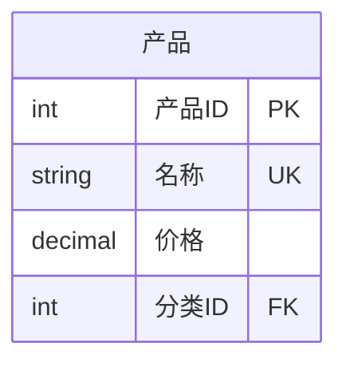

# 实体关系图

实体关系图（ER图）用于模型化数据库系统中实体之间的关系。它们展示了数据库的逻辑结构。

## 语法

### 基本元素
- 实体: `entity 实体名`
- 属性: 在实体内列出
- 关系: 实体之间的各种连接类型
- 基数: `|o--o|`, `}o--o{` 等

### 关系类型
- 一对一: `||--||`
- 一对多: `||--o{`
- 多对一: `}o--||`
- 多对多: `}o--o{`

## 基础示例

## 高级示例

这是一个展示博客系统的更详细的ER图：

## 属性和类型

可以指定属性及其类型：

## 关系标签

可以添加标签来描述关系：

## 附加功能

### 键类型
- PK: 主键
- FK: 外键
- UK: 唯一键

## 样式设置

外观可以通过以下方式自定义：
- 不同的关系类型
- 属性类型
- 关系标签
- 实体名称和描述

## 实用技巧
- 使用清晰描述性的实体名称
- 仅包含重要属性
- 使用正确的基数显示关系
- 添加有意义的关系描述
- 考虑规范化规则
- 将相关实体分组
- 使用标准命名约定

## 常见问题解决

1. **设计问题**
   - 确保实体名称明确
   - 验证关系的基数
   - 检查属性的完整性

2. **关系问题**
   - 确认关系类型正确
   - 验证外键约束
   - 检查循环依赖

3. **属性问题**
   - 确保属性命名清晰
   - 验证数据类型
   - 检查键的正确性

## 下一步
- [用户旅程图](/zh/diagrams/user-journey)
- [甘特图](/zh/diagrams/gantt)
- [饼图](/zh/diagrams/pie) 