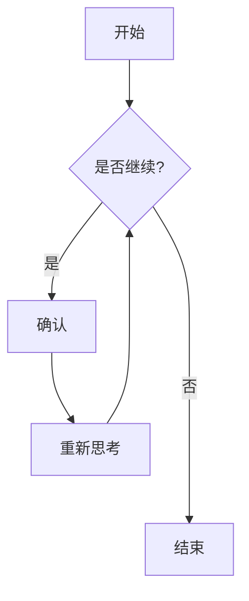
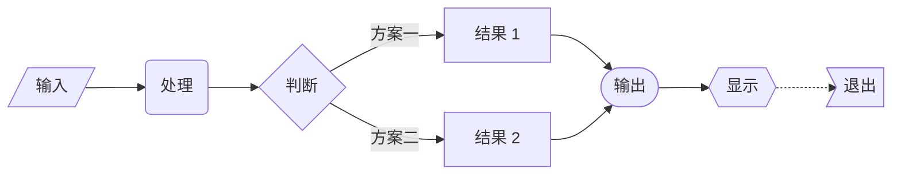
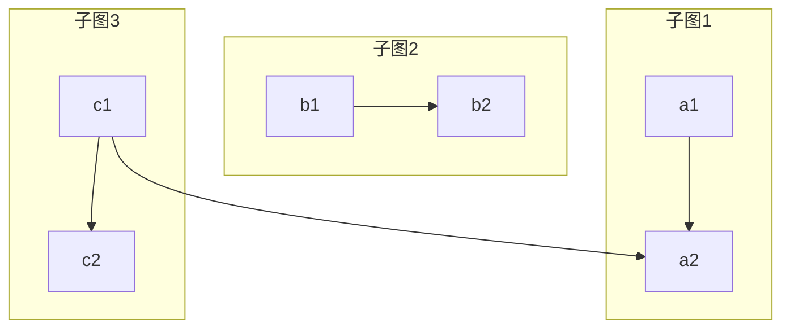
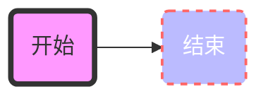
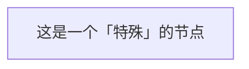
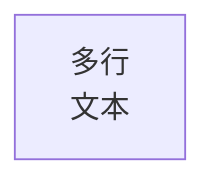

# 流程图

流程图是用于表示工作流程或过程的图表。Mermaid 可以通过文本描述来渲染流程图。

## 语法

### 节点类型
- `id[文本]` - 矩形节点
- `id(文本)` - 圆角矩形节点
- `id([文本])` - 体育场形状节点
- `id[[文本]]` - 子程序形状节点
- `id>文本]` - 不对称节点
- `id{文本}` - 菱形节点
- `id{{文本}}` - 六边形节点
- `id[/文本/]` - 平行四边形节点
- `id[\文本\]` - 反向平行四边形节点

### 连接线
- `-->` - 箭头连接
- `---` - 开放连接
- `-.->` - 虚线连接
- `==>` - 粗线连接
- `--文本-->` - 带文本的箭头连接
- `--文本---` - 带文本的开放连接
- `==文本==>` - 带文本的粗线连接

## 基础示例

## 高级示例

这是一个展示各种节点类型和连接方式的复杂流程图：

## 方向设置

你可以指定流程图的方向：
- `TB` - 从上到下
- `TD` - 从上到下（同 TB）
- `BT` - 从下到上
- `RL` - 从右到左
- `LR` - 从左到右

## 子图

你可以使用子图来组织复杂的流程图：

## 样式设置

你可以为节点和连接线添加样式：

## 特殊语法

### 转义字符
如果文本中包含特殊字符，可以使用双引号：

### 多行文本
使用 ` ` 来添加换行：

## 实用技巧
- 保持流程图简洁明了
- 为相似元素使用一致的节点类型
- 为连接线添加有意义的标签
- 选择最适合展示流程的方向
- 使用子图组织复杂逻辑
- 合理使用样式突出重要节点
- 避免过多的交叉连接
- 使用清晰的节点命名

## 常见问题解决

1. **布局问题**
   - 尝试调整图表方向
   - 减少节点间的连接
   - 使用子图分组相关节点

2. **样式问题**
   - 检查样式语法
   - 确保颜色代码正确
   - 验证样式属性名称

3. **渲染问题**
   - 确认语法正确
   - 检查节点 ID 唯一性
   - 验证连接的节点是否存在

## 下一步学习
- [时序图](/zh/diagrams/sequence)
- [状态图](/zh/diagrams/state)
- [类图](/zh/diagrams/class) 